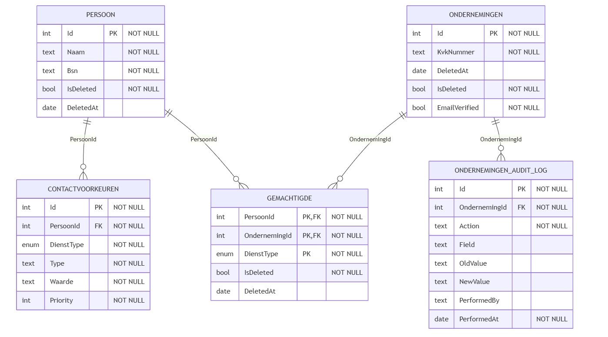
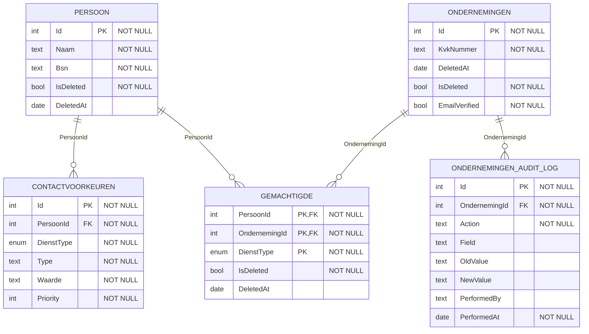
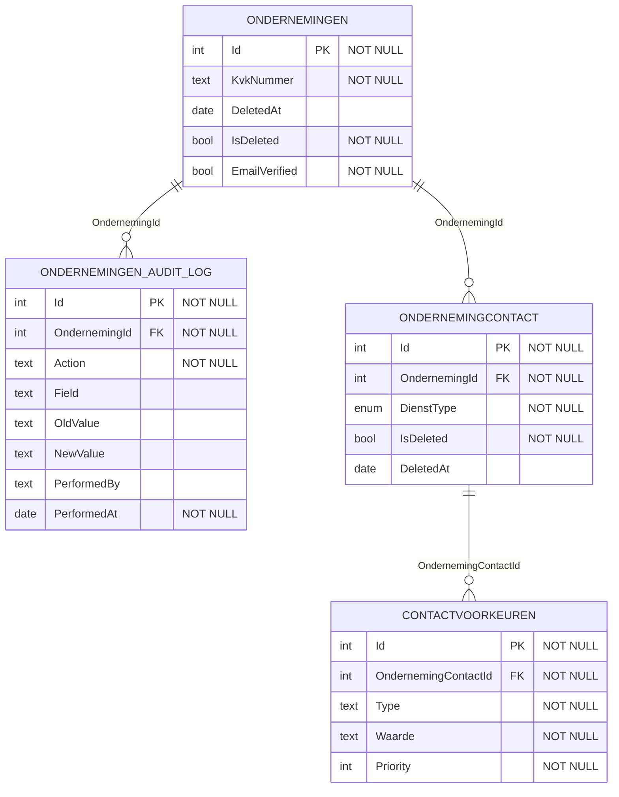

# 7. (NOG CONCEPT!!) Modelkeuze: Persoon vs. Zonder Persoon

**Date:** 2025-10-16

## Status

Proposed 

## Context

In de Profiel Service beheren we de contactinformatie van ondernemingen, zodat overheidsdiensten weten waar ze berichten & notificaties naartoe kunnen sturen.  
Tijdens het modelleren rees de vraag of de Profiel Service ook persoonsgegevens (zoals naam en rol van een contactpersoon) moet opslaan, of dat het voldoende is om enkel functionele contactpunten te beheren per diensttype.

Hieronder volgen twee scenario’s die onderzocht zijn:

---

### Model A — Met `PERSOON

In dit model worden contactvoorkeuren gekoppeld aan een persoon.  
Een persoon kan gemachtigd zijn namens een onderneming en heeft voor elk diensttype eigen contactvoorkeuren, bijvoorbeeld e-mail of telefoon.

Dit model biedt bovendien een toekomstig uitbreidingspad richting digitale identiteit en machtigingen, in de context van de EU Digital Identity Wallet.  
De Profiel Service zou een kaart kunnen uitgeven die bij gebruikers in de wallet komt, met deze zouden ze dan potentieel kunnen inloggen bij diverse overheidsdienstverleners.  
De Profiel Service zou dan fungeren als een identity provider voor deze machtigingen.

  
Zie mermaid code

**Voordelen:**

- Traceerbaarheid — duidelijk welke persoon verantwoordelijk is voor de communicatie.
- Toekomstbestendig — eenvoudig uitbreidbaar naar authenticatie.
- Hergebruik van contactgegevens over meerdere ondernemingen en diensten.

**Nadelen:**

- Meer persoonsgegevens en dus strengere AVG-verplichtingen.
- Extra logica nodig anonimiseren van personen.

---

### Model B — Zonder `PERSOON`

In dit model vervalt de entiteit `PERSOON`.  
In plaats daarvan wordt per onderneming en diensttype één of meer contactvoorkeuren vastgelegd via de entiteit `ONDERNEMINGCONTACT`.  
Dit beschrijft dus hoe een dienst een onderneming kan bereiken, zonder expliciet vast te leggen wie dat precies is. Hoewel te beargumenteren valt dat bepaalde contactgegevens, zoals een e-mailadres, indirect herleidbaar kunnen zijn tot een persoon.

  
Zie mermaid code

**Voordelen:**

- Privacyvriendelijk niet automatisch persoonsgegevens opgeslagen.
- Beter passend bij het huidige gebruiksdoel: communicatiekanalen i.p.v. personen.

**Nadelen:**

- Geen individuele traceerbaarheid of verantwoording (“wie is gecontacteerd?”).
- Moeilijker uitbreidbaar naar persoonlijke accounts of ondertekening.
- Contactinformatie moet per diensttype opnieuw worden opgevoerd.

---

## Decision

---

## Consequences
