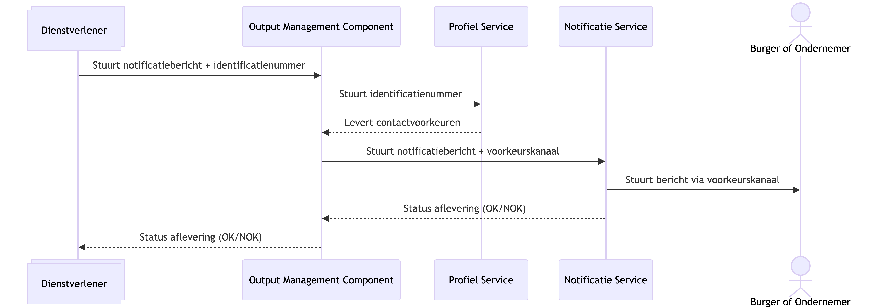

# 11. Positionering en gebruik van Profiel Service

Date: 2025-12-12

## Status

Proposed

## Context

Bij de uitwerking van de eerste alfa-versie van de Profiel Service, moet naast naar requirements van de organisaties ook gekeken worden naar aan welke randvoorwaarden een eventuele MVP zou moeten voldoen. Daar komt ook de AVG bij kijken en de daarbij behorende doelbinding.

We hebben twee variaties waarop de Profiel Service beschikbaar gesteld kan worden aan overheidsorganisaties.

### Optie 1: Profiel Service als centraal register

Wanneer we de Profiel Service beschikbaar stellen als centraal register binnen het Federatief Datastelsel zodat overheidsorganisaties hierop kunnen aansluiten, is er sprake van het verstrekken van persoonsgegevens. Dit zou kunnen als de burger of ondernemer zijn of haar gegevens zelf in de Profiel Service heeft ingevuld, met als doel via deze contactvoorkeuren te kunnen worden benaderd door overheidsorganisaties.

Hierbij is het doel of de grondslag van het contact leggen per organisatie mogelijk verschillend. Wel zijn deze vooraf vastgelegd in het contract tussen dienstverlener en de Profiel Service.

#### Diagram 1: Profiel Service als centraal register


<details>
    <summary>Zie Mermaid code</summary>

    ```mermaid
    sequenceDiagram
        participant Dienstverlener@{"type" : "collections"}
        participant PS as Profiel Service
        participant NS as Notificatie Service
        actor BO as Burger of Ondernemer

        Dienstverlener ->> PS: Stuurt identificatienummer
        PS -->> Dienstverlener: Levert contactvoorkeuren
        Dienstverlener ->> NS: Stuurt inhoud notificatiebericht + voorkeurskanaal
        NS ->> BO: Stuurt bericht via voorkeurskanaal
        NS -->> Dienstverlener: Status aflevering (OK/NOK)
    ```

</details>

### Optie 2: Profiel Service als onderdeel van de Overheidsbrede Notificatie Dienst (OND)

Wanneer we de Profiel Service niet opzichzelfstaand beschikbaar stellen, maar als onderdeel van de overheidsbrede notificatie dienst, zorgen we ervoor dat persoonsgegevens niet buiten deze omgeving worden gedeeld.

Hierbij is het doel en de grondslag altijd hetzelfde, namelijk: "het afleveren van notificaties aan burgers of ondernemers".

#### Diagram 2: Profiel Service als onderdeel van Overheidsbrede Notificatie Dienst (OND)



<details>
    <summary>Zie Mermaid code</summary>

    ```mermaid
    sequenceDiagram
        participant Dienstverlener@{"type" : "collections"}
        participant OMC as Output Management Component
        participant PS as Profiel Service
        participant NS as Notificatie Service
        actor BO as Burger of Ondernemer

        Dienstverlener ->> OMC: Stuurt notificatiebericht + identificatienummer
        OMC ->> PS: Stuurt identificatienummer
        PS -->> OMC: Levert contactvoorkeuren
        OMC ->> NS: Stuurt notificatiebericht + voorkeurskanaal
        NS ->> BO: Stuurt bericht via voorkeurskanaal
        NS -->> OMC: Status aflevering (OK/NOK)
        OMC -->> Dienstverlener: Status aflevering (OK/NOK)
    ```

</details>


### Doelbinding

Om dit te toetsen, dienen we deze opties voor te leggen bij juridisch adviseurs. Hiervoor zijn bijgevoegde doelbinding documenten opgesteld, waarin is beschreven wie, welke gegevens met welk doel kan raadplegen en hoe we ervoor zorgen dat dit veilig gebeurt.

- [Doelbinding - Profiel Service als centraal register](./addendum/profiel-service-doelbinding-optie-1.md)
- [Doelbinding - Profiel Service als onderdeel van Overheidsbrede Notificatie Dienst](./addendum/profiel-service-doelbinding-optie-2.md)
- [Doelbinding - Logging en toegang](./addendum/profiel-service-logging-en-toegang.md)

## Decision

Nog geen beslissing genomen.

## Consequences

Beide opties hebben plus- en minpunten. Hieronder zetten we deze uiteen;

### Optie 1: Profiel Service als centraal register

#### Voordelen

- Aangesloten organisaties kunnen de contactvoorkeuren en -gegevens gebruiken in hun bestaande systemen

#### Nadelen

- Doel en wettelijke grondslag van het ophalen van gegevens kunnen per organisatie verschillend zijn, waardoor dit juridisch misschien ingewikkelder valt te verantwoorden

### Optie 2: Profiel Service als onderdeel van OND

#### Voordelen
- Doel en wettelijke grondslag zijn strak afgekaderd, waardoor dit juridisch eenvoudiger valt te verantwoorden
- Het kunnen notificeren van burgers en ondernemers is hiermee opgelost

#### Nadelen
- Contactvoorkeuren / -gegevens zijn niet inzichtelijk voor organisaties zelf
- Meer componenten nodig dan alleen de Profiel Service om als MVP mee live te gaan