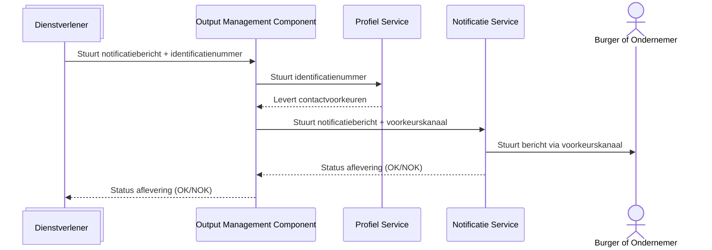

# 11. Positionering en gebruik van Profiel Service

Date: 2025-12-12

## Status

Proposed

## Context

Bij de uitwerking van de eerste alfa-versie van de Profiel Service, moet naast naar requirements van de organisaties ook gekeken worden naar aan welke randvoorwaarden een eventuele MVP zou moeten voldoen. Daar komt ook de doelbinding bij kijken en daarbij moeten we voldoen aan de AVG.

We hebben twee variaties waarop de Profiel Service beschikbaar gesteld kan worden aan overheidsorganisaties.

### Optie 1: Profiel Service als Centraal register

Wanneer we de Profiel Service beschikbaar stellen als centraal register waar overheidsorganisaties op aansluiten, is er sprake van het verstrekken van persoonsgegevens. Dit zou kunnen als de burger of ondernemer zijn of haar gegevens zelf in de Profiel Service heeft ingevuld, met als doel via deze contactvoorkeuren te kunnen worden benaderd door overheidsorganisaties.

#### Diagram: Profiel Service als centraal register

**LET OP: AANPASSEN NOG!!!**

### Optie 2: Profiel Service als onderdeel van de Overheidsbrede Notificatie Dienst (OND)

Wanneer we de Profiel Service niet opzichzelfstaand beschikbaar stellen, maar als onderdeel van de overheidsbrede notificatie dienst, zorgen we ervoor dat persoonsgegevens niet buiten deze omgeving worden gedeeld.

#### Diagram Profiel Service als onderdeel van Overheidsbrede Notificatie Dienst (OND)

### Doelbinding

Om dit te toetsen, dienen we deze opties voor te leggen bij juridisch adviseurs. Hiervoor zijn bijgevoegde doelbinding documenten opgesteld, waarin is beschreven wie, welke gegevens met welk doel kan raadplegen en hoe we ervoor zorgen dat dit veilig gebeurt.

- [Doelbinding - Profiel Service als centraal register](./addendum/profiel-service-doelbinding-optie-1.md)
- [Doelbinding - Profiel Service als onderdeel van Overheidsbrede Notificatie Dienst](./addendum/profiel-service-doelbinding-optie-2.md)

## Decision

Nog geen beslissing genomen.

## Consequences

Beide opties hebben plus- en minpunten. Hieronder zetten we deze uiteen;

