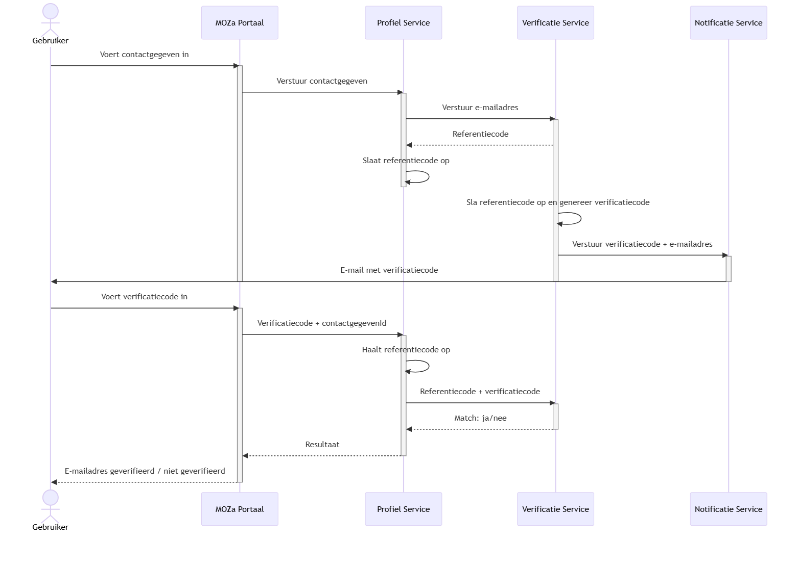
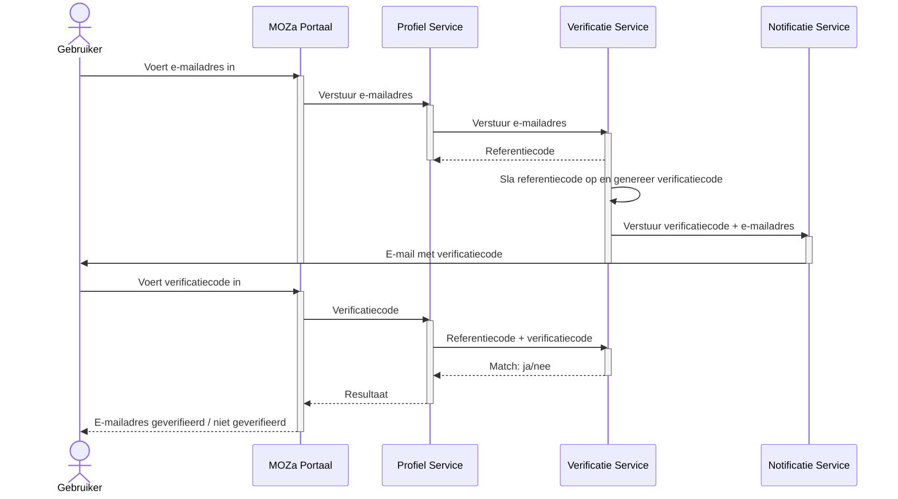

# 14. Onderzoek naar de keuze van e‑mailverificatieservice

Datum: 2026-02-23

## Status
Proposed

## Gerelateerde ADRs
- [ADR 0002 — Notify Onderzoek](0002-notify-onderzoek.md): achtergrond bij de keuze voor NotifyNL/NotifyRO als notificatiekanaal.
- [ADR 0011 — Positionering en gebruik van Profiel Service](0011-positionering-en-gebruik-van-profiel-service.md): de Profielservice die e‑mailverificatie nodig heeft.

## Termen
NotifyNL: De notificatie service ontwikkeld en gehost door Worth systems.
NotifyRO: De notificatie service (door)ontwikkeld en gehost door Logius.

## Context
Voor de Profielservice is een e‑mailverificatieservice nodig, zodat we e‑mailadressen kunnen valideren vóórdat ze worden gebruikt. We hebben onderzocht welke opties er zijn en wat de beste route is.

### Huidige situatie
Er bestaat al een e‑mailverificatieservice, ontwikkeld door Worth Systems in opdracht van de gemeente Amsterdam. De huidige flow werkt, maar verandert doordat Logius een eigen notificatieservice (NotifyRO) ontwikkelt — al dan niet als fork van NotifyNL.

### Onderzoek bestaande verificatieservice
We hebben de bestaande verificatieservice van Worth Systems onderzocht en de volgende bevindingen gedaan:

1. **Architectuurcomplexiteit.** In de nieuwe situatie gebruikt de Profielservice NotifyRO om e‑mails te versturen. Als we daarnaast de bestaande verificatieservice blijven gebruiken, ontstaat een keten waarin die service via NotifyNL verstuurt, terwijl Logius overstapt op NotifyRO. Dit introduceert extra afhankelijkheden en complexiteit.

   

2. **Andere technologiestack.** De bestaande verificatieservice is geschreven in TypeScript/Node. De beoogde beheerpartij, Logius, heeft een voorkeur voor Quarkus/Java. Een service in een bekende stack voor Logius verlaagt de drempel voor beheer en doorontwikkeling.

3. **Afhankelijkheid van externe partij.** Bij doorgebruik blijven we afhankelijk van een externe partij voor onderhoud en doorontwikkeling. De service is beschikbaar als open source, maar forken betekent dat we zelf een TypeScript/Node-codebase moeten onderhouden — wat hetzelfde tech-stack-vraagstuk introduceert.

4. **AVG-aandachtspunt.** De bestaande verificatieservice slaat e‑mailadressen op om deze daarna te verifiëren met email deels als key. Dit is op te lossen met een verwerkersovereenkomst, maar met een eigen service hebben we gekeken hoe reëel het is alleen met referentie te werken, waardoor de e-mail nooit opgeslagen hoeft te worden.

### Prototype eigen verificatieservice
Om te onderzoeken wat het kost om een eigen verificatieservice te bouwen is een volledig werkend prototype neergezet in Quarkus/Java, inclusief code-verificatie, versturen via e-mail en opslag zonder e‑mailadressen. Het prototype is nog niet productierijp, maar toont aan dat een AVG-conforme verificatieservice met beperkte inspanning gerealiseerd kan worden.

#### Sequentiediagram prototype

Hieronder is een sequentiediagram van het verificatieproces in ons prototype.

  
Zie mermaid code

## Overwogen scenario's

| Alternatief                                                 | Voordelen                                                                                                                         | Nadelen                                                                                                                                                   |
|-------------------------------------------------------------|-----------------------------------------------------------------------------------------------------------------------------------|-----------------------------------------------------------------------------------------------------------------------------------------------------------|
| **Bestaande verificatieservice behouden via NotifyNL**      | Geen ontwikkelwerk nodig                                                                                                          | Logius stapt over op NotifyRO; creëert dubbele afhankelijkheid; e‑mailadressen worden extern opgeslagen                                                   |
| **Bestaande verificatieservice forken en zelf onderhouden** | Bewezen implementatie; volledig eigen beheer                                                                                      | TypeScript/Node wijkt af van platformstack; onderhoud van externe codebase; e‑mailopslag vereist aanpassing voor AVG-compliance of verwerkersovereenkomst |
| **Eigen verificatieservice bouwen (gekozen)**               | Zelf gekozen tech-stack; geen externe afhankelijkheden; directe integratie met NotifyRO; volledige controle over AVG-compliance   | Vergt eigen ontwikkeling en onderhoud                                                                                                                     |
| **Eigen service met orchestratie in Profiel Service**       | Sterkere dataminimalisatie: verificatieservice ziet nooit het e-mailadres; Profiel Service stuurt zelf de Notificatie Service aan | Wijkt te veel af van de flow van de huidige verificatieservice; bemoeilijkt adoptie en vervanging doordat afnemers hun integratiepatroon moeten aanpassen |

## Decision
Op basis van het onderzoek naar de bestaande verificatieservice en de resultaten van het prototype bouwen we een eigen e‑mailverificatieservice die via de Notificatie Service verstuurt.

## Consequences
- We zijn verantwoordelijk voor ontwerp, ontwikkeling en onderhoud van de verificatieservice.
- De afhankelijkheid van NotifyNL vervalt; alle e‑mailcommunicatie loopt via de Notificatie Service.
- De service wordt gebouwd in Quarkus/Java, wat beheer door Logius vereenvoudigt.
- We hebben volledige controle over de opslag en verwerking van persoonsgegevens.
- De service kan in potentie hergebruikt worden door andere overheidsorganisaties.
- We introduceren een afhankelijkheid van NotifyRO voor het versturen van verificatie-e‑mails. NotifyRO wordt beheerd door Logius.
