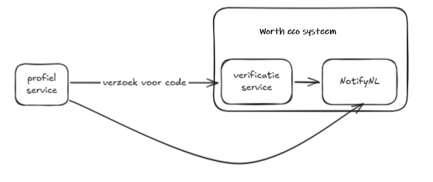
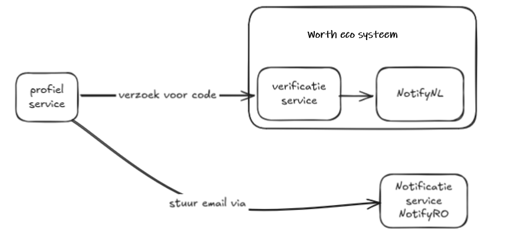
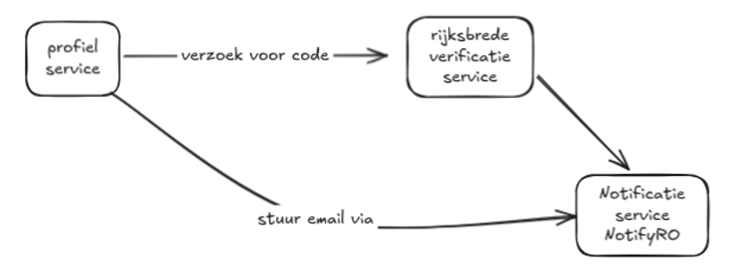

# 14. Keuze voor e‑mailverificatieservice

Datum: 2026-02-23

## Status
Proposed

## Gerelateerde ADRs
- [ADR 0002 — Notify Onderzoek](0002-notify-onderzoek.md): achtergrond bij de keuze voor NotifyNL/NotifyRO als notificatiekanaal.
- [ADR 0011 — Positionering en gebruik van Profiel Service](0011-positionering-en-gebruik-van-profiel-service.md): de Profielservice die e‑mailverificatie nodig heeft.

## Context
Voor de Profielservice is een e‑mailverificatieservice nodig, zodat we e‑mailadressen kunnen valideren vóórdat ze worden gebruikt.

### Huidige situatie
Er bestaat al een e‑mailverificatieservice, ontwikkeld door Worth Systems in opdracht van de gemeente Amsterdam. 
De huidige flow werkt, maar verandert doordat Logius een eigen notificatieservice (NotifyRO) ontwikkelt — al dan niet als fork van NotifyNL.

### Nieuwe situatie
In de nieuwe situatie gebruikt de Profielservice NotifyRO om e‑mails te versturen. 
Als we daarnaast de verificatieservice van Worth blijven gebruiken, ontstaat een keten waarin die service via NotifyNL verstuurt, terwijl Logius overstapt op een eigen notificatieservice (NotifyRO). Dit introduceert extra afhankelijkheden en complexiteit.

### Waarom niet verder met de verificatieservice van Worth Systems?
Naast de bovengenoemde architectuurcomplexiteit zijn er aanvullende redenen om niet verder te gaan met de bestaande verificatieservice:

1. **Andere technologiestack dan de rest van het platform.** De verificatieservice van Worth Systems is geschreven in TypeScript/Node. De beoogde beheerpartij, Logius, heeft een voorkeur voor Quarkus/Java. Een eigen service in een bekende stack voor logius verlaagt de drempel voor beheer en doorontwikkeling.

2. **Afhankelijkheid van een externe partij.** Bij doorgebruik van de Worth-verificatieservice blijven we afhankelijk van Worth Systems voor onderhoud en doorontwikkeling. De service is beschikbaar als open source, maar forken betekent dat we zelf een TypeScript/Node-codebase moeten onderhouden — wat hetzelfde tech-stack-vraagstuk introduceert als hierboven beschreven.

### Nieuwe situatie met eigen verificatieservice
In dit scenario bouwen we een eigen e‑mailverificatieservice die direct via NotifyRO verstuurt.
Deze service kan in potentie hergebruikt worden door andere overheidsorganisaties die e‑mailverificatie nodig hebben.

## Overwogen alternatieven

| Alternatief | Voordelen | Nadelen |
|---|---|---|
| **Worth-verificatieservice behouden via NotifyNL** | Geen ontwikkelwerk nodig | Logius stapt over op NotifyRO; creëert dubbele afhankelijkheid |
| **Worth-verificatieservice forken en zelf onderhouden** | Bewezen implementatie; geen afhankelijkheid van Worth | TypeScript/Node wijkt af van platformstack; onderhoud van externe codebase |
| **Eigen verificatieservice bouwen (gekozen)** | Eén tech-stack (Quarkus/Java); geen externe afhankelijkheden; directe integratie met NotifyRO | Vergt eigen ontwikkeling en onderhoud |

## Decision
We bouwen een eigen e‑mailverificatieservice die via NotifyRO verstuurt.

## Consequences
- We zijn verantwoordelijk voor ontwerp, ontwikkeling en onderhoud van de verificatieservice.
- De afhankelijkheid van NotifyNL vervalt; alle e‑mailcommunicatie loopt via NotifyRO.
- De service wordt gebouwd in Quarkus/Java, wat beheer door Logius vereenvoudigt.
- De service kan in potentie hergebruikt worden door andere overheidsorganisaties.
- We introduceren een afhankelijkheid van NotifyRO voor het versturen van verificatie-e‑mails. NotifyRO wordt beheerd door Logius.

