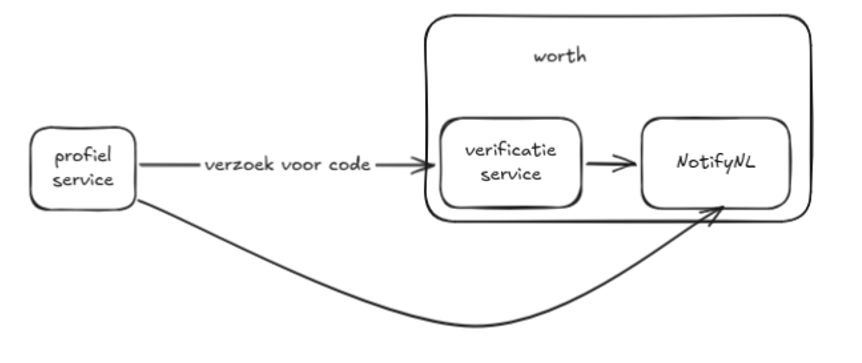

# 14. Keuze voor e‑mailverificatieservice

Datum: 2026-02-23

## Status
Proposed

## Context
Voor de Profielservice is een e‑mailverificatieservice nodig, zodat we e‑mailadressen kunnen valideren vóórdat ze worden gebruikt.

### Huidige situatie
Er bestaat al een e‑mailverificatieservice, ontwikkeld door Worth Systems in opdracht van de gemeente Amsterdam. 
De huidige flow werkt, maar verandert doordat Logius de Notificatieservice vervangt door NotifyRO.

### Nieuwe situatie
In de nieuwe situatie gebruikt de Profielservice NotifyRO om e‑mails te versturen. 
Als we daarnaast de verificatieservice van Worth blijven gebruiken, ontstaat een keten waarin die service via NotifyNL verstuurt, terwijl NotifyNL juist wordt vervangen door NotifyRO. Dit introduceert extra afhankelijkheden en complexiteit.

### Nieuwe situatie met eigen verificatieservice
In dit scenario bouwen we een eigen (rijksbrede) e‑mailverificatieservice die direct via NotifyRO verstuurt. 
Deze service kan vervolgens hergebruikt worden door andere overheidsorganisaties die e‑mailverificatie nodig hebben.

## Decision
We bouwen een eigen e‑mailverificatieservice die via NotifyRO verstuurt.

## Consequences
We zijn verantwoordelijk voor ontwerp, ontwikkeling en het ontsluiten van de verificatieservice.

