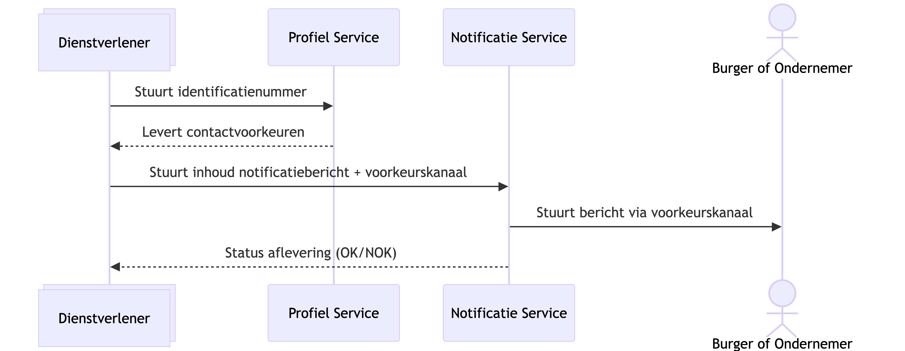
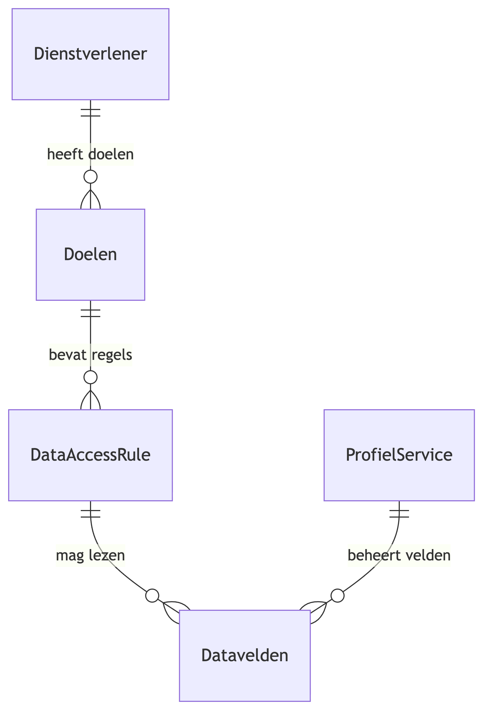
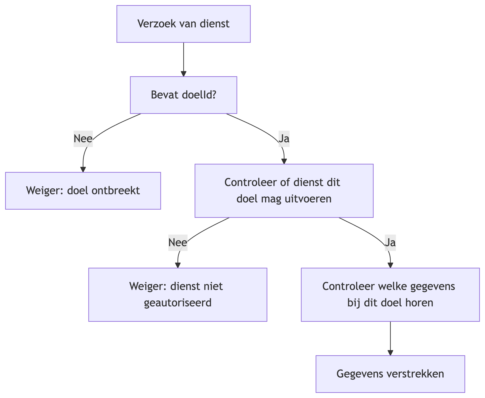
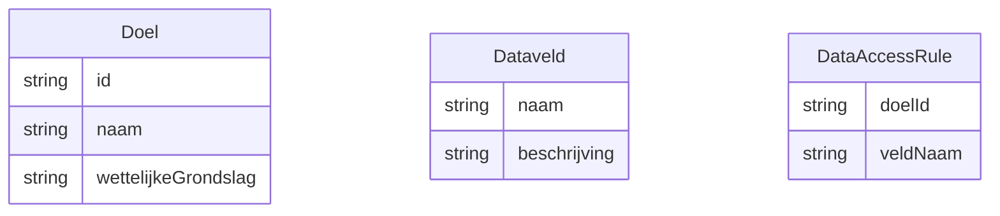

# Doelbinding voor de Profiel Service als centraal register

> **Versie:** concept 0.1<br/>
> **Doelgroep:** Juridische afdeling, architecten, product owners

## 1. Inleiding

De Profiel Service is een centrale voorziening waar burgers en ondernemers hun contactgegevens en communicatievoorkeuren voor de gehele overheid kunnen beheren. Het voordeel voor de burger en ondernemer is dat ze slechts op één plek hun contactgegevens en voorkeuren hoeven op te geven. De Profiel Service wordt door verschillende overheidsorganisaties gebruikt om contactvoorkeuren en contactgegevens van burgers en ondernemers op te halen. De overheidsorganisatie kan deze informatie gebruiken in hun contact met burgers en ondernemers. Denk aan het versturen van een notificatie, maar ook op het moment dat ergens telefonisch contact over nodig is.

Omdat de Profiel Service persoonsgegevens verwerkt, is doelbinding een kernprincipe. Dit document beschrijft hoe doelbinding wordt toegepast, geborgd en afgedwongen binnen de Profiel Service.

## 2. Wat is doelbinding?

Doelbinding houdt in dat persoonsgegevens alleen verwerkt mogen worden voor een specifiek, vooraf vastgesteld en gerechtvaardigd doel, en niet voor andere doeleinden gebruikt mogen worden. Dit volgt uit de AVG (artikel 5).

Voor de Profiel Service betekent dit dat elke verwerking van persoonsgegevens gekoppeld moet zijn aan:
- een geldig doel;
- een geautoriseerde dienst of instantie;
- een gerechtvaardigde grondslag (wettelijke taak of toestemming);
- een controleerbare en auditeerbare registratie.

## 3. Architectuuroverzicht



<details>
    <summary>Zie Mermaid code</summary>

    ```mermaid
    sequenceDiagram
        participant Dienstverlener@{"type" : "collections"}
        participant PS as Profiel Service
        participant NS as Notificatie Service
        actor BO as Burger of Ondernemer

        Dienstverlener ->> PS: Stuurt identificatienummer
        PS -->> Dienstverlener: Levert contactvoorkeuren
        Dienstverlener ->> NS: Stuurt inhoud notificatiebericht + voorkeurskanaal
        NS ->> BO: Stuurt bericht via voorkeurskanaal
        NS -->> Dienstverlener: Status aflevering (OK/NOK)
    ```

</details>

## 4. Toepassing van doelbinding binnen de Profiel Service

### 4.1 Overzicht van dataverwerkingen

De Profiel Service verwerkt o.a. de volgende gegevens:
- Contactgegevens (naam, e-mail, telefoonnummer)
- Communicatievoorkeuren (voorkeurskanaal, notificatie-instellingen)
- Opt-in/opt-out gegevens (toestemming)

Elke verwerking is gekoppeld aan een doel. Dit wordt in de architectuur vastgelegd en afgedwongen met behulp van de standaarden van het Federatief Datastelsel. Zie ook [Profiel Service logging en toegang](profiel-service-logging-en-toegang.md).

### 4.2 Relatie tussen instellingen, doeleinden en gegevens



<details>
    <summary>Zie Mermaid code</summary>

    ```mermaid
    erDiagram
        Dienstverlener ||--o{ Doelen : "heeft doelen"
        Doelen ||--o{ DataAccessRule : "bevat regels"
        DataAccessRule ||--o{ Datavelden : "mag lezen"
        ProfielService ||--o{ Datavelden : "beheert velden"
    ```

</details>

### 4.3 Doelbinding bij API-toegang

Elke API-call naar de Profiel Service bevat:
- de identiteit van de verzoekende dienst;
- het doel waarvoor de aanvraag wordt gedaan (purposeId);
- expliciete autorisatiekoppeling tussen dienst en doel;
- toegestane gegevensvelden per doel.

De Profiel Service voert per request een Doelbinding Check uit:



<details>
    <summary>Zie Mermaid code</summary>

    ```mermaid
    flowchart TD
        A[Verzoek van dienst] --> B[Bevat doelId?]
        B -- Nee --> X[Weiger: doel ontbreekt]
        B -- Ja --> C[Controleer of dienst dit doel mag uitvoeren]
        C -- Nee --> Y[Weiger: dienst niet geautoriseerd]
        C -- Ja --> D[Controleer welke gegevens bij dit doel horen]
        D --> E[Gegevens verstrekken]
    ```

</details>

## 5. Doelregistratie

Elke aangesloten dienst moet vooraf:
1.	de doeleinden registreren waarvoor zij gegevens willen verwerken;
2.	de wettelijke grondslag of toestemming per doel vaststellen;
3.	laten verifiëren dat deze doelen proportioneel en gerechtvaardigd zijn.

Voorbeeld van doelen:
- "Versturen van besluiten" (wettelijke taak)
- "Informeren over status van aanvragen" (wettelijke taak)
- "Ontvangen van notificaties voor MijnOverheid Berichtenbox" (toestemming)

## 6. Logging en auditing

Alle verwerkingen worden gelogd op basis van de standaard Logboek Dataverwerkingen (LDV), zie: https://logius-standaarden.github.io/logboek-dataverwerkingen/. Hiermee wordt van alle verwerkingen op een overheidsbreed uitleesbare standaard het noodzakelijke vastgelegd:
- dienst (wie)
- doel (waarvoor)
- gegevensvelden (wat)
- tijdstip (wanneer)

Auditors moeten kunnen nagaan dat:
- het doel bestaat en gerechtvaardigd is;
- de dienst correct geautoriseerd is;
- alleen gegevens zijn verstrekt die bij dat doel horen.

## 7. Borging en handhaving

Doelbinding wordt geborgd via:
- technische handhaving in API-gateways en services;
- autorisatieregels per dienst en per doel;
- dataminimalisatie per doel;
- juridisch toetsbare doelbeschrijvingen;
- monitoring en auditing.

Bij overtreding:
- kan de dienst geblokkeerd worden;
- kan het doel geschorst worden;
- volgt melding aan de verantwoordelijke Funtionaris Gegevensbescherming (FG).

## 8. Voorbeeld instellingsprofiel met doelen en toegestane velden



Voorbeeld:

| Doel                      | Wettelijke grondslag | Toegestane velden                 |
| ------------------------- | -------------------- | --------------------------------- |
| Versturen van besluiten   | AWB                  | e-mail, telefoon, voorkeur kanaal |
| Notificaties MijnOverheid | Toestemming          | e-mail, telefoon, voorkeur kanaal |
| Nieuwsbrieven             | Toestemming          | e-mail                            |

## 9. Conclusie

Met de bovenstaande inrichting wordt doelbinding:
- transparant beschreven,
- juridisch toetsbaar,
- technisch afdwingbaar,
- controleerbaar en auditeerbaar.
