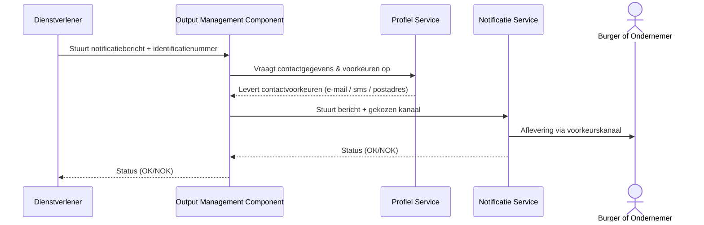
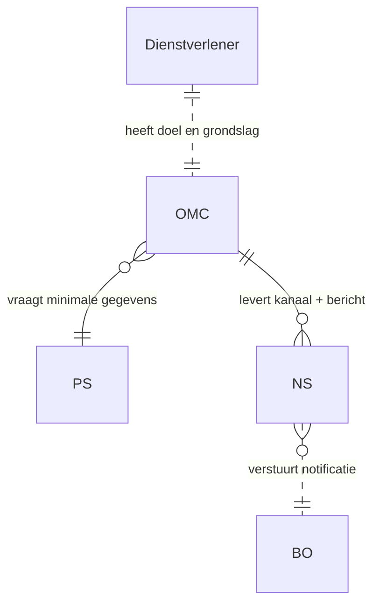

# Doelbinding voor de Profiel Service, Notificatie Service en OMC

**Optie 2: Adresboek–Postkamer–Postbode Model**\
**Versie:** concept 0.1\
**Doelgroep:** Juridische afdeling, architecten, product owners

---

## 1. Inleiding

Deze variant beschrijft een alternatieve inrichting van doelbinding binnen het notificatielandschap, waarin drie centrale componenten samenwerken:

1. **Profiel Service (PS)** – het centrale *adresboek* met contactgegevens en communicatievoorkeuren.
2. **Output Management Component (OMC)** – de *postkamer* die verantwoordelijk is voor het ophalen van contactgegevens en het routeren van berichten.
3. **Notificatie Service (NS)** – de *postbode* die uitsluitend verantwoordelijk is voor het afleveren van berichten via e-mail, sms of fysieke post.

In deze architectuur hebben dienstverleners **geen toegang** tot contactgegevens en ontvangen zij deze ook nooit. Zij sturen uitsluitend een notificatie-opdracht met een identificatienummer. Hiermee verschuift de doelbinding: de dienstverlener verwerkt geen persoonsgegevens, terwijl de OMC en PS dit namens de overheid uitvoeren binnen een strikt afgebakend, controleerbaar doel.

---

## 2. Wat is doelbinding in deze architectuur?

Doelbinding houdt in dat persoonsgegevens alleen gebruikt worden voor een specifiek, gerechtvaardigd doel. In deze opzet worden de persoonsgegevens **niet gedeeld met dienstverleners**; in plaats daarvan worden zij uitsluitend gebruikt binnen een centrale keten die berichten aflevert namens overheidsinstanties.

Hierdoor ontstaat een duidelijk gedefinieerd doel:

> *Het namens overheidsinstanties afleveren van notificaties aan burgers of ondernemers via een centraal adresboek, een centrale routeringscomponent en een notificatievoorziening.*

Het verwerken van persoonsgegevens vindt uitsluitend plaats binnen de centrale voorziening — niet in de individuele diensten.

---

## 3. Architectuuroverzicht

---

## 4. Rollen en gegevensstromen

### 4.1 Dienstverlener

- Beschikt over **identificerende persoonsgegevens** die via het inlogmiddel van de gebruiker beschikbaar komen (bijv. BSN, KVK-nummer, eHerkenning-ID, of andere identificatienummers).
- Levert bij elke notificatie-opdracht uitsluitend:
  - het **identificatienummer** + het **type identificatie** (bijv. `BSN`, `KVK`, `EHI`),
  - het bericht dat moet worden verstuurd,
  - het doel en de wettelijke grondslag voor het versturen van deze notificatie.
- Verwerkt zelf **geen contactgegevens** (zoals e‑mail, telefoonnummer of postadres).
- Ontvangt alleen een afleverstatus (bijv. OK/NOK of meer uitgebreide). (OK/NOK).

### 4.2 Profiel Service (PS)

- Is het **centrale adresboek**.
- Bevat:
  - contactgegevens (e-mail, telefoon, postadres),
  - communicatievoorkeuren,
  - opt-ins/opt-outs.
- Verstrekt gegevens enkel aan de OMC.
- Levert **nooit** persoonsgegevens aan dienstverleners.

### 4.3 Output Management Component (OMC)

- Is de **centrale routerings- en verwerkingscomponent**.
- Verwerkt persoonsgegevens met één doel: *berichten afleveren namens dienstverleners*.
- Haalt alleen de minimaal benodigde gegevens op.
- Geeft deze door aan de Notificatie Service.

### 4.4 Notificatie Service (NS)

- Verstuurt berichten via het aangeleverde kanaal.
- Ontvangt alléén:
  - berichtinhoud,
  - kanaal + adres (e-mailadres, telefoonnummer of postadres).
- Retourneert afleverstatus.

---

## 5. Doelbinding per component

### 5.1 Dienstverlener

**Doel:** Versturen van een notificatie aan een burger of ondernemer.\
**Gegevensverwerking:** Geen persoonsgegevens.\
**Reden:** De persoonsgegevens worden uitsluitend binnen de centrale keten verwerkt.

### 5.2 Profiel Service (PS)

**Doel:** Ondersteunen van centrale notificatie-afhandeling door het beschikbaar stellen van contactvoorkeuren.\
**Wettelijke grondslag:** Afhankelijk van gekozen variant (toestemming of wettelijke taak).\
**Gebruik:** Alleen voor notificatieafhandeling.\
**Uitsluitingen:** Geen verstrekking aan dienstverleners.

### 5.3 Output Management Component (OMC)

**Doel:** Verwerken, routeren en technisch afleveren van notificaties namens dienstverleners.\
**Wettelijke grondslag:** Verwerking onder verantwoordelijkheid van de overheid die de notificatie initieert.\
**Gegevensgebruik:**

- identificatie → ophalen profiel,
- contactgegevens → doorgeven aan NS,
- notificatiebericht → afleveren.

### 5.4 Notificatie Service (NS)

**Doel:** Afleveren van berichten via gekozen kanaal. **Gebruik van gegevens:** Uitsluitend voor verzending.\
**Uitsluitingen:** Geen opslag of secundair gebruik.

---

## 6. Gegevensstromen en dataminimalisatie

In deze variant:

- de dienstverlener *ziet geen persoonsgegevens*;
- de OMC verwerkt uitsluitend de gegevens die nodig zijn voor verzending;
- de NS krijgt alleen het daadwerkelijke afleveradres.

---

## 7. Grondslag en gerechtvaardigd gebruik

Deze variant maakt centrale verwerking mogelijk onder één overkoepelend doel:

> *Het uitvoeren van communicatie namens overheidsinstellingen richting burgers en ondernemers.*

Afhankelijk van keuze door wetgever kunnen deze gegevens verwerkt worden op basis van:

- een **wettelijke plicht** (meest robuuste optie),
- of **toestemming** (complexer voor burgers, foutgevoeliger).

De dienstverlener hoeft geen contactgegevens te verwerken → dit reduceert privacyrisico’s aanzienlijk.

---

## 8. Logging en auditing

De keten logt minimaal:

- doel van verzending
- identificatienummer (pseudoniem waar mogelijk)
- betrokken componenten
- tijdstip
- afleverkanaal
- status (OK/NOK)

Geen enkel log bevat volledige persoonsgegevens buiten de OMC en NS.

Auditors kunnen toetsen dat:

- PS alleen gegevens levert aan OMC,
- OMC uitsluitend gegevens gebruikt voor verzending,
- NS geen gegevens bewaart buiten noodzakelijke afleveradministratie.

---

## 9. Conclusie

Deze architectuur:

- minimaliseert blootstelling van persoonsgegevens,
- verschuift verwerking naar een strikt gecontroleerde centrale keten,
- voorkomt dat dienstverleners persoonsgegevens hoeven op te slaan of op te vragen,
- maakt doelbinding eenvoudiger en juridisch duidelijker,
- kan fungeren als basis voor wetsaanpassing of juridische onderbouwing.

Dit document is bedoeld als basis voor juridische toetsing en verdere verfijning binnen het architectuur- en beveiligingsdossier.

