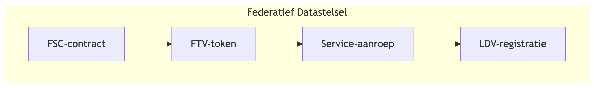

# Bijlage – Logging, Toegang en Doelbinding

**Onderwerp:** Federatief Datastelsel (FDS), Logboek Dataverwerkingen (LDV), Federatief Service Contracteren (FSC) en Federatieve Toegangsverlening (FTV)  \
**Doel:** Beschrijvend kader voor juridische toetsing  \
**Doelgroep:** Juridische afdeling, privacy officers, auditors  \
**Status:** concept

---

## 1. Doel en positionering van deze bijlage

Deze bijlage beschrijft de wijze waarop **toegang tot services** en **logging van dataverwerkingen** zijn ingericht binnen het Federatief Datastelsel (FDS), onafhankelijk van de gekozen architectuurvariant voor de Profiel Service, Output Management Component (OMC) en eventuele andere ketencomponenten.

De beschreven inrichting is **variant-onafhankelijk** en wordt in alle scenario’s toegepast.

Deze bijlage is bedoeld om door juristen te worden beoordeeld op toereikendheid ten aanzien van doelbinding, proportionaliteit en accountability.

---

## 2. Federatief Datastelsel (FDS)

Het Federatief Datatselsel is een stelsel van afspraken voor het veilig en betrouwbaar delen van data binnen overheidsorganisaties. Hieronder vallen standaarden zoals Logboek Dataverwerkingen, Federatieve Service Connectiviteit en Federatieve Toegangsverlening.

Zie voor meer informatie over het Federatief Datastelsel: [Realisatie IBDS - Wat is het Federatief Datastelsel](https://realisatieibds.nl/groups/view/0056c9ef-5c2e-44f9-a998-e735f1e9ccaa/federatief-datastelsel/wiki/view/6eb23feb-22b9-4d0a-abf1-512cc86c2d19/wat-is-het-federatief-datastelsel)

---

## 3. Logboek Dataverwerkingen (LDV)

### 3.1 Doel van het LDV

Het Logboek Dataverwerkingen (LDV) is een stelselvoorziening waarmee verwerkingen van persoonsgegevens **gestructureerd, uniform en ketenbreed** worden vastgelegd.

Het LDV heeft als doel om:
- inzicht te geven in welke verwerkingen plaatsvinden;
- transparantie te bieden richting toezicht en audits;
- achteraf controle mogelijk te maken op rechtmatigheid en doelgebruik.

Zie voor meer informatie over de LDV standaard: [Logius Standaarden - Logboek Dataverwerkingen](https://logius-standaarden.github.io/logboek-dataverwerkingen/)

### 3.2 Vastgelegde elementen

Alle dataverwerkingen worden conform de LDV-standaard vastgelegd. Meer over de wijze van vastlegging is te vinden in [paragraaf 3.2 Component: Logboek](https://logius-standaarden.github.io/logboek-dataverwerkingen/#component-logboek) in de beschrijving van de LDV standaard van Logius.

### 3.3 Relatie tot doelbinding

Het LDV legt vast **welk doel is opgegeven bij een verwerking** en **welke gegevens daarbij zijn gebruikt**. Het LDV zelf stuurt of beperkt de verwerking niet, maar maakt deze **controleerbaar en toetsbaar**.

---

## 4. Federatieve Service Connectiviteit (FSC)

### 4.1 Doel van FSC

De FSC-standaard beschrijft hoe organisaties binnen een federatief stelsel diensten bij elkaar afnemen op basis van **contractuele afspraken**.

Toegang tot een service is uitsluitend mogelijk wanneer:
- een contract is afgesloten;
- de afnemende organisatie is geïdentificeerd;
- de afgesproken dienstverlening expliciet is vastgelegd.

Zie voor meer informatie over de FSC standaard: [https://fsc-standaard.nl/](https://fsc-standaard.nl/)

### 4.2 Vastlegging van doelen in contracten

Binnen FSC kunnen contracten onder andere vastleggen:

- welke dienst wordt afgenomen;
- voor welk **doel of welke doelen** de dienst mag worden gebruikt;
- welke typen verzoeken zijn toegestaan;
- welke verantwoordelijkheden bij welke partij liggen.

Deze contracten vormen het **organisatorische en juridische kader** waarbinnen technische toegang wordt verleend.

### 4.3 Relatie tot gegevensverwerking

FSC bepaalt **wie** een dienst mag gebruiken en **onder welke voorwaarden**. Het contract fungeert daarmee als expliciete context waarbinnen gegevensverwerkingen plaatsvinden.

---

## 5. Federatieve Toegangsverlening (FTV)

### 5.1 Doel van FTV

Federatieve Toegangsverlening (FTV) beschrijft de methodiek waarmee organisaties binnen een federatief stelsel:
- elkaar herkennen;
- identiteit, rol en context betrouwbaar uitwisselen;
- toegang tot services technisch afdwingen.

FTV sluit aan op bestaande standaarden zoals OAuth2, OpenID Connect en SAML.

Zie voor meer informatie over de FTV standaard: [https://vng-realisatie.github.io/ftv/](https://vng-realisatie.github.io/ftv/)

### 5.2 Autorisatie op basis van context

Bij service-aanroepen worden tokens gebruikt die context bevatten, zoals:

- organisatie-identiteit;
- rol of hoedanigheid;
- contractuele relatie;
- (indien van toepassing) het doel waarvoor toegang wordt gevraagd.

De ontvangende service valideert deze context voordat toegang wordt verleend.

### 5.3 Relatie tot doelbinding

FTV maakt het mogelijk om:
- toegang tot services te koppelen aan vooraf vastgelegde afspraken;
- verzoeken te weigeren wanneer context of autorisatie ontbreekt;
- per verzoek vast te stellen namens welke organisatie en binnen welke context wordt gehandeld.

---

## 6. Samenhang tussen FDS, LDV, FSC en FTV

De drie standaarden vallen onder het Federatieve Datastelsel en vullen elkaar aan:

- **FSC** beschrijft *wat* is afgesproken tussen organisaties;
- **FTV** borgt *dat* alleen partijen met geldige afspraken toegang krijgen;
- **LDV** legt vast *hoe* en *waarvoor* gegevens daadwerkelijk zijn verwerkt.



<details>
    <summary>Zie Mermaid code</summary>

    ```mermaid
    flowchart
        subgraph FDS["Federatief Datastelsel"]
            direction LR

            Contract[FSC-contract]
            Token[FTV-token]
            Service[Service-aanroep]
            Log[LDV-registratie]

            Contract --> Token
            Token --> Service
            Service --> Log
        end
    ```

</details>

Deze samenhang is in alle architectuurvarianten gelijk ingericht.

---

## 7. Afbakening van deze bijlage

Deze bijlage:
- beschrijft **niet** de interne logica van specifieke services;
- beschrijft **niet** welke doelen juridisch toelaatbaar zijn;
- bevat **geen oordeel** over proportionaliteit of rechtmatigheid.

De beoordeling of deze combinatie van maatregelen **toereikend is voor doelbinding** ligt expliciet bij de juridische toetsing.

---

## 8. Gebruik als bijlage

Deze tekst is bedoeld als:
- vaste bijlage bij architectuur- en ontwerpdocumenten;
- referentie voor DPIA’s en juridische beoordelingen;
- beschrijving van generieke, stelselbrede randvoorwaarden.

De inhoud is onafhankelijk van specifieke keuzes rondom de Profiel Service of notificatie-architectuur.