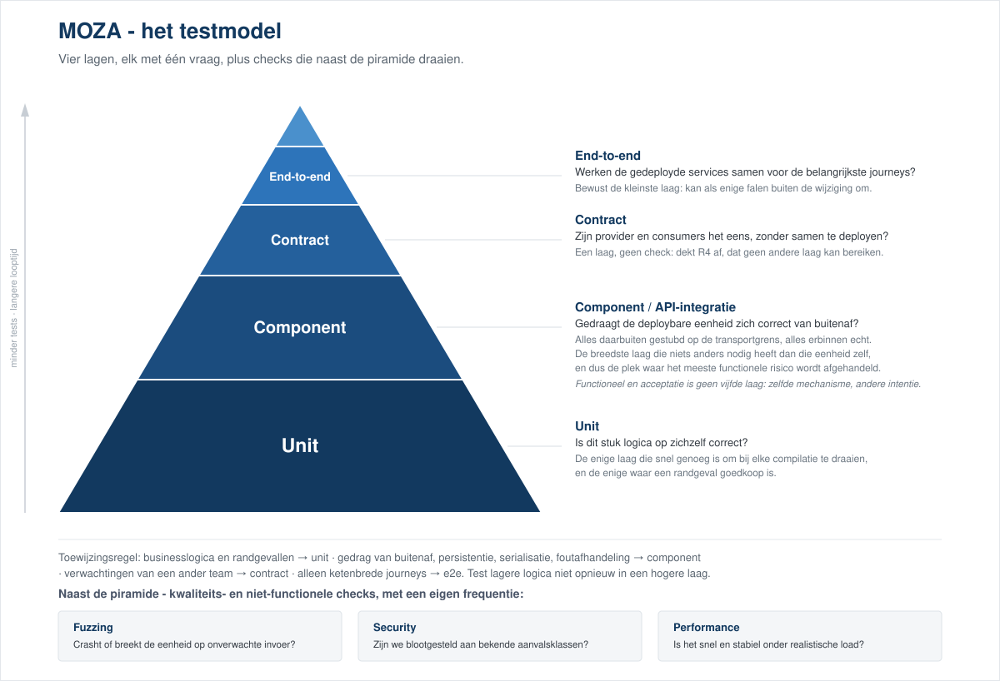
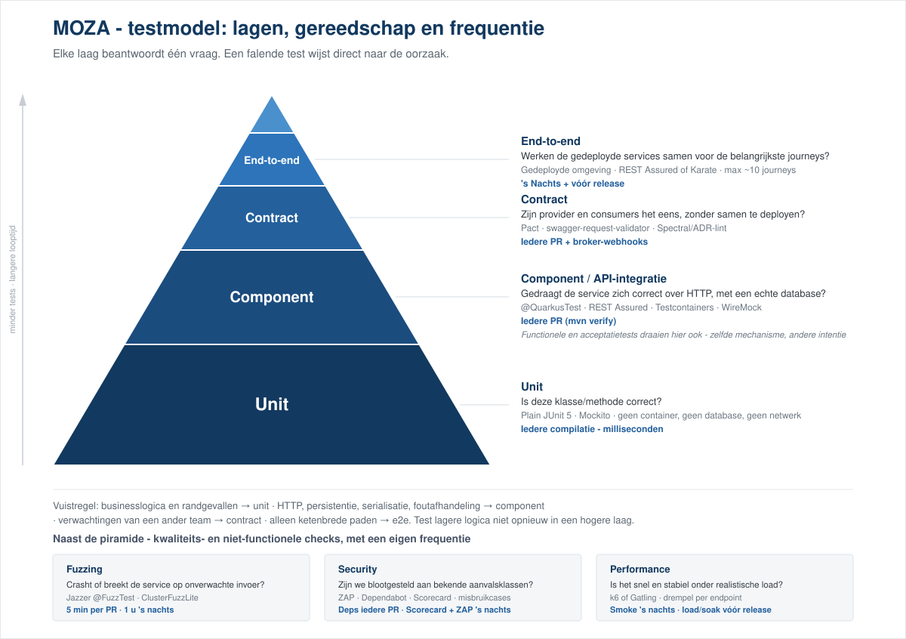

## Testen

Dit hoofdstuk beschrijft hoe er binnen MOZA getest wordt en bestaat uit verschillende delen. \
Een teststrategie die voor alle MOZA-services geldt en een testplan waarin de strategie uitgewerkt is voor de backendservices.

Indien er een UI aan MOZA wordt toegevoegd dient hier een additioneel testplan voor te worden toegevoegd.

---

### Teststrategie

De teststrategie beschrijft de keuzes die bepalen waarom we testen, tegen welke risico's we die
inspanning inzetten, hoeveel test een wijziging moet dragen en wie de eigenaar is. \
Deze strategie geldt voor iedere MOZA-service.

#### Doelen

1. **Snelle, betrouwbare feedback per pull request**\
Een groene test op een PR betekent dat de wijziging, zonder aparte verificatiestap achteraf, veilig gemerged kan worden.
2. **Onafhankelijk deploybare services**\
Contracttesten vervangt big-bang e2e-testen, zodat elke service individueel kan releasen zonder dat er een gecoördineerd testvenster geregeld dient te worden.
3. **Alles geautomatiseerd in de pipeline**\
Er is geen handmatige regressieronde. Handmatige inzet gaat naar het vinden van wat we bewust niet automatiseren.
4. **Open-source-kwaliteitssignalen**\
Gepubliceerde coverage, OpenSSF Scorecard, en een testrun die een externe contributor koud, zonder secrets, zonder toegang tot onze infrastructuur kan reproduceren.

#### Reikwijdte

Binnen scope: geautomatiseerd en exploratief testen van de MOZA-services zelf.\
Dit betreft het gedrag, de gegevens, de API's, en de afspraken die de services met elkaar en met externe partijen hebben.

Buiten scope:
- platform- en infrastructuurtesten (cluster, netwerk, backup en restore).
- uitwijk- en failover-oefeningen.
- gebruiksonderzoek en toegankelijkheid (WCAG) van eventuele burgergerichte frontends.
- de juistheid van de systemen van externe partijen zelf in tegenstelling tot afspraken met hen (zie Risicobeeld R4).

#### Risicobeeld

Het risicobeeld wordt bepaald door het feit dat MOZA-services vastleggen hoe iemand door de overheid benaderd wil worden en daarnaar handelen.\
De focus is met name op de gevallen waarin het systeem gewoon doorloopt en een verkeerde, onrechtmatige of onzichtbare uitkomst produceert. De testinspanning is daarop afgesteld.

| # | Risico | Waarom | Afgedekt door |
|---|---|---|---|
| **R1** | Verkeerd, ongewenst of herhaald contact: een bericht aan de verkeerde persoon, via een ingetrokken kanaal, of twee keer omdat een retry het dubbel aflevert. | Directe schade voor een burger en voor het vertrouwen in de overheid; niet terug te draaien zodra het verzonden is. | Unit (de beslissing), component (de routering en de idempotentie van aflevering), e2e (de journey). |
| **R2** | Onrechtmatige verstrekking of bewaring van persoonsgegevens. | Een juridische inbreuk, en een die een functionele suite vrolijk groen noemt. | Component (scopefiltering, retentiejobs), misbruikcases. |
| **R3** | Ontbrekende of onjuiste verwerkingslogging. | Verwerkingen loggen is een wettelijke verplichting. Het ontbreken ervan is onzichtbaar bij normaal gebruik. | Component, geassert als uitkomst en nooit als implementatiedetail. |
| **R4** | Een afspraak met een ander team of partij breken. | Breekt de service van een ander bij hún deploy, niet bij de onze. Laat en duur gevonden. | Contract |
| **R5** | Stille storingen. Bijv.: jobs die niet meer draaien, retries die uitblijven, callbacks die verdwijnen. | Er wordt niets rood. De schade stapelt zich op tot iemand het handmatig opmerkt. | Component met gestuurde tijd, plus monitoring. |
| **R6** | Onbeschikbaarheid of degradatie onder realistische load. | Burgers kunnen een dienst die ze moeten gebruiken niet bereiken. | Performance, tegen een vastgestelde drempel. |
| **R7** | Compromittering via niet-vertrouwde invoer. Bijvoorbeeld request forgery via door de aanroeper aangeleverde URL's, omzeilen van authenticatie, verzwakte pseudonimisering. | Extern bereikbaar en extern vindbaar. | Misbruikcases en fuzzing; **niet** door scanners alleen. |

#### Kwaliteitsattributen

Onderstaande toont hoe de kwaliteitsattributen aan bod komen.

| Kwaliteitsattribuut | Aandacht | Hoe |
|---|---|---|
| Functionele juistheid | Hoog | De hele piramide. Dit betreft het grootste deel van de inspanning. |
| Security | Hoog | Misbruikcases per uitgaande aanroep en per authenticatiepunt, fuzzing, dependency-scanning. |
| Betrouwbaarheid (fouttolerantie, herstel) | Hoog | Fault-injection in de componentlaag; geen aparte robuustheidssuite. |
| Compatibiliteit / interoperabiliteit | Hoog | Contracttesten; conformiteit aan de specificatie. |
| Performance-efficiëntie | Middel, drempelgestuurd | Alleen tegen een vastgesteld belastingmodel en budget. Zonder die twee is het een rapport, geen test. |
| Onderhoudbaarheid | Middel, indirect gemeten | Via de testsuite zelf: looptijd, flakiness, mutation score. |
| Bruikbaarheid, overdraagbaarheid | Hier niet getest | Zie *Reikwijdte* |

#### Uitgangspunten

Onderstaand staan de uitgangspunten waarop deze teststrategie is neergezet. Deze gelden ongeacht taal, framework of CI-systeem en zijn dus op iedere bestaande en nog te bouwen service van toepassing.

1. **Het mechanisme bepaalt de laag**\
   Dit is de meest dragende regel. Een map of intent van de auteur bepaalt de laag niet.\
   Een test die een container start is geen unittest omdat hij in een pakket `unit` staat.
2. **Test op de laagste laag waar het risico echt is.**\
   Een risico dat twee keer is afgedekt kost twee keer en levert maar één keer op.\
   Een hogere laag bestaat om te testen wat de lagere structureel niet kan.
3. **Elke test benoemt een storing die hij voorkomt.**\
   Als er niet aangegeven kan worden welk defect een test zou kunnen vangen dan is die test overbodig.\
   Dat een regel wordt aangeraakt is geen valide reden.
4. **Elke laag beantwoordt precies één vraag**\
   Zo wijst een rode build naar één oorzaak.
5. **Een flaky test is slechter dan geen test.**\
   Een flaky test "leert" het team dat rood niet kapot betekent. Een dergelijke les slaat over op de overige tests. Determinisme gaat boven dekking.
6. **Geautomatiseerd, tenzij.**\
   Handmatige inzet gaat naar wat automatisering structureel niet kan, het zoeken naar het probleem wat niemand gespecificeerd heeft.\
   Handmatig regressietesten maakt geen deel uit van deze strategie.
7. **Tests zijn van het team dat de service bezit.**\
   Er is geen apart testteam en geen overdrachtsmoment waarop code het verificatieprobleem van een ander wordt.
8. **Coverage is een signaal, geen doel.**\
   Het zegt wat is uitgevoerd, nooit wat is geassert.\
   Behandel een daling als een vraag, nooit als een getal dat hersteld moet worden.
9. **Elke bevinding krijgt een regressietest**\
   De regressietest wordt geschreven vóór de fix en daarna behouden.\
   Anders houdt niets dezelfde fout tegen bij de volgende herschrijving, en is er geen bewijs dat de fix het gemelde geval afdekt.
10. **De PR-suite draait koud, offline en zonder secrets.**\
   Er is geen gedeelde omgeving, geen VPN, geen credential. Dit is onderdeel van doel 4.\
   Het is ook wat de suite snel genoeg houdt om gedraaid te worden.
11. **Geen enkele test mag twee van de services samen gedeployd nodig hebben**\
   Dit geldt voor iedere laag behalve de end-to-end-laag.\
   Dit punt dient de onafhankelijkheid van doel 2.

#### Risicoklassen/Testdiepgang

Niet iedere wijziging verdient dezelfde behandeling.\
Alles licht behandelen laat de benoemde risico's onbeschermd. Alles zwaar behandelen maakt de
suite zo traag dat hij wordt omzeild, waarmee je diezelfde bescherming alsnog verliest.\
De auteur van een wijziging kiest de klasse. De reviewer toetst die keuze.

**Klasse A**: raakt een benoemd risico.\
Persoonsgegevens, contactroutering, authenticatie of autorisatie, verwerkingslogging, retentie of verwijdering, een uitgaande aanroep, of alles wat zichtbaar is in een gepubliceerde API.\
Vereist:
- unittests voor de beslislogica
- een componenttest voor het endpoint of de job
- een misbruikcase waar R7 speelt
- contractverificatie waar R4 speelt
- het risico benoemd in de pull request
- een performancecheck waar R6 speelt, dus bijv. bij wijzigingen aan een endpoint in het kritieke pad of aan een query op een groeiende tabel.

**Klasse B**: gewoon gedrag.\
Businesslogica en endpoints zonder impact op persoonsgegevens, security of contract.\
Vereist:
- unittests voor de logica
- een componenttest voor het endpoint.

**Klasse C**: geen gedragswijziging.\
Documentatie, opmaak, een dependency-bump die geen API verandert.\
Vereist:
- de bestaande suite groen.

**Is de klasse niet evident, dan is het klasse A.**\
De kosten van één wijziging teveel testen zijn te overzien. De kosten van een R1- of R2-wijziging te weinig testen zijn exponentieel hoger.

Belangrijke punten om hierin mee te nemen die niet omlaag schalen zijn uitgangspunt 9 (elke bevinding krijgt een regressietest) en de determinismeregels.\
Die gelden voor klasse C net zo goed als voor klasse A.

#### Het testmodel

Vier functionele lagen, elk met één vraag, plus kwaliteitschecks die naast de piramide draaien in
plaats van erin. Details als de mechanismen, het gereedschap en de frequenties staan in het testplan.

- **Unit** - is dit stuk logica op zichzelf correct?\
De basis, omdat dit de enige laag is die snel genoeg is om bij elke compilatie te draaien, en de enige waar een randgeval goedkoop is.
- **Component** - gedraagt de deploybare eenheid zich correct van buitenaf, met alles daarbuiten gestubd op de transportgrens?\
De breedste laag die nog niets anders nodig heeft dan die eenheid zelf, en dus de plek waar het meeste functionele risico wordt afgehandeld.
- **Contract** - zijn provider en consumers het eens zonder samen te deployen?\
Een laag en geen overkoepelende check, omdat het een risico afdekt (R4) dat geen enkele andere laag kan bereiken.\
Het is de enige test van een afspraak tussen twee partijen waarbij er maar één draait.
- **End-to-end** - werken de gedeployde services samen voor de belangrijkste journeys?\
Bewust de kleinste laag. Het is de enige die kan falen om redenen die niets met de wijziging te maken hebben.

Functioneel en acceptatietesten is **geen** vijfde laag (zie uitgangspunt 1).

Toewijzingsregel:
- Businesslogica en randgevallen → unit
- Gedrag van de eenheid van buitenaf, persistentie, serialisatie en foutafhandeling → component
- Alles wat gaat over de *verwachtingen van een ander team* → contract
- Alleen ketenbrede journeys → end-to-end.\
Test logica uit een lagere laag niet opnieuw in een hogere laag.

#### Eigenaarschap

**Het team dat de service bezit, bezit de tests**\
Dit is inclusief de tests die falen om redenen buiten hun eigen code.

**De auteur classificeert, de reviewer toetst** (zie *Risicoklassen/Testdiepgang*).\
Een pull request waarvan de risicoklasse niet uit de wijziging is af te leiden, is niet klaar voor review.

**Een rode nachtrun heeft de volgende werkdag een eigenaar.**\
Wie dat is rouleert, en dat rooster staat per service opgeschreven in plaats van verondersteld te worden.

**Een gequarantainede test is een issue met een eigenaar en een deadline.**\
Quarantaine zonder deadline is verwijderen met extra stappen, en oneerlijker, omdat de test nog in de lijst staat.

**Contracteigenaarschap is gesplitst**\
De provider bezit de specificatie, elke consumer bezit zijn eigen verwachtingen.\
Geen van beide past het artefact van de ander aan om een build groen te krijgen.

**Securitybevindingen**\
Deze worden ingediend door wie ze ontvangt en opgelost door het eigenaarsteam, dat ook de regressietest schrijft (uitgangspunt 9).

#### Omgevingen en testdata

**Geen productiedata in enige testomgeving, op geen enkele laag.**\
Testdata is synthetisch en wordt opgebouwd door de test die de data nodig heeft. Dat is om R2-redenen niet onderhandelbaar en tevens goedkoper.

**Elke test bezit zijn eigen data en assert alleen op die data.**\
Een gedeelde fixture koppelt tests die geen reden hebben van elkaar af te weten.\
En een assertie op een totaal is een assertie over elke andere test in de suite.

**De PR-laag draait op een laptop** (uitgangspunt 10).\
Heeft de test een omgeving nodig, dan zit hij in de verkeerde laag.

**Alleen de end-to-end-laag hangt van een gedeployde omgeving af**\
De e2e laag moet kunnen falen zonder een merge te blokkeren. Anders legt een omgevingsprobleem alle levering stil.

Welke omgevingen er zijn en hoe erop wordt uitgerold, staat in [Deployment](/workspace/documentation#deployment).

#### Afrondingscriteria

**Klaar om te mergen:** de verplichte PR-checks zijn groen en de wijziging draagt de behandeling die de betreffende
klasse vereist. Er is geen verificatiestap na de merge.

**Klaar om te releasen:** de nachtsuite is groen, of de gefaalde testen zijn beoordeeld op urgentie en het besluit om toch te releasen is vastgelegd met een naam eronder. Het contract van elke consumer verifieert tegen de versie die uitgaat. Er staat geen openstaande security- of R1/R2-bevinding op het gebied dat wordt gewijzigd.

**Doorlopend, los van een wijziging:** elk risico uit het *Risicobeeld* is aanwijsbaar met minstens één test die hem afdekt, per service waarvoor het risico geldt.\
De risicotabel noemt een laag. Deze eis vraagt een test. Zonder dat wordt een risico alleen geverifieerd wanneer iemand dat gebied toevallig wijzigt.\
Is een risico voor een service niet van toepassing, dan wordt dat vastgelegd in plaats van stilzwijgend overgeslagen.

**Klaar om een nieuwe service in MOZA op te nemen:** die voldoet vanaf de eerste pull request aan de
definitions of done uit het plan, in plaats van later een testsuite te krijgen. Een unitlaag
achteraf inbouwen in een service die zonder is ontworpen, is de duurste ingreep die er is.

#### Sturingsindicatoren

Een kleine set indicatoren, elk gekoppeld aan een beslissing.\
De set wordt maandelijks besproken door wie op dat moment de nachtrun-rotatie draait.\
De uitkomst is een aanpassing in de teststrategie of een issue, nooit een rapport.

| Indicator | Vertelt ons | Actie erop |
|---|---|---|
| Defecten gevonden na de merge, met de laag erbij die ze had moeten vangen. | Welke laag te dun is. | Tests toevoegen op díe laag, niet op de laag die het vond. |
| Doorlooptijd van de verplichte PR-checks (streven onder 15 minuten). | Of de componentlaag zijn budget ontgroeid is. | Gevallen omlaag duwen naar de unitlaag. |
| Aantal flaky en gequarantainede tests. | Of de suite nog vertrouwd wordt (uitgangspunt 5). | Repareren of verwijderen, nooit negeren. |
| Mutation score op de unitlaag, zodra die laag bestaat. | Of unittests asserten of alleen uitvoeren. | Asserties aanscherpen. |
| Coverage | Context bij het bovenstaande; nooit een doel op zich (uitgangspunt 8) | Vragen waarom een daling optrad. |
| Risico's zonder aanwijsbare test, per service. | Of de dekking van het risicobeeld nog klopt (zie *Afrondingscriteria*). | Streven is nul. Iedere andere uitkomst is een test schrijven of het risico expliciet niet-toepasselijk verklaren. |

De doorlooptijd van de PR-checks en het aantal gequarantainede tests komen uit de pipeline en de issuelijst; die slaan zelf alarm. De overige vier vragen een blik.\
Indicator 1 vereist één afspraak: een defect dat na de merge wordt gevonden, krijgt bij het sluiten de laag erbij die het had moeten vangen. Dat is dezelfde afweging die uitgangspunt 9 al vraagt bij het schrijven van de regressietest.

#### Governance

Deze strategie wordt, net als code, alleen aangepast met een PR inclusief een opgegeven reden.\
**Afwijken mag, stil afwijken niet.**\
Spreken de werkelijkheid en deze strategie elkaar tegen, dan wijzigt óf de strategie, óf het verschil wordt vastgelegd met een eigenaar erbij.\
Deze strategie dient door het team te worden herzien wanneer een service aan MOZA wordt toegevoegd, wanneer het platform wezenlijk verandert, en verder minstens jaarlijks.

---

### Testplan backendservices

Dit plan geldt voor alle MOZA-backendservices en is zo geschreven dat een nieuwe service deze vanaf het begin kan overnemen.\
Het is een uitwerking van de teststrategie beschreven in het eerdere hoofdstuk.\
Dit plan beschrijft **hoe** we testen: het mechanisme van elke laag, het gereedschap en de definition of done.

#### Het testmodel voor backendservices

We hanteren een testpiramide met contracttests als de naad tussen services, plus een set
overkoepelende kwaliteitschecks die naast de piramide staan in plaats van erin. Elke laag en check
beantwoordt één vraag. Een falende test moet direct naar de oorzaak wijzen.

**Functionele lagen** (de piramide):

- **Unit** - *Is deze klasse/methode correct?*
    - Tooling: JUnit 5, Mockito.
    - Wanneer: iedere PR (`mvn test`).
- **Component / API-integratie** - *Gedraagt de service zich correct over HTTP, met een echte database?*
    - Tooling: `@QuarkusTest`, REST Assured, Testcontainers (PostgreSQL), WireMock voor externe services.
    - Wanneer: iedere PR (`mvn verify`).
- **Contract** - *Zijn provider en consumers het eens, zonder samen te deployen?*
    - Tooling: Pact (broker), swagger-request-validator, Spectral/ADR-lint.
    - Wanneer: iedere PR + broker-webhooks.
- **End-to-end** - *Werken de gedeployde services samen voor de belangrijkste journeys?*
    - Tooling: gedeployde omgeving of docker compose / Kind, REST Assured of Karate, WireMock.
    - Wanneer: 's nachts + vóór release.

Functionele en acceptatietests zijn geen vijfde laag. Ze draaien in de componentlaag, met dezelfde tooling en dezelfde frequentie.\
Alleen de reikwijdte en het lezerspubliek verschillen; zie *Functionele en acceptatietests*.

**Kwaliteits- / niet-functionele checks** (overkoepelend; geen piramidelagen, met een eigen
frequentie):

- **Fuzzing** - *Crasht of breekt de service op onverwachte invoer?*
    - Tooling: Jazzer `@FuzzTest`, ClusterFuzzLite.
    - Wanneer: 5 min per PR, wekelijkse batchrun.
- **Security** - *Zijn we blootgesteld aan bekende aanvalsklassen of kwetsbare dependencies?*
    - Tooling: ZAP API-scan, Dependabot, OpenSSF Scorecard, misbruikcase-tests.
    - Wanneer: deps iedere PR; Scorecard wekelijks; ZAP 's nachts.
- **Performance** - *Is het snel en stabiel onder realistische load?*
    - Tooling: k6 of Gatling.
    - Wanneer: smoke 's nachts; load/soak vóór release.

Robuustheid (timeouts, retries, circuit breaker) is geen aparte check. Dat wordt getest binnen de
componentlaag met WireMock-fault-injection.

De regel voor waar een test thuishoort plus de redenering achter de vorm van dit model staan in
*Het testmodel* van de teststrategie.\
Kort beschreven, het *mechanisme* bepaalt de laag.\
Logica uit een lagere laag wordt niet opnieuw in een hogere laag getest.

#### Unittests
De unitlaag is de basis van de piramide en de enige laag die snel genoeg is om bij elke compilatie
te draaien.

***Wat is een unittest hier?***\
Een unittest is plain JUnit 5. Dat houdt in: geen `@QuarkusTest`, geen database, geen netwerk, geen
bestandssysteem, en hij draait in milliseconden.\
Alles wat een container nodig heeft is per definitie componentlaag, ongeacht in welk pakket het staat.

Dat betekent niet dat elke `@QuarkusTest` verkeerd is.\
Sommige dingen bestaan alleen mét container. Bijv. CDI-interceptors, fault-tolerance-annotaties, transactiegrenzen en die horen daar thuis.\
De regel is dat een klasse die géén container nodig heeft er ook geen gebruikt.

***Wat wel en niet een unittest krijgt:***\
Wél, omdat er gedrag met vertakkingen in zit:
- validators en businessregels;
- statusovergangen en beslislogica;
- datum- en periodeberekeningen (verval, retentie, backoff);
- hashing, pseudonimisering, formattering;
- mappers, mits ze pure functies zijn;
- foutvertaling: welke exceptie leidt tot welk resultaat.
- conformiteit van de code aan het contract: pariteit van paden, enums en schema's, en onveranderbaarheid van request-DTO's. Deze tests falen op structuur in plaats van op gedrag.

Niet, omdat er niets te falsifiëren valt:
- pure delegatie zonder eigen beslissingen;
- gegenereerde code (OpenAPI-clients, MapStruct-implementaties zijn getest via hun mapper-contract,
  niet regel voor regel);
- configuratie, getters en setters;
- framework-gedrag - dat wordt niet opnieuw getest.

***Ontwerpeisen die de unitlaag mogelijk maken:***\
Deze staan hier omdat het staande eisen zijn voor iedere service, ook een service die nog niet bestaat.\
Testbaarheid is een ontwerpeigenschap die je niet achteraf aan een suite kunt toevoegen.

- **Constructor-injectie, geen veldinjectie.**\
Een klasse met constructor-injectie is in één regel te instantiëren met test doubles.\
Bij veldinjectie is een container de enige manier om hem te vullen, en verdwijnt de unitlaag van het testmodel.
- **Repositories boven active-record.**\
Statische persistentiemethoden op entiteiten (`Entiteit.persist()`, `Entiteit.deleteAll()`) zijn niet te vervangen zonder container.\
Gebruik een injecteerbare repository zodat de service zonder database getest kan worden.
- **Tijd komt uit een geïnjecteerde `Clock`.**\
Tijd komt nooit uit `Instant.now()`, `LocalDate.now()` of `System.currentTimeMillis()` in productiecode.\
Zonder `Clock` is tijdsafhankelijke logica alleen te testen door te wachten of door data relatief aan "nu" op te bouwen.\
Het eerste is traag en het tweede is broos.
- **Wachttijden en pogingen zijn configureerbaar.**\
Retry-backoff hoort uit configuratie te komen zodat tests hem op nul kunnen zetten.\
Een foutpadtest mag geen seconden kosten.
- **Geen statische, muteerbare state.**\
Een dergelijke state maakt tests volgordeafhankelijk en parallellisatie onmogelijk.
- **Domeinobjecten zijn construeerbaar in een test.**\
Heb je reflectie nodig om een object in de juiste toestand te krijgen, dan mist het type een constructor of factory.\
Reflectie is onzichtbaar voor de compiler. Een hernoemd veld breekt de test pas tijdens het draaien.

***Test doubles***
- Mock op de grens van **collaborators die je zelf bezit**. Je eigen repositories, adapters en services.
- **Mock niet wat je niet bezit.** Voor externe HTTP-services gebruik je WireMock en Pact.\
Een mock van andermans client bevriest jouw aanname over hun gedrag zonder die te toetsen.
- **Mock geen waardeobjecten, DTO's of entiteiten.** Bouw ze gewoon.\
Als bouwen teveel werk is, is dat een signaal over het type, niet over de test.
- Eén niveau diep. Mocks die mocks teruggeven betekenen dat de klasse onder test teveel weet van de
  structuur om zich heen.

***Determinisme***
- Geen `Thread.sleep` en geen wachten op echte tijd; stuur de `Clock`.
- Geen ongeseede random of `UUID.randomUUID()` in asserties.\
Injecteer een generator of assert op vorm in plaats van waarde.
- Niet leunen op de iteratievolgorde van `HashMap`/`HashSet`, of op de volgorde waarin de database rijen teruggeeft.
- Elke test bouwt zijn eigen gegevens op en deelt niets met een andere test.\
Suites slagen met `-Dsurefire.runOrder=random`.

***Structuur, naamgeving en asserties***
- **Eén gedrag per test.** Meerdere asserties mogen zolang ze hetzelfde gedrag beschrijven.
- **De naam benoemt het gedrag, niet de methode:** `verlooptNaVervaltijd_geeftGeenToegang`, niet `testValidate2`.
- **Arrange/act/assert zichtbaar.** Desnoods met witregels; drie blokken, in die volgorde.
- **Assert op waarneembaar resultaat, niet op interactie.** `verify(...)` is voorbehouden aan de gevallen waarin de interactie *zelf* het contract is.\
  Twee legitieme categorieën: verplichte verwerkingslogging en volgorde. Volgorde is een harde eis.\
  Bijvoorbeeld dat er pas verzonden wordt nadat er is opgeslagen.\
  Noem in zo'n test in een comment waarom de interactie het contract is anders kan een volgende review hem weghalen als overspecificatie.
- **Testklassen groeien mee met de klasse eronder.** Loopt een testklasse ver uit de pas met de rest van de suite, behandel dat als een ontwerpsignaal over de klasse onder test (meestal doet die teveel) en niet als een reden om de test op te knippen.\
  Het opsplitsen van de productieklasse splitst de test vanzelf.

***Code coverage***
- **Coverage-gate**: JaCoCo `check` zit in de build en laat de PR falen onder de drempel.\
De gate moet gebonden zijn aan een fase die de CI-pipeline daadwerkelijk bereikt.\
Een gate die niet kan afgaan is geen gate.
- **Meet op LINE en BRANCH** op bundle-niveau. Niet op INSTRUCTION: dat is gevoelig voor
  bytecode-details en niet vergelijkbaar tussen services.
- **Ondergrens**: minimaal 80% line / 70% branch. Dit maakt de 80% uit [ADR-0017](/workspace/decisions#17) concreet.\
Een nieuwe service begint op het niveau dat ze bij oplevering haalt en verlaagt dat nooit. Een bestaande service die er nog onder zit groeit ernaartoe in stappen van ~5%.
- **Ratchet**: de drempel gaat alleen omhoog.
- **Gegenereerde code is uitgesloten** van de meting.
- **Coverage is een ondergrens, geen doel.** Reviewers beoordelen of de betekenisvolle branches
  getest zijn, niet of het getal is gestegen.
- **Coverage op nieuwe code**: diff-coverage-feedback per PR (Codecov of SonarQube, "coverage on new
  code ≥ 80%"), zodat de bundle-drempel geen ongeteste nieuwe code verbergt achter goed geteste oude
  code.
- **Mutatietesten** (PIT, `pitest-maven`) draaien 's nachts op `main`, niet per PR.\
Ze beantwoorden de vraag "asserten de tests eigenlijk wel iets?" en wijzen aan waar coverage hol is.\
Volg de mutatiescore; in eerste instantie geen harde gate.\
Let op de afhankelijkheid: PIT draait de suite opnieuw per mutant en is alleen bruikbaar als de unitlaag daadwerkelijk containervrij is.

***Definition of done voor de unitlaag***\
Nieuwe of gewijzigde logica heeft unittests voor het happy path én voor elke vertakking die een ander resultaat oplevert. Nieuwe klassen voldoen aan de ontwerpeisen hierboven. Constructor-injectie en een geïnjecteerde `Clock` als er tijd in het spel is voordat ze gemerged worden, niet erna.

#### Component- / API-integratietests

***Wat is een componenttest hier?***\
Een componenttest start deze service en verder niets en stuurt hem over HTTP aan via zijn eigen
API.\
Alles buiten het proces wordt op de transportgrens gestubd; de database is echt.

De eenheid onder test is de deploybare eenheid.\
Daarbinnen is alles echt: routing, filters en interceptors, JSON-serialisatie, bean-validatie, transactiegrenzen, persistentie, foutafhandeling.\
Daarbuiten is alles gestubd maar gestubd als een *proces op een socket*, niet als Java-interface.

`@QuarkusTest` op zichzelf maakt nog geen componenttest. Een `@QuarkusTest` die een service injecteert en daar een methode op aanroept is geen componenttest maar een unittest die de prijs van een container/componenttest betaalt.\
Een componenttest komt binnen via de API: REST Assured, één testklasse per controller (`*ControllerIntegrationTest`).

***Wat wel en niet een componenttest krijgt:***\
Wél:
- ieder endpoint: het happy path en elke statusklasse die het kan opleveren;
- foutafhandeling - welke exceptie leidt tot welke RFC 9457 `application/problem+json`-body, centraal geassert (`StandardErrorResponsesTest`) en per endpoint waar de mapping specifiek is.\
Diezelfde centrale test assert dat de body geen identificerend gegeven bevat dat de aanroeper heeft meegestuurd.\
Een foutmelding is de makkelijkste plek waar een identificatienummer alsnog naar buiten lekt;
- authenticatie, autorisatie en scope-filtering: elk beperkend endpoint krijgt ook een request dat geweigerd móét worden;
- transactiegrenzen en rollback - een fout halverwege mag niets achterlaten;
- gedrag dat alleen tegen een echte database bestaat: unique constraints, cascades, auditing
  (Envers), optimistic locking, en de migratieset zelf;
- gedrag dat alleen mét container bestaat: CDI-interceptors, fault-tolerance-annotaties,
  request-scoped state;
- scheduled jobs, rechtstreeks aangeroepen;
- onze afhandeling van de foutmodi van de tegenpartij: timeout, 5xx, connection reset, misvormde
  body.

Niet:
- permutaties van een businessregel. Hier één representatief geval, de rest in de unitlaag.\
  Dit is de meest voorkomende reden dat deze laag traag wordt;
- wat een ander team van ons verwacht → contract;
- het gedrag van de derde partij zelf: we testen onze afhandeling ervan, niet hun dienst;
- latency en doorvoer → performance.

**Plaatsingstoets:** Blijft de test betekenisvol als je de container weghaalt? Dan hoort hij in de unitlaag.

***Stubben***\
Stub op de transportgrens, mock nooit de gegenereerde client.\
Een componenttest die `@InjectMock` op een gegenereerde REST-client-interface zet slaat alles over wat de componentlaag hoort te bewijzen. De HTTP-call zelf, de serialisatie van request en response, de headers, de foutafhandeling op statuscodes, de fault-tolerance-annotaties én de vraag of we de spec van de ander correct interpreteren.\
Wat overblijft is een unittest met een trage applicatiestart, het slechtste van twee lagen.

Stub externe services daarom **op HTTP-niveau met WireMock** (`quarkus-wiremock`, mappings in `src/test/resources/mappings/`).\
Dat is bovendien de voorwaarde om pacts te kunnen genereren. Een gemockte interface produceert geen contract.

Stub ook de *unhappy* paden: timeouts, 5xx, misvormde bodies. Daar worden de fault-tolerance-annotaties getest (circuit breaker, retries), met WireMock-fault-injection (`withFixedDelay`, `Fault.CONNECTION_RESET`).

***OpenAPI-conformiteit***\
Elk REST Assured-request/response wordt gevalideerd tegen het live OpenAPI-document via het Atlassian `swagger-request-validator`-filter (basisklasse `OpenApiValidationTest`). Dit is verplicht voor nieuwe controllertests: erf van de basisklasse.

De waarde hangt af van hoe de spec tot stand komt, en is het grootst waar hij met de hand onderhouden wordt:

- **Spec gegenereerd uit annotaties:** de spec volgt de code, dus de validator controleert vooral zelfconsistentie.\
  Het echte specrisico ligt dan bij Spectral en `oasdiff`.
- **Spec handgeschreven** (`mp.openapi.scan.disable=true`): dan kan de spec écht van de implementatie
  afwijken, terwijl consumers er hun client uit genereren. In dit geval is deze validatie de enige bewaker van het verschil tussen spec en implementatie" en dus een must-have.

***Database en migraties***
- **Een echte PostgreSQL in de tests, geen H2.** Welke van de twee mechanismen je kiest, Testcontainers of een embedded PostgreSQL als child-proces van de test-JVM, hangt af van de vraag "heeft de CI-runner Docker?". Beide voldoen, leg de keuze per service vast.\
H2 test niet het PostgreSQL-dialect, de Flyway-SQL of het Envers-gedrag dat daadwerkelijk geleverd wordt.
- **Flyway staat aan in de tests.** Draait de test tegen een schema dat Hibernate uit de entiteiten
  bouwt, dan is de migratieset die we deployen door geen enkele test uitgevoerd.\
  Dit weegt extra zwaar wanneer migraties in productie buiten de applicatie om worden aangebracht
  (`migrate-at-start=false` met `schema-management.strategy=validate`): dan is de migratie een
  deployrisico in plaats van een testdetail.

***Testdata, isolatie en jobs***
- Testdata via **builder-helpers**, geen gedeelde SQL-fixtures. Elke test maakt de data die hij
  nodig heeft, met waarden die uniek zijn voor die test.
- **Ruim niet op door gedeelde tabellen leeg te maken.** Een `deleteAll()` in een `@AfterEach` is
  globale, muteerbare state. Die maakt de uitvoeringsvolgorde betekenisvol, maakt parallellisatie
  onmogelijk en verbergt tests die stilzwijgend op de restanten van een andere test leunen.\
  Ruim op wat je zelf hebt aangemaakt, of laat een teruggedraaide transactie dat doen.
- **Assert op je eigen data, nooit op totalen.** "Drie rijen in de tabel" is ook een assertie over
  elke andere test.
- **Scheduled jobs test je door de jobmethode aan te roepen, niet door te wachten.** Zet de scheduler in tests uit en roep de job expliciet aan met een vaste `Clock`. Wachten op een cron-trigger is traag en niet-deterministisch.
- **Voor werkelijk asynchroon gedrag gebruik je Awaitility** met een expliciete timeout en nooit `Thread.sleep`.
- **Logboek Dataverwerking (LDV)**: verwerkingslogging is een wettelijke verplichting, geen feature.\
  Leg per service vast welke verwerkingen gelogd moeten worden en dek dat af met minstens één
  componenttest waarin LDV aanstaat. Dit is het schoolvoorbeeld van "de interactie *is* het
  contract".\
  Zie ook [ADR-0007](/workspace/decisions#7) en [ADR-0010](/workspace/decisions#10).

***De laag betaalbaar houden***\
Een componenttest kost ordes van grootte meer dan een unittest en is tevens de laag die bepaalt of de
PR-build onder de 15 minuten blijft.\
Twee dingen blazen hem op:

- **Herstarts van de applicatie.** Quarkus hergebruikt één draaiende applicatie over alle `@QuarkusTest`-klassen heen maar een klasse met een andere configuratie - een `@TestProfile`, een andere `@QuarkusTestResource` - dwingt een herstart af.\
Groepeer de klassen die dezelfde configuratie nodig hebben en behandel elk extra profiel als een kostenpost en niet als een detail.
- **Permutaties van businessregels in deze laag.** Een parameterized test met twintig gevallen over HTTP zijn twintig volledige requests waar de unitlaag microseconden nodig heeft.

Wachttijden in productiecode zijn configureerbaar en staan onder `%test` op vrijwel nul.

***Definition of done voor de componentlaag***\
Een nieuw of gewijzigd endpoint:
- heeft een componenttest die over HTTP gaat;
- erft van `OpenApiValidationTest`;
- heeft het happy path plus de foutresponses die het endpoint kan geven afdekt;
- stubt zijn uitgaande calls met WireMock, inclusief minstens één foutmodus van de tegenpartij.

#### Contracttesten

***Wat is een contracttest hier?***\
Een contracttest toetst een afspraak tussen twee partijen terwijl er maar één van beide draait.\
Dat is wat onafhankelijk deployen mogelijk maakt. Zonder contracttests kun je alleen bewijzen dat provider en consumer nog op elkaar passen door ze samen te deployen.\
Dat zou een e2e-test bij elke PR betekenen wat precies is wat we proberen te vermijden (doel 2 van de strategie).

Een contracttest is geen functionele test van een van beide kanten. Een contracttest assert *vorm en afspraak*: dit veld bestaat, met dit type, onder deze voorwaarde.\
Of bijvoorbeeld een bedrag correct berekend wordt is een zaak van de unitlaag.

Er zijn twee complementaire vormen. Hou beide aan.

***Provider en eigen specificatie (OpenAPI-conformiteit)***\
Via swagger-request-validator. Lint daarnaast het OpenAPI-document tegen de **NL GOV API Design
Rules 2.1.0** met Spectral + de Logius ADR-ruleset in de PR-pipeline. Zo worden schendingen van de
designregels vóór de review gevangen.

***Consumer en provider (Pact)***\
De naad tussen twee MOZA-services.

- **De consumer is eigenaar van het pact.**\
De consumer schrijft de interacties en bepaalt wat erin staat; de provider voegt er niets aan toe. Een provider die wil weten of een veld nog gebruikt wordt, vraagt het de broker.
- **Een pact bevat alleen wat de consumer leest.**\
Losse matchers (types, geen letterlijke waarden) waar mogelijk. Assert nooit een veld dat de consumer negeert. Elk geassert veld is een veld dat de provider niet meer kan wijzigen.
- **Provider states zijn het enige setup-mechanisme.**\
Benoem ze naar de toestand en niet naar de test ("er bestaat een partij met twee contactgegevens"). Ze moeten idempotent en goedkoop zijn en niet afhangen van een eerder uitgevoerde interactie.
- **Foutgevallen horen alleen in een pact als de consumer ze anders afhandelt.**\
Een 404 die de consumer omzet in een leeg resultaat is een contract. Een generieke 500 niet.

***Volgorde van invoering***\
Een Pact Broker is **niet** de eerste stap. Zonder echte consumertests is er niets om te publiceren.\
En een provider die zijn eigen pact schrijft en tegen zichzelf verifieert bewijst niets.

1. **De componenttests van de consumer stubben op HTTP-niveau.**\
Dit is de harde voorwaarde: een `@InjectMock` op de gegenereerde client kan geen pact opleveren.
2. **De consumer schrijft Pact-consumertests** (`pact-jvm` consumer JUnit 5) voor zijn client van de
   andere service.\
   De consumer bepaalt wat erin hoort, niet de provider.
3. **De provider verifieert.**\
Een `PactProviderVerificationTest` toetst elke interactie tegen de draaiende service met `@State`-methoden voor het klaarzetten van data.
4. **Introduceer een Pact Broker** (self-hosted `pact-broker`-container of PactFlow) in plaats van
   pact-bestanden tussen repo's te kopiëren:
   - De consumer-CI publiceert pacts bij elke build, getagd met branch en consumerversie (git-SHA).
   - De provider-CI verifieert pacts uit de broker (`@PactBroker`) en publiceert de verificatieresultaten (`pact.verifier.publishResults=true` - alleen vanuit CI, nooit lokaal).
   - Een broker-**webhook** triggert de provider-verificatieworkflow zodra een consumer een gewijzigd pact publiceert zodat incompatibiliteiten direct zichtbaar worden en niet pas bij de volgende providerbuild.
   - Deployments worden per omgeving bewaakt met **`can-i-deploy`**: een service mag alleen deployen als de broker bevestigt dat al haar contracten geverifieerd zijn tegen wat daar draait.
5. **Genereer clients niet uit een gekopieerde spec.**\
Een handmatig overgenomen OpenAPI-bestand drijft af zonder dat iets dat signaleert. De gegenereerde client hoort te komen uit een spec die aantoonbaar bij een geverifieerde providerversie hoort.

***Afhankelijkheden buiten ons beheer***\
Voor externe partijen waar we de provider niet beheren en niet kunnen afstemmen (bijvoorbeeld
NotifyNL): beheerde WireMock-stubs plus een periodieke live smoke-check. Die smoke-check vereist
credentials in CI en hoort in de nachtelijke laag, niet in de PR-laag.

Is de andere kant een endpoint dat de *beller* aanlevert (een callback-URL)? Dan is dat primair een
securityvraagstuk en geen contractvraagstuk - zie *Security- en robuustheidstesten*.

***Breaking changes***\
De OpenAPI-specificatie is geversioneerd (`/api/<service>/v1`). Een diff van het OpenAPI-document in de PR-pipeline (bijv. `oasdiff`) signaleert breaking changes en laat de build falen tenzij het majorversienummer wordt opgehoogd.\
Pact-verificatie is het vangnet dat bewijst dat geen *feitelijke* consumer breekt.

***Definition of done voor de contractlaag***\
Een wijziging aan het request of de response van een endpoint met een bekende consumer is pas klaar als het consumer-pact is bijgewerkt en geverifieerd, en `oasdiff` geen ongeversioneerde breaking change meldt.

#### Functionele en acceptatietests

Functionele dekking van businessregels zit primair in de componentlaag.

***Wat is een acceptatietest hier?***\
Mechanisch is het een componenttest: dezelfde `@QuarkusTest`, dezelfde PR-laag, dezelfde tooling.\
Het verschil zit in reikwijdte en lezerspubliek. Een componenttest assert één endpoint.\
Een acceptatietest volgt een voor de gebruiker zichtbare journey over meerdere endpoints en assert de uitkomst die de user story belooft.

Omdat "functioneel" een intentie beschrijft en geen mechanisme is dit geen aparte suite en krijgt het geen aparte looptijd.\
Eén acceptatietest per story, niet per endpoint. De test hoort te lezen als het acceptatiecriterium: given/when/then-gestructureerde REST Assured-tests (of Karate als niet-ontwikkelaars ze moeten kunnen lezen/schrijven; kies éénmalig, teambreed).\
Typische onderwerpen: een verificatieflow inclusief verloop, het gedrag van een retentie-/opschoningsjob,
autorisatie- en scope-gebaseerde filtering, en varianten van een flow die wezenlijk andere paden volgen.

***Exploratory testing***\
Getimeboxt en charter-gestuurd: leg vóór aanvang vast welk gebied je onderzoekt, welk risico en
binnen welke tijd, en achteraf de bevindingen.\
Dit is de enige bewust handmatige activiteit. Waar de pipeline per PR een eigen omgeving deployt, doe je die sessie op een *wijziging* in plaats van pas per release op een gedeelde omgeving.

Bevindingen worden geautomatiseerde tests in de laag waar het defect zit.\
Een validatiefout die je al verkennend vindt wordt een unittest, geen e2e-journey.

#### End-to-end-tests

***Wat is een e2e-test hier?***\
Twee of meer onafhankelijk gedeployde services, over een echt netwerk, tegen een gedeployde omgeving met niets in-process.\
Hij bewijst wat geen enkele andere laag kan: dat los gebouwde artefacten samenwerken met de echte configuratie, de echte secretsinjectie, echt netwerk en een echte database.

Die definitie heeft gevolgen die de andere lagen niet hebben:
- er kan niets in-process gestubd worden;
- de data kan tussen tests niet gereset worden;
- de test heeft geen toegang tot de binnenkant van de services;
- de omgeving wordt met anderen gedeeld.

***Welke journeys in aanmerking komen***\
Toelatingscriterium: **welke storing vangt deze journey die geen enkele test van één losse
service kan vangen?** Is daar geen antwoord op, dan is het geen e2e-test.\
Een component- of contracttest vangt dat goedkoper en wijst direct naar de oorzaak.\
Een journey verdient zijn plek alleen door een grens over te gaan die de andere lagen niet zien:
- deployconfiguratie;
- secretsinjectie;
- netwerkbeleid;
- service discovery;
- of de volgorde van twee services.

**Maximaal ~10 journeys.** Happy path plus de één of twee foutpaden die over servicegrenzen heen gaan.\
Journeys die nog niet gebouwd zijn horen pas in de suite als de code er is en niet als vooruitgeschoven skeleton.\
Externe partijen blijven ook in e2e gestubd. Alleen de periodieke live smoke-check raakt de echte dienst.

***Omgeving en testdata***
- **Draai bij voorkeur tegen een bestaande gedeployde omgeving** in plaats van een eigen compose-stack op te tuigen.\
Die omgeving deployt al automatisch en test daarmee meteen de echte configuratie- en secretsinjectie.\
Een eigen repo (bijv. `moza-e2e-tests`) blijft nuttig als *plaats voor de testcode*; docker compose of Kind is de terugvaloptie voor lokaal reproduceren en voor services die nog niet gedeployd worden.
- **Elke run maakt zijn eigen data en merkt die als de zijne**, met een run-id in de identificatoren, en ruimt die daarna op.\
Een run mag niet aannemen dat de omgeving leeg is, en ook niet dat hij er alleen op zit.
- **Assert nooit op totalen of op "het laatste record".**\
Assert op wat deze run heeft aangemaakt.
- **Geen handmatige seeding.**\
Heeft een journey data nodig, dan maakt de journey die via de API aan. De suite leunt anders stilzwijgend op een toestand die iemand er ooit met de hand in heeft gezet.
- **Credentials komen uit CI-secrets**\
Credentials staan nooit in de repo.

***Flakiness***\
Nultolerantie: een flaky e2e-test gaat dezelfde dag in quarantaine en wordt binnen een sprint
gerepareerd of verwijderd.\
Failures melden zich in het teamkanaal met de logs van alle containers erbij.

**Geen directe retries!** Retries maskeren precies waar deze laag voor bestaat.\
Een retry op journeyniveau mag alleen met een vastgelegde reden en een issue erop.\
Een generieke retry over de hele suite mag niet want die kan een echt intermitterend defect omzetten in een groene build.

***Frequentie en definition of done***\
Draait 's nachts tegen `main`-images en als releasegate.\
Draait niet per PR. Contracttests zijn het per-PR-alternatief voor e2e.\
Een journey komt pas in de suite als hij na zichzelf opruimt en een eigenaar met naam heeft.

#### Security- en robuustheidstesten

***Wat is een misbruikcase?***\
Tooling-gedreven checks (fuzzing, DAST, dependency-scanning) vinden generieke problemen.\
Ze vinden **niet** dat een endpoint precies doet wat het volgens de code hoort te doen, maar voor iemand die
dat niet zou mogen.

Een misbruikcase is een test geschreven vanuit het doel van de aanvaller, en hij assert de
weigering.\
Een gewone test assert wat het systeem doet voor iemand die het gebruikt zoals bedoeld terwijl een misbruikcase assert wat het weigert voor iemand die dat niet doet.\
Mechanisch is het een gewone componenttest maar wat verschilt is het perspectief, niet de tooling. Reken op één test per uitgaande call en per authenticatiepunt.

***De vier categorieën die in elke MOZA-service terugkomen:***

1. **Uitgaande calls naar door de beller aangeleverde URL's.**\
  Neemt de service een callback-URL over en doet daar later een request naartoe, dan is dat ongevalideerd een server-side-request-forgery-primitive richting interne adressen en cloud-metadata-endpoints.\
  Fuzzing, Dependabot noch een ZAP-scan vindt dit.\
  Vereist: een allowlist (schema, host, poort) plus tests die aantonen dat `http://localhost`, privé-IP-ranges en link-local adressen geweigerd worden.
2. **Authenticatie op publieke endpoints.**\
  Voor elk endpoint met een token of sleutel: ontbrekend, leeg, verkeerd en bijna-goed token als expliciete testset, plus de assertie dat de vergelijking constant-time is.
3. **Secrets en pseudonimisering.**\
  Waar een keyed HMAC of vergelijkbare constructie een pepper of sleutel uit configuratie haalt: test dat de service niet start, of hard faalt, bij een lege waarde in het productieprofiel. Een ontbrekend secret mag nooit stilzwijgend tot een zwakke hash leiden.
4. **Persoonsgegevens in gewone logging.**\
  Dit is het spiegelbeeld van de verwerkingslogging uit R3: daar moet je bewijzen dát je logt, hier dat je het *niet* doet.\
  Een identificatienummer in een gewone logregel of in een stacktrace is onrechtmatige bewaring (R2), en het valt bij normaal gebruik niemand op.\
  Vereist: een test die een verzoek met een bekend identificerend gegeven afvuurt en assert dat het niet in de opgevangen logoutput voorkomt, op het happy path én op het foutpad. Logt de service een identificerend gegeven bewust, dan hoort dat via de LDV-weg te lopen en niet via de applicatielog.

***Overige checks***
- **Fuzzing**:\
  Jazzer `@FuzzTest` in de normale suite, ClusterFuzzLite per PR, batchrun wekelijks.\
  Nieuwe request-DTO's en parsers krijgen een fuzz-target als onderdeel van de definition of done.\
  Publieke endpoints die extern aangeleverde JSON verwerken zijn de eerste kandidaten.
- **Dependencies**\
  Dependabot + dependency-graph-submission.\
  Documenteer security-pins in `pom.xml` en herbeoordeel ze bij elke platformupgrade.
- **Reproduceerbare builds**\
  Geen SNAPSHOT-dependencies op de hoofdbranch. Die maken de build niet-reproduceerbaar en botsen met doel 4 van de strategie (externe contributors moeten `./mvnw verify` koud kunnen draaien).
- **DAST**\
  OWASP ZAP API-scan (`zap-api-scan.py`, aangestuurd door de OpenAPI-spec) 's nachts tegen de gedeployde omgeving.\
  Dit is goedkoop toe te voegen en complementair aan fuzzing met security-specifieke regels.
- **OpenSSF Scorecard**\
  Behandel scoreverslechteringen als buildissues.
- **Secrets in tests**\
  Geen. Alles dat echte credentials nodig heeft hoort in de nachtelijke/e2e-laag, niet in de PR-laag.

***Elke bevinding krijgt een regressietest***\
Een bevinding uit een scan, een fuzz-crash, een pentest of een externe melding krijgt een test
die haar reproduceert **vóór** de fix, en die test blijft daarna staan met een verwijzing naar de
bevinding.\
Zonder die test houdt niets tegen dat dezelfde fout bij een latere herschrijving terugkomt en is er geen bewijs dat de fix het gemelde geval daadwerkelijk afdekt.

#### Performancetesten

Passend bij de levensfase (development/POC, op weg naar productie).

***Wat is een performancetest hier?***\
Een performancetest assert een drempel. Zonder drempel is regressie moeilijk aan te tonen.\
Drie dingen liggen vast vóór het eerste script geschreven wordt:

1. **het workloadmodel**: welke endpoints, in welke verhouding, met welke aankomstsnelheid, tegen welk datavolume;
2. **het budget per endpoint**: p95-latency en foutpercentage, als assertie die de run laat falen;
3. **de omgeving**: welke, en de regel dat getallen alleen vergeleken worden tussen runs daarop.

***Twee modi***\
k6 of Gatling met een scenario per kritiek endpoint:
1. ***Smoke-perf*** - 's nachts, lage load, assert op p95-latency- en foutpercentagedrempels.\
Vangt grove regressies (N+1-queries, per ongeluk synchrone calls) vroeg af.
2. ***Load/soak*** - vóór mijlpalen, realistische volumes afgestemd met het ontvangende platform; een soak-run om lekken (heap, connecties) op te sporen via de Prometheus-metrics.

***Waar het scenario rekening mee moet houden***
- **Neem uitgaande calls binnen een transactie expliciet op in het soak-scenario.**\
  Doet een service een HTTP-call, zeker met retries en backoff, binnen een actieve transactie, dan blijft een
  databaseconnectie voor de volle duur open en kan de pool onder load uitgeput raken.\
  Dat is precies het defect dat geen enkele functionele test vindt en een soak-run wél.\
  Bouw het scenario met een trage of niet-antwoordende tegenpartij.
- **Realistisch datavolume.** Een tabel met honderd rijen laat nooit een N+1 of een ontbrekende index zien.\
  Schaal de dataset naar wat productie naar verwachting bevat.
- **Warm-up.** De JVM moet eerst JIT-compileren voordat de getallen iets betekenen.\
  Gooi de eerste minuut weg in plaats van erop te asserten.
- **Meet aan beide kanten.** Latency aan de clientkant zegt wat de consument merkt.\
  De eigen Prometheus-metrics van de service (poolbezetting, GC, aantal connecties) zeggen waarom.\
  Een soak-run zonder dat tweede is onleesbaar.

Performancebudgetten staan in de repo naast de scripts, geversioneerd als code. Een overschreden
budget is een buildfailure, geen aantekening. Is het nieuwe getal het bedoelde getal, dan wijzigt het
budget in dezelfde PR als de code, bewust en zichtbaar.

#### Pipeline-integratie

Per **pull request** (verplichte checks, doel < 15 min doorlooptijd):

1. Build + unit- + componenttests (`mvn -B verify`) met Testcontainers PostgreSQL
2. JaCoCo-bundle-gate + diff-coverage-rapport op de PR
3. Pact-providerverificatie (uit de broker) / consumer-pact genereren + publiceren
4. Spectral ADR-lint + `oasdiff` breaking-change-check op het OpenAPI-document
5. ClusterFuzzLite PR-fuzzing (5 min)
6. Scorecard / dependency review

Let op de fasebinding: de pipeline moet een Maven-fase draaien die álle gates bereikt.\
Stopt de build op `package`, dan draaien de failsafe-ITs niet en wordt een aan `verify` gebonden coverage-gate nooit geëvalueerd.

's Nachts op `main`: mutatietesten (PIT), e2e-suite, ZAP API-scan, smoke-perf, 1 u batch-fuzzing.\
Release: `can-i-deploy` tegen de doelomgeving, volledige e2e, loadtest als de wijziging daarom vraagt.

Pipeline-principes: testresultaten (Surefire-/Failsafe-XML, JaCoCo, Pact, k6) worden als CI-artifacts gepubliceerd.\
Een rode nachtelijke build wordt de volgende ochtend getriageerd en kan releases blokkeren.\
Tests in quarantaine worden als issue gevolgd met een eigenaar en een deadline.

> Zie [Deployment](/workspace/documentation#deployment) voor de omgevingen en de gebruikte CI/CD-tooling.

#### Grondregels voor testautomatisering

- **De scheiding die telt is container tegen geen container.**\
De containervrije laag heeft een eigen ingang (`-Dgroups=unit`) zodat een ontwikkelaar haar in seconden draait en PIT er alleen op kan mikken; `verify` draait alles.\
Dwing die scheiding af in plaats van haar te benoemen: een architectuurtest assert dat geen klasse in de unitselectie een container start. Een handmatig label liegt zodra iemand er later een `@QuarkusTest` bij zet (uitgangspunt 1).\
`*IT` en failsafe zijn gereserveerd voor tests tegen het gebouwde containerimage (entrypoint, JVM-flags, non-root-gebruiker, health-endpoints) en bestaan pas zodra die er zijn.
- **Traag of extern afhankelijk is een derde categorie.**\
Een suite die een externe dienst raakt of minuten kost, krijgt een eigen tag en een expliciete pipeline-stage, los van de container-scheiding hierboven.\
Die stage draait 's nachts en niet per PR. Dit is ook waar alles landt wat echte credentials nodig heeft.
- **Stub op de transportgrens.** Mock nooit een gegenereerde REST-client-interface in een componenttest.\
  Mocks op interfacegrenzen horen in de unitlaag.
- **Determinisme**: geen sleeps in tests.\
  Gebruik Awaitility voor asynchrone asserties (scheduled jobs, callbacks)\
  Injecteer een vaste `Clock` voor tijdsafhankelijke logica.
- **Wachttijden in productiecode zijn injecteerbaar** en staan in `%test` op vrijwel nul.\
  Anders sluipt de PR-suite langzaam over de 15 minuten heen.
- **Onafhankelijkheid**: elke test beheert zijn eigen data.\
  Suites slagen met `-Dsurefire.runOrder=random`.
- **Eén assertie-onderwerp per test**\
Testnamen benoemen het gedrag, niet de geteste methode.
- **Toolingcompatibiliteit met de JDK.**\
Bytecode-manipulerende tooling (Jazzer, PIT, pact-jvm) loopt achter op nieuwe JDK-releases.\
  Verifieer dat een tool op de gebruikte JDK draait vóórdat hij in de pipeline wordt toegezegd.
- **Definition of done** voor een wijziging, als verzameling van de definities per laag:
  - unittests voor nieuwe logica;
  - componenttest voor nieuwe/gewijzigde endpoints;
  - pact bijgewerkt en geverifieerd als een consumercontract wijzigt;
  - fuzz-target voor nieuwe parsers/DTO's;
  - misbruikcase-test bij een nieuwe uitgaande call of een nieuw authenticatiepunt;
  - een regressietest bij elke securitybevinding;
  - documentatie bijgewerkt.

---
