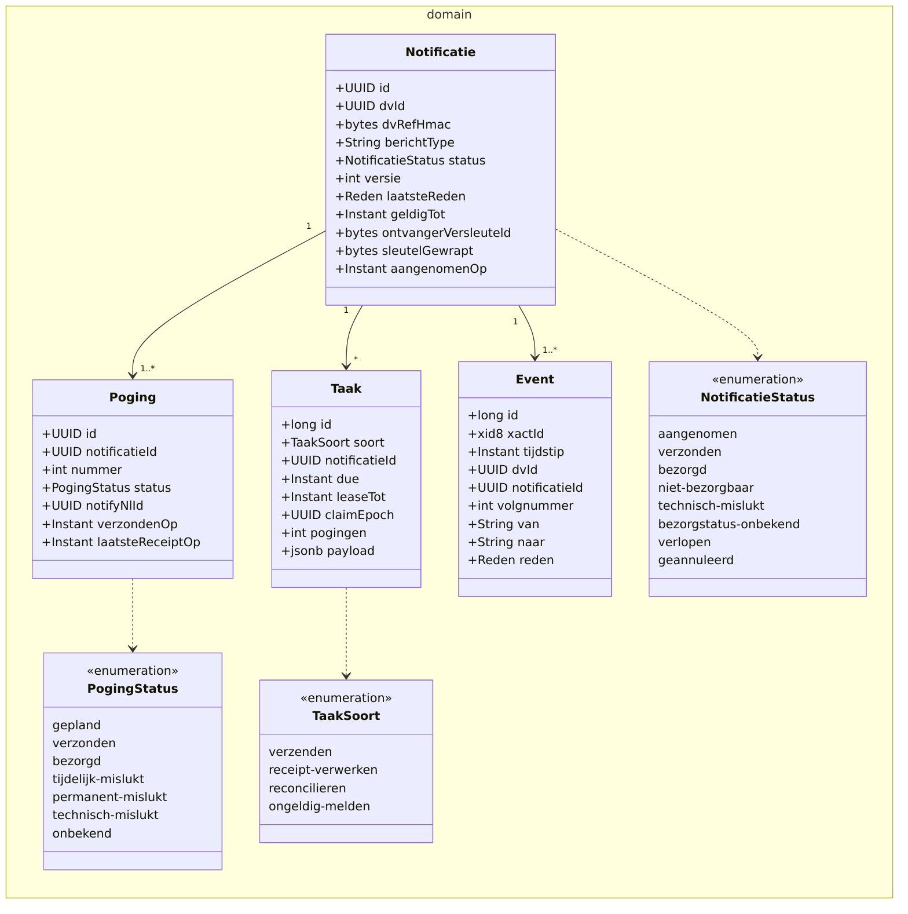
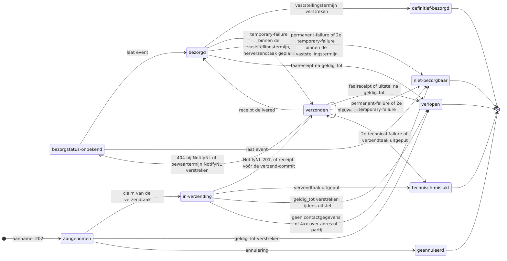
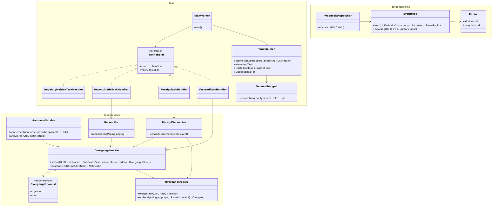
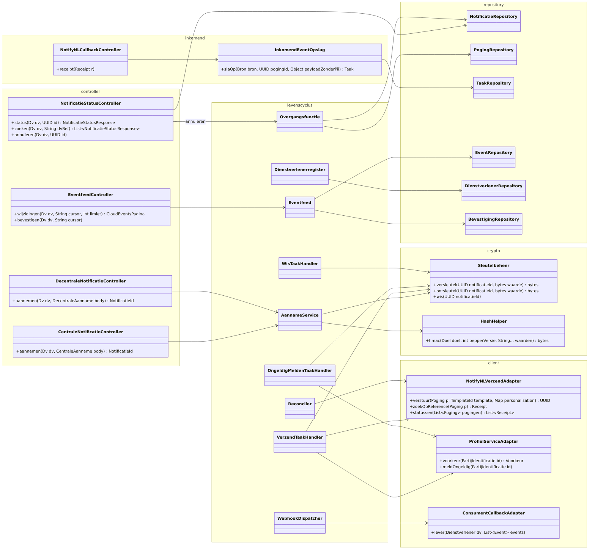

## Code

De broncode van het NMC staat op GitHub: [MinBZK/moza-notificatiemanagementcomponent](https://github.com/MinBZK/moza-notificatiemanagementcomponent).

### Technologiestack

| Component          | Technologie                                        | Versie |
|--------------------|----------------------------------------------------|--------|
| Runtime            | Java                                               | 25     |
| Framework          | Quarkus                                            | 3.35.1 |
| Build tool         | Maven                                              | -      |
| ORM                | Hibernate ORM met Panache (repository pattern)     | -      |
| Databasemigraties  | Flyway                                             | -      |
| Database           | PostgreSQL (H2 in tests)                           | -      |
| API-contracten     | SmallRye OpenAPI + OpenAPI Generator (server-interfaces en uitgaande clients) | - |
| Uitgaande JWT      | SmallRye JWT Build (NotifyNL-authenticatie)        | -      |
| Foutafhandeling    | Quarkus HTTP Problem (RFC 9457)                    | -      |
| Health             | SmallRye Health                                    | -      |
| Container image    | Jib                                                | -      |
| Verwerkingslogging | LDV-wrapper (logboekdataverwerking-wrapper)        | -      |

### Pakketstructuur

De broncode volgt een gelaagde pakketstructuur onder `nl.rijksoverheid.moz.nmc`:

| Pakket                   | Verantwoordelijkheid                                                                                     |
|--------------------------|----------------------------------------------------------------------------------------------------------|
| `controller`             | REST-endpoints van de business-API (centrale en decentrale intake) en de API-Version responsefilter      |
| `service`                | Aanname en verzending, de overgangsfunctie, de receiptverwerking en de mapping van berichttype naar NotifyNL-template |
| `domain`                 | De entiteiten notificatie, poging en event, de statussen en de toegestane overgangen                     |
| `repository`             | Toegang tot het Notificatieregister, inclusief het claimen van verlopen notificaties voor de retentiejob |
| `job`                    | Retentiejob die notificaties na de bewaartermijn in batches verwijdert, met cascade naar de pogingen      |
| `client.notifynl`        | Verzendadapter naar NotifyNL, inclusief de JWT-opbouw per aanroep                                        |
| `client.profielservice`  | Adapter die de contactvoorkeur bij de Profielservice ophaalt                                             |
| `client.consumentcallback` | Statusterugkoppeling naar de aanroeper als CloudEvents-webhook met retries                             |
| `notifynlcallback`       | Inkomende NotifyNL delivery receipts: controller en bearer-token-authenticatiefilter                     |
| `helper`                 | Pseudonimisering met keyed HMAC en hulpfuncties voor RFC 9457-responses                                  |

De takentabel, de herverzending, de reconciler, de eventfeed en het status-endpoint uit hoofdstuk 6 zijn nog niet gebouwd.

### Klassen (doelontwerp ADR 0024)

De componenten uit hoofdstuk 6 werken uit tot de klassen hieronder. Dit is het doelontwerp van [ADR 0024](/workspace/decisions#24); de pakketstructuur hierboven beschrijft de huidige code. Klassen die blijven bestaan houden hun naam (`NotifyNLVerzendAdapter`, `ProfielServiceAdapter`, `NotifyNLCallbackController`, `ConsumentCallbackAdapter`, `HashHelper`, `NotificatieRepository`). De orchestrator `NotificatieService` vervalt; zijn verantwoordelijkheden verdelen zich over de aanname, de overgangsfunctie en de taakhandlers. De mechanismen hieronder (`SKIP LOCKED`, `xid8`, de trigger, partities) zijn niet op H2 te testen; de tests van het doelontwerp draaien op een embedded PostgreSQL.

| Component (hoofdstuk 6) | Klassen |
|---|---|
| Centrale-notificatie-controller, Decentrale-notificatie-controller | `CentraleNotificatieController`, `DecentraleNotificatieController`, `AannameService`, `Templateregister` |
| Dienstverlenerregister | `Dienstverlenerregister`, `Dienstverlener`, `DienstverlenerRepository` |
| Notificatiestatus-controller | `NotificatieStatusController` |
| Notificatiestatus-feed | `EventfeedController`, `Eventfeed`, `Cursor`, `Bevestiging` |
| Afleverstatus-callback | `NotifyNLCallbackController`, `InkomendEventOpslag` |
| Statusbeheer | `Overgangsfunctie`, `Overgangsregels`, `OvergangUitkomst`, `ReceiptVerwerker` |
| Verzendverwerker | `TaakWorker`, `TaakClaimer`, `Verzendbudget`, `TaakHandler` en zijn negen implementaties, `Verwerkingslog` |
| Afleverstatus-navraag | `Reconciler` |
| Notificatiestatus-webhook | `TerugkoppelTaakHandler`, `WebhookDispatcher`, `Webhookpositie`, `ConsumentCallbackAdapter` |
| Sleutelbeheer | `Sleutelbeheer`, `HashHelper` |
| Profielservice-adapter | `ProfielServiceAdapter` |
| Verzendadapter | `NotifyNLVerzendAdapter` |

#### Domein

De entiteiten volgen de tabellen één op één. `Notificatie` draagt de status en een versie die per overgang met één oploopt; het volgnummer van het event is gelijk aan die versie. `Event` draagt de transactie-id (`xid8`) waarop de feed leest onder het watermerk, zodat een cursor nooit een laat gecommit event overslaat; de feed garandeert geen volgorde binnen één notificatie, de dienstverlener verwerkt per notificatie op volgnummer. `Taak.notificatieId` is leeg voor taken per dienstverlener of per systeem. `Dienstverlener` is het register uit de onboarding; `Bevestiging` is de feedcursor die de dienstverlener zelf schrijft en `Webhookpositie` de leverpositie van de webhook. Contactgegevens en de waarden voor de personalisation staan versleuteld met een sleutel per notificatie; het eventlog en de `Taak`-payload bevatten geen contactgegevens, identificerende nummers of berichtinhoud. Het eventlog is pseudoniem en herleidbaar door de dienstverlener en wordt als persoonsgegeven behandeld.



<details>
    <summary>Zie Mermaid code</summary>

    ```mermaid
    classDiagram
        direction LR
        namespace domain {
            class Notificatie {
                +UUID id
                +UUID dvId
                +bytes dvRefHmac
                +int pepperVersie
                +bytes payloadHash
                +String berichtType
                +NotificatieStatus status
                +int versie
                +Reden laatsteReden
                +Instant geldigTot
                +UUID batchId
                +bytes ontvangerVersleuteld
                +bytes personalisatieVersleuteld
                +bytes sleutelGewrapt
                +Instant aangenomenOp
            }
            class Poging {
                +UUID id
                +UUID notificatieId
                +int nummer
                +PogingStatus status
                +UUID notifyNlId
                +List~UUID~ notifyNlIdDuplicaten
                +Instant verzondenOp
                +Instant receiptVoltooidOp
            }
            class Taak {
                +long id
                +TaakSoort soort
                +UUID dvId
                +UUID notificatieId
                +Instant due
                +Instant leaseTot
                +long claimEpoch
                +int pogingen
                +String traceId
                +TaakStatus status
                +jsonb payload
            }
            class Event {
                +long id
                +xid8 xactId
                +Instant tijdstip
                +UUID dvId
                +UUID notificatieId
                +int volgnummer
                +String van
                +String naar
                +Reden reden
            }
            class Dienstverlener {
                +UUID id
                +String oin
                +List~String~ berichttypen
                +int quotumPerDag
                +URL webhook
                +Duration bevestigingstermijn
                +Duration maxCursorleeftijd
                +String beheerkanaal
            }
            class Bevestiging {
                +UUID dvId
                +Cursor cursor
                +Instant bevestigdOp
            }
            class Webhookpositie {
                +UUID dvId
                +Cursor cursor
                +int mislukkingen
                +Instant gepauzeerdTot
            }
            class Budgettijdvak {
                +String notifyService
                +Instant tijdvak
                +int tokens
            }
            class Reden {
                <<enumeration>>
                onbereikbaar
                geen-contactgegevens
                verlopen
                geannuleerd
                technisch
            }
            class NotificatieStatus {
                <<enumeration>>
                aangenomen
                in-verzending
                verzonden
                bezorgd
                definitief-bezorgd
                niet-bezorgbaar
                technisch-mislukt
                bezorgstatus-onbekend
                verlopen
                geannuleerd
            }
            class PogingStatus {
                <<enumeration>>
                gepland
                verzonden
                bezorgd
                tijdelijk-mislukt
                permanent-mislukt
                technisch-mislukt
                onbekend
            }
            class TaakSoort {
                <<enumeration>>
                verzenden
                receipt-verwerken
                reconcilieren
                bezorging-vaststellen
                terugkoppelen
                ongeldig-melden
                wissen
                controle
                onderhoud
            }
            class TaakStatus {
                <<enumeration>>
                open
                mislukt
            }
        }
        Notificatie "1" --> "0..*" Poging
        Notificatie "1" --> "*" Taak
        Notificatie "1" --> "1..*" Event
        Notificatie ..> NotificatieStatus
        Poging ..> PogingStatus
        Taak ..> TaakSoort
        Taak ..> TaakStatus
        Notificatie ..> Reden
        Dienstverlener "1" --> "*" Notificatie
        Dienstverlener "1" --> "0..1" Bevestiging
        Dienstverlener "1" --> "0..1" Webhookpositie
    ```

</details>

#### Statusovergangen

De `Overgangsfunctie` staat alleen de overgangen hieronder toe; een dubbele of ongeordende receipt is een no-op, geordend op het tijdstip in de receipt zelf. De claim van elke verzendtaak loopt via de `Overgangsfunctie` onder de rijvergrendeling: `aangenomen` naar `in-verzending` voor de eerste poging, `verzonden` naar `verzonden` met een nieuwe poging voor een herverzending, en afronden zonder verzending als de notificatie inmiddels terminaal of `bezorgd` is; zo delen annuleren, claimen en een late receipt dezelfde vergrendeling en kan annuleren alleen vanuit `aangenomen`. Een herclaim na een verlopen lease is geen overgang. `bezorgd` is niet terminaal: een `delivered` is bij NotifyNL tot zeven dagen erna nog door een faalreceipt te herroepen. Terminale statussen zijn absorberend, met als enige uitzondering `bezorgstatus-onbekend`, dat door een laat event nog naar `bezorgd` of `niet-bezorgbaar` mag; een late temporary-failure of technical-failure wordt daar alleen op de poging vastgelegd. Bij een herverzending of nieuwe poging blijft de notificatie `verzonden`; de poging draagt de tussenstatus en de versie loopt op, zodat de trigger ook daar een event schrijft. Een `delivered` op welke poging dan ook leidt tot `bezorgd` en plant een vaststeltaak met `due` op het tijdstip uit de receipt plus de vaststellingstermijn (MEBV, zeven dagen, configuratiewaarde) plus het callback-venster van NotifyNL als marge; die taak sluit de notificatie af als `definitief-bezorgd`. Een temporary-failure of permanent-failure op de poging waarop `bezorgd` rust volgt binnen die termijn de regels hieronder alsof de poging nog liep en rondt de open vaststeltaak af, waarna een nieuwe `delivered` een nieuwe plant; daarna, en voor elke andere niet-lopende poging, wordt hij op de poging vastgelegd zonder overgang; een poging is lopend zolang haar status `verzonden` of `onbekend` is. Een permanent-failure leidt tot `niet-bezorgbaar`. Een notificatie krijgt in totaal één herverzending, ongeacht de faalsoort; de receipt plant de herverzendtaak en de claim daarvan maakt de nieuwe poging aan: een tweede temporary-failure leidt tot `niet-bezorgbaar` en een tweede technical-failure tot `technisch-mislukt`. Een 4xx over het adres of de partij is terminaal; een 401, 403, 429 of 5xx, een verbindingsfout of een time-out betreft de aanroep en leidt tot uitstel van de taak zonder dat de pogingenteller oploopt; het wachten wordt alleen door `geldig_tot` begrensd: verstrijkt dat tijdens het uitstel, dan eindigt de notificatie in `verlopen`. `geldig_tot` geldt voor het starten van een poging: na dat tijdstip wordt geen verzending of herverzending meer gestart en eindigt de notificatie in `verlopen`; een poging die al bij NotifyNL ligt loopt door tot haar uitkomst. De reconciliatie eindigt bij een 404 of bij het verstrijken van de bewaartermijn van NotifyNL in `bezorgstatus-onbekend`.



<details>
    <summary>Zie Mermaid code</summary>

    ```mermaid
    stateDiagram-v2
        direction LR
        state "niet-bezorgbaar" as niet_bezorgbaar
        state "technisch-mislukt" as technisch_mislukt
        state "bezorgstatus-onbekend" as bezorgstatus_onbekend
        state "in-verzending" as in_verzending
        state "definitief-bezorgd" as definitief_bezorgd
        [*] --> aangenomen : aanname, 202
        aangenomen --> in_verzending : claim van de verzendtaak
        aangenomen --> verlopen : geldig_tot verstreken
        aangenomen --> geannuleerd : annulering
        in_verzending --> verzonden : NotifyNL 201, of receipt vóór de verzend-commit
        in_verzending --> technisch_mislukt : verzendtaak uitgeput
        in_verzending --> verlopen : geldig_tot verstreken tijdens uitstel
        in_verzending --> niet_bezorgbaar : geen contactgegevens of 4xx over adres of partij
        verzonden --> verzonden : nieuwe poging
        verzonden --> verlopen : faalreceipt of uitstel na geldig_tot
        verzonden --> bezorgd : receipt delivered
        verzonden --> niet_bezorgbaar : permanent-failure of 2e temporary-failure
        verzonden --> technisch_mislukt : 2e technical-failure of verzendtaak uitgeput
        verzonden --> bezorgstatus_onbekend : 404 bij NotifyNL of bewaartermijn NotifyNL verstreken
        bezorgstatus_onbekend --> bezorgd : laat event
        bezorgstatus_onbekend --> niet_bezorgbaar : laat event
        bezorgd --> definitief_bezorgd : vaststellingstermijn verstreken
        bezorgd --> verzonden : temporary-failure binnen de vaststellingstermijn, herverzendtaak gepland
        bezorgd --> niet_bezorgbaar : permanent-failure of 2e temporary-failure binnen de vaststellingstermijn
        bezorgd --> verlopen : faalreceipt na geldig_tot
        definitief_bezorgd --> [*]
        niet_bezorgbaar --> [*]
        technisch_mislukt --> [*]
        verlopen --> [*]
        geannuleerd --> [*]
    ```

</details>

#### Levenscyclus en taken

`Overgangsfunctie` is de enige schrijver van de status; alle andere klassen roepen haar aan binnen hun eigen transactie, zodat werk, taakafronding en event samen committen, en de rijvergrendeling gaat aan elke schrijfactie op de notificatierij vooraf. De overgangstabel staat in de databasetrigger; `Overgangsregels` is de kopie in Java, die een test tegen de triggerdefinitie controleert. `TaakWorker` claimt taken via `TaakClaimer` (`SELECT ... FOR UPDATE SKIP LOCKED` op soort, `dvId` en `due`; een claimronde kiest de dienstverleners met openstaand werk en claimt per dienstverlener een deel van de batch; tokens uit `Verzendbudget` per Notify-service per tijdvak, aangemaakt door de eerste claim in dat tijdvak) en delegeert per taaksoort aan een `TaakHandler`. De claim is een eigen transactie die vóór de uitvoering committet; de lease dekt de batch en wordt per taak verlengd vóór elke externe aanroep. De claim van een verzendtaak loopt binnen die claimtransactie via de `Overgangsfunctie` (`in-verzending` of een nieuwe poging); een herclaim na een verlopen lease hergebruikt dezelfde `Poging`, verhoogt het claim-epoch en zoekt eerst op `reference`. De HTTP-aanroep naar NotifyNL valt tussen de claimtransactie en de overgangstransactie, nooit erin. Een uitgeputte verzendtaak leidt tot `technisch-mislukt`; elke andere uitgeputte taak krijgt `TaakStatus.mislukt`, telt in een metriek en wacht op beheer, en `ControleTaakHandler` plant voor een notificatie zonder terminale status en zonder open of mislukte taak de ontbrekende taak opnieuw; een unieke index op (notificatie, soort) voor open taken voorkomt dubbele planning; receipttaken vallen daarbuiten en zijn uniek op (poging, tijdstip uit de receipt). `OnderhoudTaakHandler` maakt de volgende partitie van het eventlog aan, herwrapt sleutels bij een KEK-rotatie en verwijdert rijen na de bewaartermijn. `Verwerkingslog` schrijft de LDV-registratie vóór de externe aanroep, onder de trace-id op de taak. `Reconciler` voert de navraagtaken uit die de verzend-commit per poging plant en een receipt afrondt: hij vraagt statussen in batches op, met een vast aandeel van hetzelfde verzendbudget, alleen voor pogingen met een NotifyNL-id. `BezorgingVaststellenTaakHandler` brengt een notificatie in `bezorgd` na de vaststellingstermijn via de `Overgangsfunctie` naar `definitief-bezorgd`, zonder navraag bij NotifyNL. `Eventfeed` leest het eventlog onder het watermerk van de oudste lopende transactie; de bevestiging is de cursor die de dienstverlener schrijft. `WebhookDispatcher` gebruikt dezelfde feed met een eigen leverpositie per dienstverlener en draait als terugkoppeltaak, zodat per dienstverlener één worker tegelijk levert; elke aanroep draagt de cursor van het laatst geleverde event, en een 2xx op de webhook is geen bevestiging.



<details>
    <summary>Zie Mermaid code</summary>

    ```mermaid
    classDiagram
        direction TB
        namespace levenscyclus {
            class AannameService {
                +aannemen(Dv dv, AannameOpdracht opdracht) UUID
            }
            class Dienstverlenerregister {
                +opOin(String oin) Dienstverlener
                +toets(Dv dv, String berichtType)
            }
            class Overgangsfunctie {
                +status(UUID notificatieId, NotificatieStatus naar, Reden reden) OvergangUitkomst
                -vergrendel(UUID notificatieId) Notificatie
            }
            class Overgangsregels {
                +toegestaan(van, naar) boolean
                +uitReceipt(Poging poging, Receipt receipt) Overgang
            }
            class OvergangUitkomst {
                <<enumeration>>
                uitgevoerd
                no-op
            }
            class ReceiptVerwerker {
                +verwerk(InkomendEvent event)
            }
            class Reconciler {
                +reconcilieer(List~Poging~ pogingen)
            }
            class Templateregister {
                +template(String berichtType) TemplateId
            }
            class Verwerkingslog {
                +registreer(Taak t, Verwerking v)
            }
        }
        namespace taak {
            class TaakWorker {
                +run()
            }
            class TaakClaimer {
                +claim(TaakSoort soort, int batch) List~Taak~
                +verleng(Taak t)
                +afronden(Taak t)
                +uitstellen(Taak t, Instant due)
                +uitgeput(Taak t)
            }
            class Verzendbudget {
                +neem(String notifyService, Instant tijdvak, int n) int
            }
            class TaakHandler {
                <<interface>>
                +soort() TaakSoort
                +voerUit(Taak t)
            }
            class VerzendTaakHandler
            class ReceiptTaakHandler
            class ReconciliatieTaakHandler
            class BezorgingVaststellenTaakHandler
            class TerugkoppelTaakHandler
            class OngeldigMeldenTaakHandler
            class WisTaakHandler
            class ControleTaakHandler
            class OnderhoudTaakHandler
        }
        namespace terugkoppeling {
            class Eventfeed {
                +lees(UUID dvId, Cursor cursor, int limiet) EventPagina
                +bevestig(UUID dvId, Cursor cursor)
            }
            class WebhookDispatcher {
                +dispatch(UUID dvId)
            }
            class Cursor {
                +long epoch
                +xid8 xactId
                +long eventId
            }
        }
        TaakWorker --> TaakClaimer
        TaakWorker --> TaakHandler
        TaakClaimer --> Verzendbudget
        TaakHandler <|.. VerzendTaakHandler
        TaakHandler <|.. ReceiptTaakHandler
        TaakHandler <|.. ReconciliatieTaakHandler
        TaakHandler <|.. BezorgingVaststellenTaakHandler
        TaakHandler <|.. TerugkoppelTaakHandler
        TaakHandler <|.. OngeldigMeldenTaakHandler
        TaakHandler <|.. WisTaakHandler
        TaakHandler <|.. ControleTaakHandler
        TaakHandler <|.. OnderhoudTaakHandler
        AannameService --> Overgangsfunctie
        AannameService --> Templateregister
        AannameService --> Dienstverlenerregister
        VerzendTaakHandler --> Overgangsfunctie
        VerzendTaakHandler --> Templateregister
        VerzendTaakHandler --> Verwerkingslog
        ReconciliatieTaakHandler --> Verwerkingslog
        OngeldigMeldenTaakHandler --> Verwerkingslog
        TerugkoppelTaakHandler --> Verwerkingslog
        Eventfeed --> Verwerkingslog
        TerugkoppelTaakHandler --> WebhookDispatcher
        ReceiptTaakHandler --> ReceiptVerwerker
        ReceiptVerwerker --> Overgangsregels
        ReceiptVerwerker --> Overgangsfunctie
        ReconciliatieTaakHandler --> Reconciler
        Reconciler --> Overgangsfunctie
        BezorgingVaststellenTaakHandler --> Overgangsfunctie
        Overgangsfunctie --> Overgangsregels
        Overgangsfunctie ..> OvergangUitkomst
        WebhookDispatcher --> Eventfeed
        Eventfeed ..> Cursor
    ```

</details>

#### Randen: controllers, callbacks, adapters en opslag

De controllers implementeren de gegenereerde server-interfaces en bevatten geen logica; elke aanroep van een dienstverlener draagt de `Dv` uit het toegangstoken en elke lezing en schrijving blijft binnen die dienstverlener. De NotifyNL-callback authenticeert en valideert de receipt; `reference` is het id van de poging, waaruit `InkomendEventOpslag` de notificatie, de dienstverlener en de trace-id van de taak afleidt. Een receipt met een onbekende `reference` wordt geteld en niet opgeslagen. De verwerking volgt in de `TaakWorker` onder de rijvergrendeling: een poging zonder NotifyNL-id neemt het id uit de receipt over, waarna de verwerking eerst `in-verzending` naar `verzonden` uitvoert, of bij een herverzending de poging vastlegt, een afwijkend id wordt als duplicaat op de poging vastgelegd en de receipt wordt verwerkt. `Sleutelbeheer` beheert de sleutel per notificatie onder een KEK in de sleutelvoorziening van het platform; wissen van de sleutel is de wisactie, uitgevoerd door de `WisTaakHandler`. `HashHelper` gebruikt per doel een eigen pepper. Een webhook-URL wordt bij registratie gevalideerd (https, publiek adres, geen redirects) en de `ConsumentCallbackAdapter` levert met een JWT waarvan `aud` de webhook-URL is.



<details>
    <summary>Zie Mermaid code</summary>

    ```mermaid
    classDiagram
        direction LR
        namespace controller {
            class CentraleNotificatieController {
                +aannemen(Dv dv, CentraleAanname body) NotificatieId
            }
            class DecentraleNotificatieController {
                +aannemen(Dv dv, DecentraleAanname body) NotificatieId
            }
            class NotificatieStatusController {
                +status(Dv dv, UUID id) NotificatieStatusResponse
                +zoeken(Dv dv, String dvRef) List~NotificatieStatusResponse~
                +annuleren(Dv dv, UUID id)
            }
            class EventfeedController {
                +wijzigingen(Dv dv, String cursor, int limiet) CloudEventsPagina
                +bevestigen(Dv dv, String cursor)
            }
        }
        namespace inkomend {
            class NotifyNLCallbackController {
                +receipt(Receipt r)
            }
            class InkomendEventOpslag {
                +slaOp(Bron bron, UUID pogingId, Object payloadZonderPii) Taak
            }
        }
        namespace client {
            class NotifyNLVerzendAdapter {
                +verstuur(Poging p, TemplateId template, Map personalisation) UUID
                +zoekOpReference(Poging p) Receipt
                +statussen(List~Poging~ pogingen) List~Receipt~
            }
            class ProfielServiceAdapter {
                +voorkeur(PartijIdentificatie id) Voorkeur
                +meldOngeldig(PartijIdentificatie id)
            }
            class ConsumentCallbackAdapter {
                +lever(Dienstverlener dv, List~Event~ events)
            }
        }
        namespace repository {
            class NotificatieRepository
            class PogingRepository
            class TaakRepository
            class EventRepository
            class DienstverlenerRepository
            class BevestigingRepository
        }
        namespace crypto {
            class Sleutelbeheer {
                +versleutel(UUID notificatieId, bytes waarde) bytes
                +ontsleutel(UUID notificatieId, bytes waarde) bytes
                +wis(UUID notificatieId)
            }
            class HashHelper {
                +hmac(Doel doel, int pepperVersie, String... waarden) bytes
            }
        }
        namespace levenscyclus {
            class AannameService
            class Overgangsfunctie
            class Reconciler
            class Eventfeed
            class WebhookDispatcher
            class VerzendTaakHandler
            class OngeldigMeldenTaakHandler
            class WisTaakHandler
            class Dienstverlenerregister
        }
        CentraleNotificatieController --> AannameService
        DecentraleNotificatieController --> AannameService
        NotificatieStatusController --> Overgangsfunctie : annuleren
        NotificatieStatusController --> NotificatieRepository
        Dienstverlenerregister --> DienstverlenerRepository
        EventfeedController --> Eventfeed
        Eventfeed --> BevestigingRepository
        NotifyNLCallbackController --> InkomendEventOpslag
        InkomendEventOpslag --> TaakRepository
        AannameService --> HashHelper
        AannameService --> Sleutelbeheer
        VerzendTaakHandler --> ProfielServiceAdapter
        VerzendTaakHandler --> NotifyNLVerzendAdapter
        Reconciler --> NotifyNLVerzendAdapter
        OngeldigMeldenTaakHandler --> ProfielServiceAdapter
        VerzendTaakHandler --> Sleutelbeheer
        OngeldigMeldenTaakHandler --> Sleutelbeheer
        WisTaakHandler --> Sleutelbeheer
        WebhookDispatcher --> ConsumentCallbackAdapter
        Overgangsfunctie --> NotificatieRepository
        Overgangsfunctie --> PogingRepository
        Eventfeed --> EventRepository
    ```

</details>

### Ontwikkelprincipes

#### Contract-first met OpenAPI

De API-specificaties in `src/main/resources/META-INF` zijn de bron. De server-interfaces worden gegenereerd (jaxrs-spec, interface-only) en de controllers implementeren die interfaces. De NotifyNL-callback heeft bewust een eigen specificatie, los van de business-API, omdat het een inkomende webhook met een eigen contract is. Ook de clients voor NotifyNL en de Profielservice worden gegenereerd uit hun specificaties.

#### Ports & adapters per externe dienst

Elke externe koppeling heeft een eigen adapter in een eigen pakket. De orchestrator kent alleen de adapters, niet de onderliggende REST-clients; externe diensten zijn daardoor vervangbaar zonder de orchestratie te raken.

#### Constructor injection

Afhankelijkheden worden via de constructor geïnjecteerd, niet via field injection.

#### Statusterugkoppeling met retries

In de PoC-fase verstuurt de ConsumentCallbackAdapter de statusterugkoppeling als CloudEvents-event en herhaalt hij bij fouten met exponentiële back-off en een begrensd aantal pogingen; de wachttijd is configureerbaar. In het doelontwerp levert de terugkoppeltaak vanaf de leverpositie en pauzeert hij na herhaald falen (hoofdstuk 6). Elke overgang die op een receipt volgt, wordt één keer doorgegeven, met `sequence` het volgnummer waarop de dienstverlener ordent; een herhaalde of oudere receipt levert geen terugkoppeling op. Een geslaagde terugkoppeling verwijdert de notificatie niet; dat doet de retentiejob.

#### Foutafhandeling volgens RFC 9457

Fouten worden geretourneerd als `application/problem+json`, met een consistente structuur over alle endpoints.

### Testen

| Aspect          | Aanpak                                                                 |
|-----------------|------------------------------------------------------------------------|
| Framework       | JUnit 5 via `@QuarkusTest`                                             |
| Database        | H2 in-memory in de huidige code; embedded PostgreSQL voor het doelontwerp |
| REST API        | RestAssured                                                            |
| Externe services | Mockito `@InjectMock`                                                 |
| Testdekking     | JaCoCo; de build faalt onder 90% instructie- of 75% branch-dekking     |

Tests zijn per laag georganiseerd: controllers (REST-integratie), services (bedrijfslogica en berichttypen), adapters (NotifyNL, Profielservice, consument-callback) en helpers.
