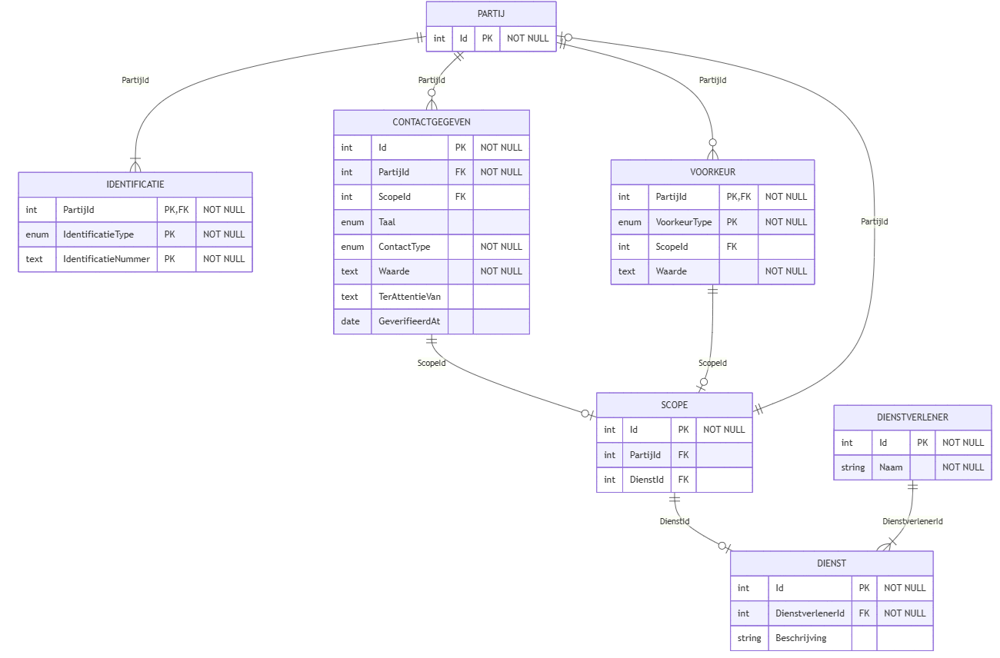

## Software architectuur

### Architectuur ProfielService

#### Gegevensmodel

Het gegevensmodel van de ProfielService is opgebouwd rond twee entiteiten: PARTIJ en CONTACTVOORKEUR.

1. PARTIJ beschrijft een natuurlijke persoon of rechtspersoon die geïdentificeerd kan worden via verschillende identificatietypen, zoals BSN, KVK of RSIN.

2. CONTACTVOORKEUR legt vast hoe en via welk kanaal een partij gecontacteerd wil worden door een bepaalde dienst of organisatie.

Hiermee kunnen burgers en ondernemers hun voorkeuren zelf beheren en bepalen of communicatie bijvoorbeeld via e-mail of telefoon verloopt, en of dit zakelijk of privé van toepassing is.

Hieronder een tabel van definities die wij aanhouden binnen die entiteiten.

| Attribuut           | Omschrijving                                                                                                 |
| ------------------- | ------------------------------------------------------------------------------------------------------------ |
| PARTIJ              |                                                                                                              |
| Id                  | Unieke identificator van PARTIJ                                                                              |
| IdentificatieType   | Wijze waarop PARTIJ uniek kan worden geïdentificeerd, te weten: BSN, KVK, RSIN of ander identificatiesysteem |
| IdentificatieNummer | Nummer waarmee PARTIJ uniek identificeerbaar is binnen het opgegeven IdentificatieType                       |

<br/>

| Attribuut           | Omschrijving                                                                           |
| ------------------- | -------------------------------------------------------------------------------------- |
| CONTACTVOORKEUR     |                                                                                        |
| Id                  | Unieke identificator van CONTACTVOORKEUR                                               |
| EigenaarPartijId    | Identificator van de eigenaar uit PARTIJ voor deze CONTACTVOORKEUR                     |
| BetreffendePartijId | Identificator op welke PARTIJ deze CONTACTVOORKEUR betrekking heeft                    |
| Scope               | Het toepassingsgebied van deze CONTACTVOORKEUR, te weten: Burger of Zakelijk           |
| DienstType          | Het organisatie-identificatienummer (OIN) waarop dit CONTACTVOORKEUR mogelijk kan zijn |
| Type                | Het soort CONTACTVOORKEUR, te weten: e-mail of (mobiel) telefoonnummer                 |
| Waarde              | De door de eigenaar opgegeven waarde voor het CONTACTVOORKEUR-Type                     |
| GeverifieerdAt      | Datum waarop IsGeverifieerd voor het laatst is ingesteld                               |

Het onderstaande diagram geeft de structuur van het gegevensmodel weer, inclusief de relaties tussen PARTIJ en CONTACTVOORKEUR.



<details>
  <summary>Zie mermaid code</summary>
  
    erDiagram
        PARTIJ {
            int Id PK "NOT NULL"
            enum IdentificatieType "NOT NULL"
            text IdentificatieNummer "NOT NULL"
        }

        CONTACTVOORKEUR {
            int Id PK "NOT NULL"
            int EigenaarPartijId FK "NOT NULL"
            int BetreffendePartijId FK ""
            enum Scope "NOT NULL"
            enum DienstType ""
            enum Type "NOT NULL"
            text Waarde "NOT NULL"
            bool IsGeverifieerd "NOT NULL"
            date GeverifieerdAt "NOT NULL"
        }

        %% Relationships
        PARTIJ ||--o{ CONTACTVOORKEUR : "EigenaarPartijId"
        PARTIJ |o--|{ CONTACTVOORKEUR : "BetreffendePartijId"

</details>

#### Data Transfer Object (DTO)

Wanneer de profiel-service wordt bevraagd, kan onderstaand DTO als response worden verwacht:

**YAML**

```yaml
id: 1
identifier_type: BSN
identifier_id: "123456789"
contactvoorkeuren:
  - id: 101
    type: EMAIL
    waarde: rvo-afdeling@bedrijf.nl
    scope: ZAKELIJK
    voor_partij_id: 1001
    dienst_type: "0000000123"
    geverifieerd_at: "2025-11-03T12:00:00Z"

  - id: 102
    type: POST
    waarde:
      ter_attentie_van: "Robbert"
      straat: Wilhelminastraat
      huisnummer: 52
      postcode: "2215PA"
      plaats: Den Haag
      land: Nederland
    scope: ZAKELIJK
    voor_partij_id: 1001
    dienst_type: "0000000456"
    geverifieerd_at: "2025-11-03T12:00:00Z"
```

**JSON**

```json
{
  "id": 1,
  "identifier_type": "BSN",
  "identifier_id": "123456789",
  "contactvoorkeuren": [
    {
      "id": 101,
      "type": "EMAIL",
      "waarde": "rvo-afdeling@bedrijf.nl",
      "scope": "ZAKELIJK",
      "voor_partij_id": 1001,
      "dienst_type": "0000000123",
      "geverifieerd_at": "2025-11-03T12:00:00Z"
    },
    {
      "id": 102,
      "type": "POST",
      "waarde": {
        "ter_attentie_van": "Robbert",
        "straat": "Wilhelminastraat",
        "huisnummer": 52,
        "postcode": "2215PA",
        "plaats": "Den Haag",
        "land": "Nederland"
      },
      "scope": "ZAKELIJK",
      "voor_partij_id": 1001,
      "dienst_type": "0000000456",
      "geverifieerd_at": "2025-11-03T12:00:00Z"
    }
  ]
}
```

#### Sequentiediagrammen

De volgende diagrammen illustreren de belangrijkste interacties met de ProfielService.

1. Dienstverlener bevraagt de ProfielService  
   In dit scenario vraagt een dienstverlener de contactvoorkeuren op van een ondernemer of onderneming.  
   Deze informatie kan de dienstverlener dan gebruiken om kennisgevingen en/of attenderingen correct af te kunnen leveren.


<details>
  <summary>Zie mermaid code</summary>
  
    sequenceDiagram
        participant Dienstverlener

        Dienstverlener-->>Mandaat Service: Vraag gemandateerde bsn(s) op
        activate Mandaat Service
        Mandaat Service-->>Dienstverlener: Ok
        deactivate Mandaat Service

        participant Profiel as Profiel Service

        Dienstverlener->>Profiel: GET contactvoorkeuren Bsn en/of KvK
        activate Profiel
        Profiel-->>Dienstverlener: Contactvoorkeur(en) + Bsn
        deactivate Profiel

</details>

2. Ondernemer bekijkt en wijzigt contactvoorkeuren  
   Dit scenario toont hoe een ondernemer via het MOZa-portaal zijn eigen contactvoorkeuren kan inzien en aanpassen.  
   Afhankelijk van de loginmethode (bijv. DigiD of eHerkenning) worden de relevante ondernemingen opgehaald, waarna de ondernemer zijn voorkeuren per onderneming kan beheren.  
   Na het aanpassen van een voorkeur wordt deze wijziging via de ProfielService opgeslagen, en indien van toepassing geverifieerd.


<details>
  <summary>Zie mermaid code</summary>
  
    sequenceDiagram
        actor Ondernemer
        participant MOZa as MOZa Portaal
        participant KvK as KvK
        participant Profiel as Profiel Service

        Ondernemer->>MOZa: Logt in
        activate MOZa

        alt Als login via DigiD
            MOZa->>KvK: Haal ondernemingen op voor BSN
            deactivate MOZa
            activate KvK
            KvK-->>MOZa: Geeft ondernemingen terug (KvK-nummers)
            deactivate KvK
            activate MOZa
        end

        MOZa->>Ondernemer: Toon Profiel Pagina
        Ondernemer->>MOZa: Opent pagina 'Contactvoorkeuren'

        MOZa->>Profiel: GET contactvoorkeuren (BSN + KvK)
        deactivate MOZa
        activate Profiel
        Profiel-->>MOZa: Contactvoorkeuren terug
        deactivate Profiel
        activate MOZa

        MOZa->>Ondernemer: Toon pagina 'Contactvoorkeuren'

        Ondernemer->>MOZa: Past contactvoorkeur aan

        MOZa->>Profiel: PATCH contactvoorkeur (BSN + KvK)
        deactivate MOZa
        activate Profiel
        Profiel-->>MOZa: Ok (voorkeur bijgewerkt)
        deactivate Profiel
        activate MOZa

        MOZa-->>Ondernemer: Toont bevestiging
        deactivate MOZa

</details>

Deze scenario’s vormen de basis voor de interacties tussen de ProfielService, dienstverleners en eindgebruikers binnen de keten.
