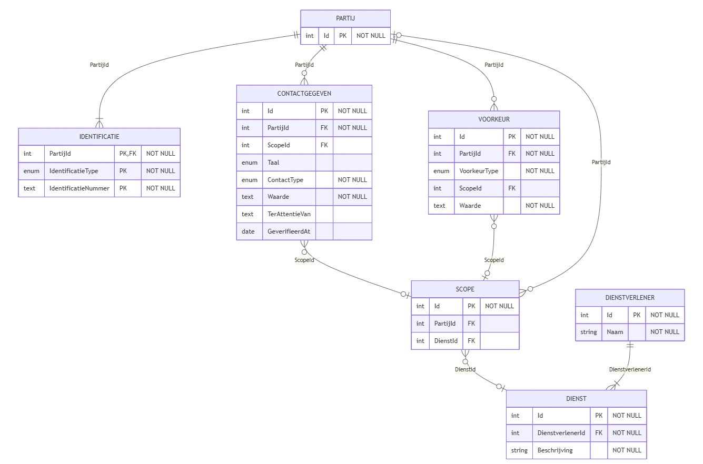
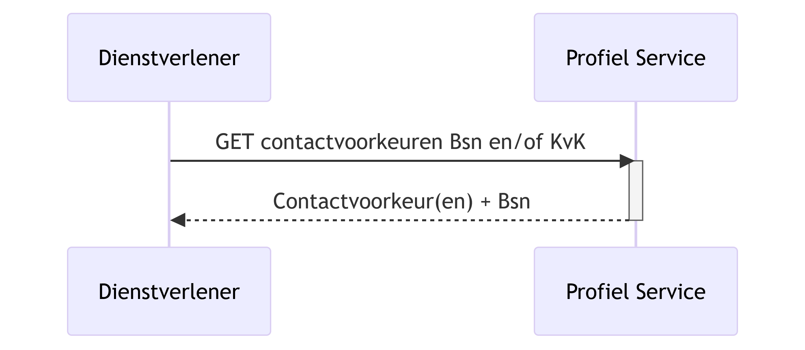
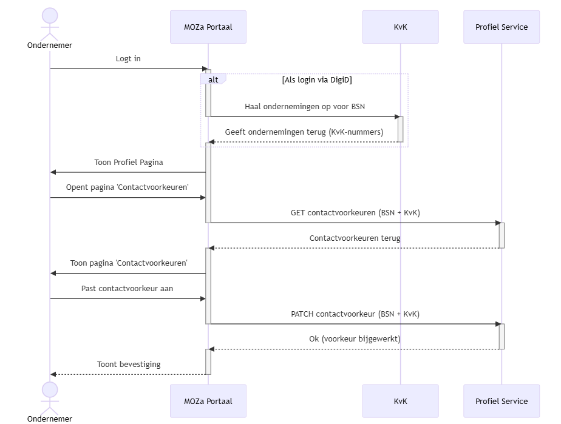

## Data

### Gegevensmodel

Het gegevensmodel van de ProfielService is opgebouwd rond de entiteiten **PARTIJ** en **CONTACTGEGEVEN**.

1. **PARTIJ** is de basis van een natuurlijke persoon of rechtspersoon. Een partij kan één of meerdere identificaties hebben, zoals BSN, KVK, RSIN of andere vormen van identificatie. Zowel personen als ondernemingen zijn een PARTIJ.
2. **CONTACTGEGEVEN** legt vast hoe en via welk kanaal een partij gecontacteerd kan worden door een dienst of organisatie. Een contactgegeven kan optioneel gekoppeld worden aan een **SCOPE**, waarmee wordt vastgelegd voor welke onderneming (PARTIJ) en/of welke dienst van een dienstverlener (DIENST) het contactgegeven geldt.

Hiermee kunnen burgers en ondernemers vastleggen hoe zij gecontacteerd willen worden, bijvoorbeeld via e-mail of telefoon. Een ondernemer die meerdere bedrijven beheert kan per bedrijf verschillende contactgegevens en voorkeuren opslaan, terwijl het bedrijf (als PARTIJ) slechts één keer in de database voorkomt.

Ter ondersteuning van deze kernfunctionaliteit zijn vijf aanvullende entiteiten toegevoegd: **IDENTIFICATIE**, **VOORKEUR**, **SCOPE**, **DIENSTVERLENER** en **DIENST**.

Hieronder volgt een tabel met de definities die wij hanteren voor deze entiteiten.


#### PARTIJ

| Attribuut  | Omschrijving                    |
|------------|---------------------------------|
| **PARTIJ** |                                 |
| Id         | Unieke identificator van PARTIJ |


#### CONTACTGEGEVEN

| Attribuut          | Omschrijving                                                               |
|--------------------|----------------------------------------------------------------------------|
| **CONTACTGEGEVEN** |                                                                            |
| Id                 | Unieke identificator van contactgegeven                                    |
| PartijId           | Identificator van de PARTIJ die eigenaar is van dit contactgegeven         |
| ScopeId            | Optionele verwijzing naar SCOPE waarop dit contactgegeven betrekking heeft |
| Taal               | De taalvoorkeur voor dit contactgegeven                                    |
| ContactType        | Het soort contactgegeven: e-mail of (mobiel) telefoonnummer                |
| Waarde             | De opgegeven contactwaarde (bijv. mailadres)                               |
| TerAttentieVan     | Optionele override van de aanhef specifiek voor dit contactgegeven. Indien niet ingevuld wordt de standaard Aanhef voorkeur (VoorkeurType=Aanhef) gebruikt |
| GeverifieerdAt     | Datum waarop de verificatiestatus voor het laatst is gezet                 |

#### IDENTIFICATIE

| Attribuut           | Omschrijving                                                                                       |
|---------------------|----------------------------------------------------------------------------------------------------|
| **IDENTIFICATIE**   |                                                                                                    |
| PartijId            | Verwijzing naar de PARTIJ aan wie deze IDENTIFICATIE toebehoort                                    |
| IdentificatieType   | Wijze waarop PARTIJ uniek kan worden geïdentificeerd: BSN, KVK, RSIN of ander identificatiesysteem |
| IdentificatieNummer | Nummer waarmee PARTIJ uniek identificeerbaar is binnen het opgegeven IdentificatieType             |

#### VOORKEUR

| Attribuut     | Omschrijving                                                                                              |
|---------------|-----------------------------------------------------------------------------------------------------------|
| **VOORKEUR** |                                                                            |
| PartijId     | Verwijzing naar de PARTIJ waarvoor de voorkeur geldt                        |
| VoorkeurType | Het type voorkeur (enum), bijvoorbeeld taal of communicatievorm             |
| ScopeId      | Optionele verwijzing naar SCOPE waarop deze voorkeur betrekking heeft       |
| Waarde       | De waarde van de voorkeur, afhankelijk van het VoorkeurType                 |

##### VoorkeurTypes

| VoorkeurType              | Omschrijving                                                        |
|---------------------------|---------------------------------------------------------------------|
| WebsiteTaal               | Standaard taalvoorkeur voor communicatie (bijv. "Nederlands")       |
| MagGebeldWorden           | Of de partij gebeld mag worden                                      |
| WebsiteThema              | Thema/weergavevoorkeur voor de website                              |
| PostcodeInUwBuurt         | Postcode voor "berichten in uw buurt"                               |
| ActueleOnderwerpVoorkeur  | Voorkeur voor actuele onderwerpen (bijv. subsidies, wetswijzigingen)|
| Aanhef                    | Standaard aanhef voor de partij (bijv. "Dhr. Jansen")              |

##### Voorkeuren met fallback naar contactgegeven

Sommige voorkeuren dienen als standaardwaarde, die per contactgegeven overridden kan worden:

| Voorkeur (standaard)      | Override op CONTACTGEGEVEN | Omschrijving                                                    |
|---------------------------|----------------------------|-----------------------------------------------------------------|
| Aanhef                    | TerAttentieVan             | Hoe de partij aangesproken wil worden                           |
| WebsiteTaal               | Taal                       | In welke taal de partij gecontacteerd wil worden                |

De fallback-logica voor dienstverleners:

1. Als een **CONTACTGEGEVEN** een override-waarde heeft (`TerAttentieVan` of `Taal`), wordt die gebruikt voor dat specifieke contactgegeven.
2. Als de override leeg is, wordt de standaard **voorkeur** van de partij gebruikt.

Dit stelt dienstverleners in staat om standaardwaarden op te halen, terwijl de gebruiker per contactgegeven een afwijkende instelling kan maken.


#### SCOPE

| Attribuut   | Omschrijving                                                                                 |
|-------------|----------------------------------------------------------------------------------------------|
| **SCOPE**   |                                                                                              |
| Id          | Unieke identificator van de scope                                                            |
| PartijId    | Optionele verwijzing naar een PARTIJ (bijv. een onderneming) waarop de scope betrekking heeft |
| DienstId  | Optionele verwijzing naar een DIENST waarop de scope betrekking heeft                         |

Een SCOPE combineert de twee dimensies waarop een contactgegeven of voorkeur betrekking kan hebben: een onderneming (PARTIJ) en/of een dienst van een dienstverlener (DIENST). Beide velden zijn optioneel — een scope kan alleen een onderneming bevatten, alleen een dienst, of beide.

#### DIENSTVERLENER

| Attribuut          | Omschrijving                            |
|--------------------|-----------------------------------------|
| **DIENSTVERLENER** |                                         |
| Id                 | Unieke identificator van DIENSTVERLENER |
| Naam               | Naam van de dienstverlener              |


#### DIENST

| Attribuut        | Omschrijving                       |
|------------------|------------------------------------|
| **DIENST**       |                                        |
| Id               | Unieke identificator van de dienst     |
| DienstverlenerId | Verwijzing naar DIENSTVERLENER           |
| Beschrijving     | Beschrijving van de dienst             |


Het onderstaande diagram geeft de structuur van het gegevensmodel weer, inclusief de relaties tussen PARTIJ, VOORKEUR, CONTACTGEGEVEN, SCOPE, DIENSTVERLENER en DIENST.



<details>
  <summary>Zie mermaid code</summary>
  
    erDiagram
        PARTIJ {
            int Id PK "NOT NULL"
        }

        IDENTIFICATIE {
            int PartijId PK,FK "NOT NULL"
            enum IdentificatieType PK "NOT NULL"
            text IdentificatieNummer PK "NOT NULL"
        }

        CONTACTGEGEVEN {
            int Id PK "NOT NULL"
            int PartijId FK "NOT NULL"
            int ScopeId FK ""
            enum Taal
            enum ContactType "NOT NULL"
            text Waarde "NOT NULL"
            text TerAttentieVan
            date GeverifieerdAt
        }

        VOORKEUR {
            int Id PK "NOT NULL"
            int PartijId FK "NOT NULL"
            enum VoorkeurType "NOT NULL"
            int ScopeId FK ""
            text Waarde "NOT NULL"
        }

        SCOPE {
            int Id PK "NOT NULL"
            int PartijId FK ""
            int DienstId FK ""
        }

        DIENSTVERLENER {
            int Id PK "NOT NULL"
            string Naam "NOT NULL"
        }

        DIENST {
            int Id PK "NOT NULL"
            int DienstverlenerId FK "NOT NULL"
            string Beschrijving "NOT NULL"
        }

        %% Relationships
        PARTIJ ||--|{ IDENTIFICATIE : "PartijId"
        PARTIJ ||--o{ CONTACTGEGEVEN : "PartijId"
        PARTIJ ||--o{ VOORKEUR : "PartijId"
        CONTACTGEGEVEN }o--o| SCOPE : "ScopeId"
        VOORKEUR }o--o| SCOPE : "ScopeId"
        SCOPE }o--o| PARTIJ : "PartijId"
        SCOPE }o--o| DIENST : "DienstId"
        DIENSTVERLENER ||--|{ DIENST : "DienstverlenerId"

</details>

#### Data Transfer Object (DTO)

Wanneer de profiel-service wordt bevraagd, kan onderstaand DTO als response worden verwacht. Let op: het response-DTO levert `isGeverifieerd` (boolean) af, afgeleid van het entity-veld `GeverifieerdAt` (niet-leeg = geverifieerd).

**YAML**

```yaml
partijId: 1
identificaties:
  - identificatieType: BSN
    identificatieNummer: "123456789"
contactgegevens:
  - id: 101
    type: Email
    waarde: rvo-dienst@bedrijf.nl
    taal: Nederlands
    terAttentieVan: null
    isGeverifieerd: true
    scope:
      partij:
        identificatieType: KVK
        identificatieNummer: "12345678"
      dienst:
        id: 10
        beschrijving: "Belastingen"

  - id: 102
    type: Email
    waarde: info@anderbedrijf.nl
    taal: Engels
    terAttentieVan: "Robbert"
    isGeverifieerd: false
    scope:
      partij:
        identificatieType: KVK
        identificatieNummer: "87654321"
      dienst: null

  - id: 103
    type: Telefoonnummer
    waarde: "+31612345678"
    taal: null
    terAttentieVan: null
    isGeverifieerd: false
    scope: null
voorkeuren:
  - id: 201
    voorkeurType: WebsiteTaal
    waarde: "Nederlands"
    scope: null
```

**JSON**

```json
{
  "partijId": 1,
  "identificaties": [
    {
      "identificatieType": "BSN",
      "identificatieNummer": "123456789"
    }
  ],
  "contactgegevens": [
    {
      "id": 101,
      "type": "Email",
      "waarde": "rvo-dienst@bedrijf.nl",
      "taal": "Nederlands",
      "terAttentieVan": null,
      "isGeverifieerd": true,
      "scope": {
        "partij": {
          "identificatieType": "KVK",
          "identificatieNummer": "12345678"
        },
        "dienst": {
          "id": 10,
          "beschrijving": "Belastingen"
        }
      }
    },
    {
      "id": 102,
      "type": "Email",
      "waarde": "info@anderbedrijf.nl",
      "taal": "Engels",
      "terAttentieVan": "Robbert",
      "isGeverifieerd": false,
      "scope": {
        "partij": {
          "identificatieType": "KVK",
          "identificatieNummer": "87654321"
        },
        "dienst": null
      }
    },
    {
      "id": 103,
      "type": "Telefoonnummer",
      "waarde": "+31612345678",
      "taal": null,
      "terAttentieVan": null,
      "isGeverifieerd": false,
      "scope": null
    }
  ],
  "voorkeuren": [
    {
      "id": 201,
      "voorkeurType": "WebsiteTaal",
      "waarde": "Nederlands",
      "scope": null
    }
  ]
}
```

### Sequentiediagrammen

De volgende diagrammen illustreren de belangrijkste interacties met de ProfielService.

1. Dienstverlener bevraagt de ProfielService  
   In dit scenario vraagt een dienstverlener de contactvoorkeuren op van een ondernemer of onderneming.  
   Deze informatie kan de dienstverlener dan gebruiken om kennisgevingen en/of attenderingen correct af te kunnen leveren.




<details>
  <summary>Zie mermaid code</summary>
  
    sequenceDiagram
        participant Dienstverlener
        participant Profiel as Profiel Service

        Dienstverlener->>Profiel: GET contactvoorkeuren Bsn en/of KvK
        activate Profiel
        Profiel-->>Dienstverlener: Contactvoorkeur(en) + Bsn
        deactivate Profiel

</details>

2. Ondernemer bekijkt en wijzigt contactvoorkeuren  
   Dit scenario toont hoe een ondernemer via het MOZa-portaal zijn eigen contactvoorkeuren kan inzien en aanpassen.  
   Afhankelijk van de loginmethode (bijv. DigiD of eHerkenning) worden de relevante ondernemingen opgehaald, waarna de ondernemer zijn voorkeuren per onderneming kan beheren.  
   Na het aanpassen van een voorkeur wordt deze wijziging via de ProfielService opgeslagen, en indien van toepassing geverifieerd.



<details>
  <summary>Zie mermaid code</summary>
  
    sequenceDiagram
        actor Ondernemer
        participant MOZa as MOZa Portaal
        participant KvK as KvK
        participant Profiel as Profiel Service

        Ondernemer->>MOZa: Logt in
        activate MOZa

        alt Als login via DigiD
            MOZa->>KvK: Haal ondernemingen op voor BSN
            deactivate MOZa
            activate KvK
            KvK-->>MOZa: Geeft ondernemingen terug (KvK-nummers)
            deactivate KvK
            activate MOZa
        end

        MOZa->>Ondernemer: Toon Profiel Pagina
        Ondernemer->>MOZa: Opent pagina 'Contactvoorkeuren'

        MOZa->>Profiel: GET contactvoorkeuren (BSN + KvK)
        deactivate MOZa
        activate Profiel
        Profiel-->>MOZa: Contactvoorkeuren terug
        deactivate Profiel
        activate MOZa

        MOZa->>Ondernemer: Toon pagina 'Contactvoorkeuren'

        Ondernemer->>MOZa: Past contactvoorkeur aan

        MOZa->>Profiel: PATCH contactvoorkeur (BSN + KvK)
        deactivate MOZa
        activate Profiel
        Profiel-->>MOZa: Ok (voorkeur bijgewerkt)
        deactivate Profiel
        activate MOZa

        MOZa-->>Ondernemer: Toont bevestiging
        deactivate MOZa

</details>

Deze scenario’s vormen de basis voor de interacties tussen de ProfielService, dienstverleners en eindgebruikers binnen de keten.
