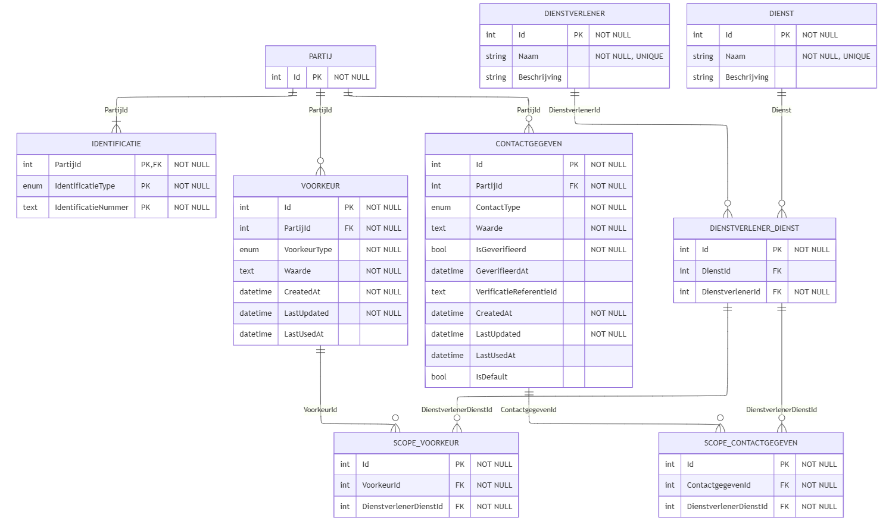
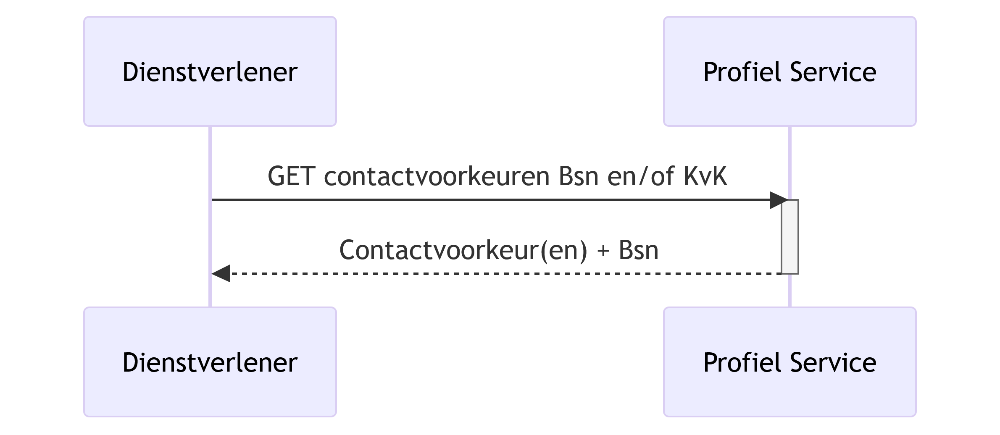
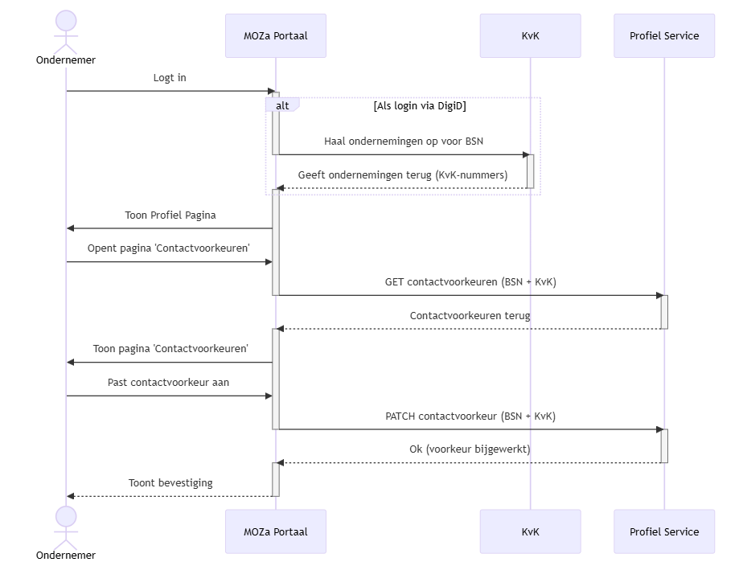

## Data

### Gegevensmodel

Het gegevensmodel van de ProfielService is opgebouwd rond de entiteiten **PARTIJ** en **CONTACTGEGEVEN**.

1. **PARTIJ** is de basis van een natuurlijke persoon of rechtspersoon. Een partij kan één of meerdere identificaties hebben, zoals BSN, KVK, RSIN of andere vormen van identificatie. Zowel personen als ondernemingen zijn een PARTIJ.
2. **CONTACTGEGEVEN** legt vast hoe en via welk kanaal een partij gecontacteerd kan worden door een dienst of organisatie. Een contactgegeven kan optioneel afgebakend worden via een **SCOPE_CONTACTGEGEVEN**, waarmee wordt vastgelegd voor welke dienst van welke dienstverlener het contactgegeven geldt.

Hiermee kunnen burgers en ondernemers vastleggen hoe zij gecontacteerd willen worden, bijvoorbeeld via e-mail of telefoon. Een ondernemer die meerdere bedrijven beheert kan per bedrijf verschillende contactgegevens en voorkeuren opslaan, terwijl het bedrijf (als PARTIJ) slechts één keer in de database voorkomt.

Ter ondersteuning van deze kernfunctionaliteit zijn aanvullende entiteiten toegevoegd: **IDENTIFICATIE**, **VOORKEUR**, **SCOPE_CONTACTGEGEVEN**, **SCOPE_VOORKEUR**, **DIENSTVERLENER**, **DIENST** en de koppeltabel **DIENSTVERLENER_DIENST**.

Een **CONTACTGEGEVEN** kan nul of meer **SCOPE_CONTACTGEGEVEN**s hebben; een **VOORKEUR** kan nul of meer **SCOPE_VOORKEUR**s hebben. Een scope bakent af voor welke combinatie van dienstverlener en dienst (via **DIENSTVERLENER_DIENST**) het contactgegeven of de voorkeur geldt; ontbreekt een scope, dan geldt het contactgegeven of de voorkeur als standaard voor alle diensten. Hierdoor kan eenzelfde waarde (bijvoorbeeld een e-mailadres) één keer worden vastgelegd en aan meerdere dienstverlener-dienst-combinaties worden gekoppeld zonder duplicatie. De afbakening per onderneming is niet meer onderdeel van de scope zelf, maar volgt indirect uit de PARTIJ waaraan het CONTACTGEGEVEN of de VOORKEUR is gekoppeld.

Hieronder volgen eerst enkele overkoepelende ontwerpkeuzes, en daarna een tabel met de definities die wij hanteren voor deze entiteiten.

#### Ontwerpkeuzes

##### Doelbinding en grondslag

Het centraal opslaan van een BSN of KVK valt onder de AVG en, voor BSN, onder de Wet algemene bepalingen burgerservicenummer (Wabb). De grondslag per verwerking is vastgelegd in het verwerkingsregister waar `dpl.core.processing_activity_id` naar verwijst. Aanvullend beschrijft [ADR 0011: Positionering en gebruik van de Profiel Service](../decisions/0011-positionering-en-gebruik-van-profiel-service.md) welk gebruik wel en niet binnen de doelbinding valt. Op dit gegevensmodel wordt een DPIA uitgevoerd; de uitkomsten daarvan worden bij het verwerkingsregister gepubliceerd.

##### Identifiers

Alle entiteit-`Id`'s in dit model zijn UUID's en worden in API's en logs als opaque strings behandeld. Auto-increment integers gebruiken we niet: ze geven de omvang van de dataset prijs en maken enumeration van records mogelijk.

##### Encryptie en opslag

`IdentificatieNummer` (BSN/KVK/RSIN) en Contactgegeven `Waarde` (e-mailadres, telefoonnummer, applicatie-id) worden versleuteld opgeslagen via column-level encryption. Voor BSN geldt aanvullend dat de waarde eerst wordt gepseudonimiseerd via de BSNk-module (BSN-koppelnummer) van Logius en pas daarna versleuteld opgeslagen. De Profiel Service bewaart dus geen ruw BSN. Voor andere identificatienummers (KVK, RSIN, etc) wordt onderzocht in welke mate dezelfde pseudonimisering-aanpak toepasbaar is. De sleutelmanagement-keuzes en de exacte BIO-classificatie staan beschreven in [§09 Infrastructuurarchitectuur](09-infrastructuur-architectuur.md).

##### Logging en redactie

Persoonsgegevens komen niet voor in applicatielogs. Identificatie van de betrokkene voor traceability gebeurt uitsluitend via LDV-attributen (zie [Logboek Dataverwerkingen (LDV)](#logboek-dataverwerkingen-ldv) hieronder). Applicatielogs hanteren een redactie-regel die deze velden vervangt door een vaste placeholder.

##### Data bij de bron

IDENTIFICATIE is bedoeld als opzoek-sleutel naar een PARTIJ, niet als bronsysteem. De authoritative bron voor BSN is de Basisregistratie Personen (BRP); voor KVK het Handelsregister; voor RSIN de Basisregistratie Ondernemingen. De Profiel Service valideert deze nummers syntactisch (elf-proef, lengte) maar leidt geen materiële wijzigingen door wijzigingen volgen uit het bronsysteem.

##### Bewaartermijnen en verwijdering

Op verzoek van de betrokkene, conform met AVG (Art. 17), wordt een PARTIJ inclusief gekoppelde IDENTIFICATIE-, CONTACTGEGEVEN-, VOORKEUR- en scope-rijen fysiek verwijderd, met een bijbehorende LDV-regel die de verwijdering vastlegt. De concrete bewaartermijnen per verwerking volgen uit het verwerkingsregister.

##### `LastUsedAt` en profilering

`LastUsedAt` wordt uitsluitend gebruikt voor onderhoud, zoals opschoning van inactieve contactgegevens en voorkeuren. Het veld is niet bedoeld voor analytics, rapportage of profilering en wordt niet via de publieke API uitgeleverd.

#### PARTIJ

| Attribuut    | Omschrijving                                                                                      |
|--------------|---------------------------------------------------------------------------------------------------|
| **PARTIJ**   |                                                                                                   |
| Id           | Unieke identificator van PARTIJ (UUID)                                                            |

#### CONTACTGEGEVEN

| Attribuut               | Omschrijving                                                                                                  |
|-------------------------|---------------------------------------------------------------------------------------------------------------|
| **CONTACTGEGEVEN**      |                                                                                                               |
| Id                      | Unieke identificator van contactgegeven (UUID)                                                                |
| PartijId                | UUID van de PARTIJ die eigenaar is van dit contactgegeven                                                     |
| ContactType             | Het soort contactgegeven: `Email`, `Telefoonnummer` of `ApplicatieId`                                         |
| Waarde                  | De opgegeven contactwaarde (bijv. mailadres of telefoonnummer); versleuteld opgeslagen                        |
| IsGeverifieerd          | Of het contactgegeven is geverifieerd                                                                         |
| GeverifieerdAt          | Tijdstip waarop het contactgegeven is geverifieerd; leeg als nog niet geverifieerd                            |
| VerificatieReferentieId | Referentie naar de lopende verificatieaanvraag (alleen relevant voor Email)                                   |
| CreatedAt               | Tijdstip van aanmaken                                                                                         |
| LastUpdated             | Tijdstip van laatste wijziging                                                                                |
| LastUsedAt              | Tijdstip waarop het contactgegeven voor het laatst is opgehaald. Uitsluitend voor opschoningsbeleid; niet voor analytics of profilering en niet via de publieke API uitgeleverd (zie [Ontwerpkeuzes](#lastusedat-en-profilering)) |
| IsDefault               | Markeert dit contactgegeven als de standaard voor de combinatie (PARTIJ, ContactType). Per (PARTIJ, ContactType) is maximaal één contactgegeven `IsDefault = true`; een partij kan dus bijvoorbeeld één standaard `Email` én één standaard `Telefoonnummer` hebben |

**Constraints**

- `UNIQUE(PartijId, ContactType, Waarde)` — dezelfde waarde (bijv. een e-mailadres) wordt per partij + type slechts één keer opgeslagen. Een POST met een bestaande combinatie wordt afgehandeld als een update op de bestaande rij.
- `UNIQUE(PartijId, ContactType) WHERE IsDefault = true` — partial unique index die garandeert dat er per (PARTIJ, ContactType) maximaal één standaard is.

#### IDENTIFICATIE

| Attribuut           | Omschrijving                                                                                                                                                                                                                       |
|---------------------|------------------------------------------------------------------------------------------------------------------------------------------------------------------------------------------------------------------------------------|
| **IDENTIFICATIE**   |                                                                                                                                                                                                                                    |
| Id                  | Unieke identificator van deze identificatie (UUID)                                                                                                                                                                                 |
| PartijId            | UUID van de PARTIJ aan wie deze IDENTIFICATIE toebehoort                                                                                                                                                                           |
| IdentificatieType   | Wijze waarop PARTIJ uniek kan worden geïdentificeerd: `BSN`, `KVK`, `RSIN` of ander identificatiesysteem                                                                                                                            |
| IdentificatieNummer | Nummer waarmee PARTIJ uniek identificeerbaar is binnen het opgegeven IdentificatieType; versleuteld opgeslagen. Syntactische validatie (zoals elf-proef voor BSN, lengte voor KVK) gebeurt bij invoer; voor authoritative waarden geldt het [bronsysteem](#data-bij-de-bron) |

**Constraints**

- `UNIQUE(IdentificatieType, IdentificatieNummer)`: eenzelfde nummer-binnen-type wijst altijd naar dezelfde PARTIJ; een BSN of KVK komt nooit aan twee partijen toe.

#### VOORKEUR

| Attribuut    | Omschrijving                                                                                                                                                                                                                                       |
|--------------|----------------------------------------------------------------------------------------------------------------------------------------------------------------------------------------------------------------------------------------------------|
| **VOORKEUR** |                                                                                                                                                                                                                                                    |
| Id           | Unieke identificator van voorkeur (UUID)                                                                                                                                                                                                           |
| PartijId     | UUID van de PARTIJ waarvoor de voorkeur geldt                                                                                                                                                                                                      |
| VoorkeurType | Het type voorkeur (enum): `WebsiteTaal`, `MagGebeldWorden`, `WebsiteThema`, `Aanhef`, `OntvangViaBerichtenbox`                                                                                                                                      |
| Waarde       | De waarde van de voorkeur, getypeerd per `VoorkeurType` (zie [VoorkeurTypes](#voorkeurtypes) voor toegestane vormen)                                                                                                              |
| CreatedAt    | Tijdstip van aanmaken                                                                                                                                                                                                                              |
| LastUpdated  | Tijdstip van laatste wijziging                                                                                                                                                                                                                     |
| LastUsedAt   | Tijdstip waarop de voorkeur voor het laatst is opgehaald. Uitsluitend voor opschoningsbeleid; niet voor analytics of profilering en niet via de publieke API uitgeleverd (zie [Ontwerpkeuzes](#lastusedat-en-profilering))                          |

**Constraints**

Een partij kan meerdere VOORKEUR-rijen hebben voor hetzelfde `VoorkeurType` (bijvoorbeeld een andere `WebsiteTaal` per dienst), mits de scopes elkaar niet overlappen. Concreet:

- Per (PartijId, VoorkeurType) bestaat maximaal één VOORKEUR-rij **zonder** scopes (de default voor alle diensten).
- Voor (PartijId, VoorkeurType) gekoppeld aan een specifieke DIENSTVERLENER_DIENST bestaat maximaal één VOORKEUR-rij die via SCOPE_VOORKEUR naar diezelfde DIENSTVERLENER_DIENST verwijst.

Omdat deze regel zich uitstrekt over VOORKEUR en SCOPE_VOORKEUR is hij niet als één SQL `UNIQUE` af te dwingen en wordt hij op applicatieniveau bewaakt.

##### VoorkeurTypes

Iedere `VoorkeurType` heeft een bijbehorende vorm voor `Waarde`.

| VoorkeurType            | Omschrijving                                                                                  | Toegestane vorm voor `Waarde`                                           |
|-------------------------|-----------------------------------------------------------------------------------------------|-------------------------------------------------------------------------|
| WebsiteTaal             | Taalvoorkeur voor communicatie en weergave (bijv. `nl`, `en`)                                 | `string`, ISO 639-1 code uit een vaste lijst van ondersteunde talen     |
| MagGebeldWorden         | Of de partij gebeld mag worden                                                                | `boolean`                                                               |
| WebsiteThema            | Thema/weergavevoorkeur voor de website                                                        | `string`, code uit een vaste lijst van beschikbare thema's              |
| Aanhef                  | Aanhef die gebruikt mag worden bij contact met de partij (bijv. "Dhr. Jansen")                | `string`, vrije tekst met maximumlengte                                 |
| OntvangViaBerichtenbox  | Of de partij berichten via de Berichtenbox wil ontvangen                                      | `boolean`                                                               |

#### SCOPE_CONTACTGEGEVEN

Een SCOPE_CONTACTGEGEVEN bakent af voor welke combinatie van dienstverlener en dienst een CONTACTGEGEVEN geldt. Een CONTACTGEGEVEN zonder scopes geldt als standaard voor alle diensten. De afbakening per onderneming (PARTIJ) zit niet in de scope zelf maar in het CONTACTGEGEVEN.

| Attribuut               | Omschrijving                                                                                    |
|-------------------------|-------------------------------------------------------------------------------------------------|
| **SCOPE_CONTACTGEGEVEN** |                                                                                                |
| Id                      | Unieke identificator van scope                                                                  |
| ContactgegevenId        | Verwijzing naar het CONTACTGEGEVEN waar deze scope bij hoort (verplicht)                        |
| DienstverlenerDienstId  | Verwijzing naar de DIENSTVERLENER_DIENST-combinatie waarop de scope betrekking heeft (verplicht) |

**Constraints**

- `UNIQUE(ContactgegevenId, DienstverlenerDienstId)` — een combinatie wordt per contactgegeven maximaal één keer opgeslagen; bij een dubbele toevoeging wordt de bestaande scope hergebruikt.

#### SCOPE_VOORKEUR

Een SCOPE_VOORKEUR bakent af voor welke combinatie van dienstverlener en dienst een VOORKEUR geldt. Een VOORKEUR zonder scopes geldt als standaard voor alle diensten. De afbakening per onderneming (PARTIJ) zit niet in de scope zelf maar in de VOORKEUR.

| Attribuut               | Omschrijving                                                                                    |
|-------------------------|-------------------------------------------------------------------------------------------------|
| **SCOPE_VOORKEUR**      |                                                                                                 |
| Id                      | Unieke identificator van scope                                                                  |
| VoorkeurId              | Verwijzing naar de VOORKEUR waar deze scope bij hoort (verplicht)                               |
| DienstverlenerDienstId  | Verwijzing naar de DIENSTVERLENER_DIENST-combinatie waarop de scope betrekking heeft (verplicht) |

**Constraints**

- `UNIQUE(VoorkeurId, DienstverlenerDienstId)` — een combinatie wordt per voorkeur maximaal één keer opgeslagen; bij een dubbele toevoeging wordt de bestaande scope hergebruikt.

#### DIENSTVERLENER

| Attribuut          | Omschrijving                                |
|--------------------|---------------------------------------------|
| **DIENSTVERLENER** |                                             |
| Id                 | Unieke identificator van DIENSTVERLENER     |
| Naam               | Naam van de dienstverlener (uniek)          |
| Beschrijving       | Optionele beschrijving van de dienstverlener |

**Constraints**

- `UNIQUE(Naam)` — dienstverleners hebben een globaal unieke naam.

#### DIENST

| Attribuut    | Omschrijving                       |
|--------------|------------------------------------|
| **DIENST**   |                                    |
| Id           | Unieke identificator van de dienst |
| Naam         | Naam van de dienst                 |
| Beschrijving | Optionele beschrijving van de dienst |

#### DIENSTVERLENER_DIENST

Koppeltabel tussen DIENSTVERLENER en DIENST. Hiermee kan dezelfde DIENST door meerdere dienstverleners worden aangeboden, en kan een dienstverlener bestaan zonder dat er al een dienst aan gekoppeld is. Een scope verwijst altijd naar een rij in deze tabel, zodat duidelijk is om welke dienstverlener-dienst-combinatie het gaat. Een rij met alleen een DienstverlenerId (DienstId leeg) bakent de scope af tot de dienstverlener als geheel, zonder een specifieke dienst.

| Attribuut             | Omschrijving                                              |
|-----------------------|-----------------------------------------------------------|
| **DIENSTVERLENER_DIENST** |                                                       |
| Id                    | Unieke identificator van de combinatie                    |
| DienstverlenerId      | Verwijzing naar DIENSTVERLENER (verplicht)                |
| DienstId              | Optionele verwijzing naar DIENST                          |

**Constraints**

- `UNIQUE(DienstverlenerId, DienstId)` — dezelfde dienstverlener-dienst-combinatie komt maximaal één keer voor.

#### Logboek Dataverwerkingen (LDV)

Naast de hierboven beschreven entiteiten slaat de Profiel Service logregels op conform de [Logboek Dataverwerkingen standaard](https://logius-standaarden.github.io/logboek-dataverwerkingen/#interface). Wanneer een trace bij de Profiel Service begint (de Profiel Service is de initiërende dienst), wordt een identificerend nummer van de betrokkene opgeslagen in de LDV-attributen. De volgende attributen worden per logregel vastgelegd:

| Attribuut | Omschrijving |
|-----------|-------------|
| `dpl.core.processing_activity_id` | URI naar het verwerkingsactiviteitenregister met informatie over de verwerking |
| `dpl.core.data_subject_id` | Identificerend nummer van de betrokkene |
| `dpl.core.data_subject_id_type` | Type identificatiecode |
| `dpl.core.foreign_operation.processor` | URL naar externe applicatie |

Daarnaast worden de overige door de LDV-standaard vereiste velden (zoals `trace_id`, `span_id`, `start_time` en `end_time`) automatisch door de tracing-infrastructuur gevuld; de tabel hierboven beschrijft de attributen die de Profiel Service zelf invult.

Hiermee is elke verwerking van persoonsgegevens herleidbaar naar de betrokken persoon.

Het onderstaande diagram geeft de structuur van het gegevensmodel weer, inclusief de relaties tussen PARTIJ, VOORKEUR, CONTACTGEGEVEN, DIENSTVERLENER, en DIENST.

  
Zie mermaid code

  
    erDiagram
        PARTIJ {
            uuid Id PK "NOT NULL"
        }

        IDENTIFICATIE {
            uuid Id PK "NOT NULL"
            uuid PartijId FK "NOT NULL"
            enum IdentificatieType "NOT NULL"
            text IdentificatieNummer "NOT NULL, ENCRYPTED"
        }

        CONTACTGEGEVEN {
            uuid Id PK "NOT NULL"
            uuid PartijId FK "NOT NULL"
            enum ContactType "NOT NULL"
            text Waarde "NOT NULL, ENCRYPTED"
            bool IsGeverifieerd "NOT NULL"
            datetime GeverifieerdAt ""
            text VerificatieReferentieId ""
            datetime CreatedAt "NOT NULL"
            datetime LastUpdated "NOT NULL"
            datetime LastUsedAt ""
            bool IsDefault ""
        }

        VOORKEUR {
            uuid Id PK "NOT NULL"
            uuid PartijId FK "NOT NULL"
            enum VoorkeurType "NOT NULL"
            text Waarde "NOT NULL"
            datetime CreatedAt "NOT NULL"
            datetime LastUpdated "NOT NULL"
            datetime LastUsedAt ""
        }

        SCOPE_VOORKEUR {
            uuid Id PK "NOT NULL"
            uuid VoorkeurId FK "NOT NULL"
            uuid DienstverlenerDienstId FK "NOT NULL"
        }

        SCOPE_CONTACTGEGEVEN {
            uuid Id PK "NOT NULL"
            uuid ContactgegevenId FK "NOT NULL"
            uuid DienstverlenerDienstId FK "NOT NULL"
        }

        DIENSTVERLENER_DIENST {
            uuid Id PK "NOT NULL"
            uuid DienstId FK ""
            uuid DienstverlenerId FK "NOT NULL"
        }

        DIENSTVERLENER {
            uuid Id PK "NOT NULL"
            string Naam "NOT NULL, UNIQUE"
            string Beschrijving ""
        }

        DIENST {
            uuid Id PK "NOT NULL"
            string Naam "NOT NULL"
            string Beschrijving ""
        }

        %% Relationships
        PARTIJ ||--|{ IDENTIFICATIE : "PartijId"
        PARTIJ ||--o{ VOORKEUR : "PartijId"
        PARTIJ ||--o{ CONTACTGEGEVEN : "PartijId"
        CONTACTGEGEVEN ||--o{ SCOPE_CONTACTGEGEVEN : "ContactgegevenId"
        DIENSTVERLENER_DIENST ||--o{ SCOPE_CONTACTGEGEVEN : "DienstverlenerDienstId"
        VOORKEUR ||--o{ SCOPE_VOORKEUR : "VoorkeurId"
        DIENSTVERLENER_DIENST ||--o{ SCOPE_VOORKEUR : "DienstverlenerDienstId"
        DIENSTVERLENER ||--o{ DIENSTVERLENER_DIENST : "DienstverlenerId"
        DIENST ||--o{ DIENSTVERLENER_DIENST : "DienstId"

### Sequentiediagrammen

De volgende diagrammen illustreren de belangrijkste interacties met de ProfielService.

1. Dienstverlener bevraagt de ProfielService  
   In dit scenario vraagt een dienstverlener de contactvoorkeuren op van een ondernemer of onderneming.  
   Deze informatie kan de dienstverlener dan gebruiken om kennisgevingen en/of attenderingen correct af te kunnen leveren.

  
Zie mermaid code

  
    sequenceDiagram
        participant Dienstverlener
        participant Profiel as Profiel Service

        Dienstverlener->>Profiel: POST /partijen:zoek (identificatieType + identificatieNummer)
        activate Profiel
        Profiel-->>Dienstverlener: partijId
        deactivate Profiel

        Dienstverlener->>Profiel: GET /partijen/{partijId}
        activate Profiel
        Profiel-->>Dienstverlener: Contactvoorkeur(en) + identificaties
        deactivate Profiel

2. Ondernemer bekijkt en wijzigt contactvoorkeuren  
   Dit scenario toont hoe een ondernemer via het MOZa-portaal zijn eigen contactvoorkeuren kan inzien en aanpassen.  
   Afhankelijk van de loginmethode (bijv. DigiD of eHerkenning) worden de relevante ondernemingen opgehaald, waarna de ondernemer zijn voorkeuren per onderneming kan beheren.  
   Na het aanpassen van een voorkeur wordt deze wijziging via de ProfielService opgeslagen, en indien van toepassing geverifieerd.

  
Zie mermaid code

  
    sequenceDiagram
        actor Ondernemer
        participant MOZa as MOZa Portaal
        participant KvK as KvK
        participant Profiel as Profiel Service

        Ondernemer->>MOZa: Logt in
        activate MOZa

        alt Als login via DigiD
            MOZa->>KvK: Haal ondernemingen op voor BSN
            deactivate MOZa
            activate KvK
            KvK-->>MOZa: Geeft ondernemingen terug (KvK-nummers)
            deactivate KvK
            activate MOZa
        end

        MOZa->>Ondernemer: Toon Profiel Pagina
        Ondernemer->>MOZa: Opent pagina 'Contactvoorkeuren'

        MOZa->>Profiel: POST /partijen:zoek (identificatieType + identificatieNummer)
        deactivate MOZa
        activate Profiel
        Profiel-->>MOZa: partijId
        deactivate Profiel
        activate MOZa

        MOZa->>Profiel: GET /partijen/{partijId}
        deactivate MOZa
        activate Profiel
        Profiel-->>MOZa: Contactvoorkeuren terug
        deactivate Profiel
        activate MOZa

        MOZa->>Ondernemer: Toon pagina 'Contactvoorkeuren'

        Ondernemer->>MOZa: Past contactvoorkeur aan

        MOZa->>Profiel: PUT /contactgegevens/{contactgegevenId}
        deactivate MOZa
        activate Profiel
        Profiel-->>MOZa: Ok (voorkeur bijgewerkt)
        deactivate Profiel
        activate MOZa

        MOZa-->>Ondernemer: Toont bevestiging
        deactivate MOZa

Deze scenario’s vormen de basis voor de interacties tussen de ProfielService, dienstverleners en eindgebruikers binnen de keten.
