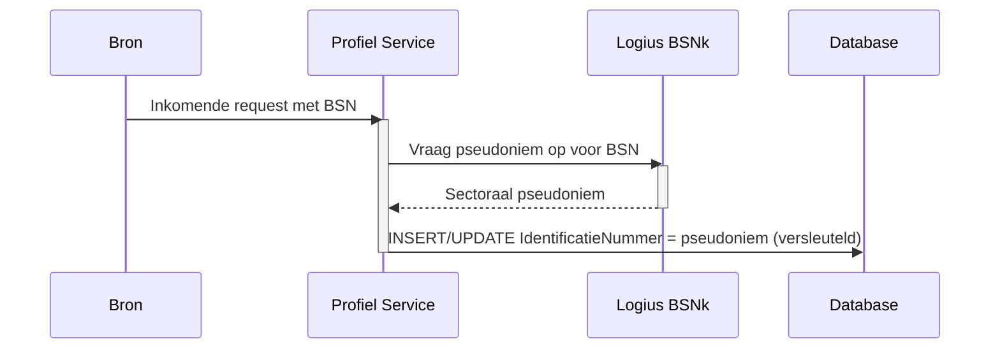

## Infrastructuur Architectuur

Deze sectie beschrijft de infrastructuurkeuzes die specifiek zijn voor de Profiel Service. Voor de algemene MOZa-infrastructuur (Standaard Platform van Logius, Kubernetes, klantomgeving, multi-DC) wordt verwezen naar het systeemwijde [§09 Infrastructuur Architectuur](../docs/09-infrastructuur-architectuur.md).

### Hostingomgeving

De Profiel Service draait op het Standaard Platform van Logius. Concrete cluster- en namespace-toewijzing staat beschreven in [§10 Deployment](10-deployment.md). Deze sectie richt zich uitsluitend op infrastructuurelementen die voor de Profiel Service architectonisch significant zijn.

### Authenticatie en autorisatie

De Profiel Service voert zelf geen authenticatie of autorisatie uit. Alle aanroepen komen binnen via een API-gateway die toegang afdwingt op basis van twee samenhangende standaarden uit het Federatief Datastelsel.

De service is voorzien om gehost te worden in de **Logius Private Cloud (LPC)**. Op netwerkniveau hanteert LPC een whitelist: alleen verbindingen die binnenkomen via een FTV-gevalideerde aanroep worden toegelaten. Verkeer dat niet via FTV is geauthenticeerd komt het cluster überhaupt niet binnen, los van wat de gateway en de service zelf doen. Hiermee zit FTV op twee niveaus in de toegangsbeslissing: als netwerkfilter op de LPC-rand en als applicatieve tokenvalidatie op de gateway.

De gateway valideert vervolgens op basis van:

- **Federatieve Service Connectiviteit (FSC)** legt het contract vast tussen afnemer en aanbieder: welke dienst, voor welk doel, met welke verzoeken. Zonder geldig FSC-contract is technische toegang niet mogelijk.
- **Federatieve Toegangsverlening (FTV)** levert per aanroep een token met organisatie-identiteit, rol en contractcontext. De gateway valideert dit token en weigert verzoeken zonder geldige context.

Elke aanroep van de Profiel Service is daarmee een service-to-service-aanroep, ook wanneer er uiteindelijk een ingelogde eindgebruiker achter zit. Twee typen aanroepers zijn relevant:

- **Het MOZa-portaal of een vakapplicatie**, dat handelt namens een ingelogde burger of ondernemer. De eindgebruiker is daar aan de voorkant geauthenticeerd via DigiD, eHerkenning of eIDAS; de bijbehorende identificaties (BSN, KvK, RSIN) worden door het portaal als gevalideerde context meegestuurd in de aanroep naar de Profiel Service. De inlogflow aan de voorkant is buiten scope voor de Profiel Service en wordt beschreven in [§07 Code, Authenticatie](07-code.md#authenticatie).
- **Dienstverleners en ketenpartners** die rechtstreeks profielgegevens opvragen, bijvoorbeeld voor het versturen van notificaties.

In beide gevallen handhaaft de gateway op basis van het FSC-contract van de aanroepende partij en het bijbehorende FTV-token. De Profiel Service zelf maakt geen onderscheid op netwerkniveau tussen "portaalverkeer" en "dienstverlenerverkeer".

Een uitgebreide beschrijving van FSC, FTV en hun samenhang met FDS en LDV staat in de [bijlage Logging, Toegang en Doelbinding](../decisions/addendum/profiel-service-logging-en-toegang.md).

Consequenties voor de Profiel Service:

- De service implementeert geen eigen scope-mapping en geen eigen credential-store voor afnemers.
- Partij-identificaties (BSN, KvK, RSIN) worden uitsluitend in de request body meegestuurd, nooit in het pad of in querystrings. Dit voorkomt dat persoonsgegevens in access logs, proxy-logs of browserhistorie terechtkomen. In-service tokencontroles zijn niet nodig; de gateway garandeert dat de aanroeper voor deze identificaties geautoriseerd is.
- Wijzigingen in toegangscontracten verlopen via het FSC-beheerproces en niet via codewijzigingen in de Profiel Service.

**Open punt:** in hoeverre de Profiel Service na de gateway nog een eigen OIDC-tokenvalidatie uitvoert (defense in depth) wordt nog onderzocht. Mogelijke argumenten voor een tweede validatie zijn een onafhankelijke controle op `iss`, `aud`, `exp` en handtekening tegen de JWKS, en het beschikbaar krijgen van claims voor logging en doelbinding zonder afhankelijkheid van gateway-headers. Argumenten tegen zijn de duplicatie met de gateway en het risico op divergentie in trustconfiguratie. Wanneer hierover een besluit is genomen wordt dit vastgelegd in een ADR.

### Secret management

De Profiel Service maakt gebruik van enkele soorten Kubernetes `Secret`-resources:

- Databasecredentials voor PostgreSQL.
- Versleutelingssleutels voor column-level encryption van `IDENTIFICATIE.IdentificatieNummer` en `CONTACTGEGEVEN.Waarde` (zie [§08 Data, Encryptie en opslag](08-data.md#encryptie-en-opslag)).
- Credentials voor externe API's (BSNk, KvK, EmailVerificatieService).

Al deze secrets worden opgeslagen als [Sealed Secrets](https://sealed-secrets.netlify.app/) in de infrastructuur-repository van het Standaard Platform op GitLab. De werking is als volgt:

1. Maak een Kubernetes `Secret`-manifest met de gewenste waarde.
2. Seal het secret met de `kubeseal` CLI tot een `SealedSecret`. De waarde is hierna uitsluitend in versleutelde vorm aanwezig en buiten het cluster nergens leesbaar.
3. Commit het `SealedSecret`-manifest naar de GitLab infrastructuur-repository.
4. De pipeline rolt het `SealedSecret` uit naar het cluster.
5. De Sealed Secrets-controller in het cluster unseal't het manifest naar een reguliere Kubernetes `Secret`, die als environment variable of mounted volume aan de Profiel Service-pod beschikbaar komt.

Implicaties:

- Per cluster werkt een eigen Sealed Secrets-controller met een eigen sleutelpaar. Dezelfde versleutelde manifesten zijn daardoor niet zonder hercodering bruikbaar in een ander cluster (test versus productie).
- Rotatie van een secret gebeurt door een nieuwe `SealedSecret` te genereren met de bijgewerkte waarde, deze te committen en de Profiel Service opnieuw uit te rollen.

#### Rotatiebeleid

Op dit moment is er nog geen rotatiebeleid voor de Profiel Service-secrets. Dit wordt in de toekomst in samenwerking met Logius ingevuld, aansluitend op hun infrastructuur.

### Pseudonimisering van BSN (BSNk)

Een ruw BSN komt niet voor in de database. De Profiel Service ontvangt of haalt een BSN op, pseudonimiseerde deze met behulp van de BSNk-module (BSN-koppelnummer), en bewaart vervolgens uitsluitend het sectorale pseudoniem.

Voor andere identificatienummers (KVK, RSIN, ...) wordt onderzocht in welke mate dezelfde aanpak toepasbaar is. Tot die beslissing genomen is, worden deze nummers wel versleuteld maar niet gepseudonimiseerd opgeslagen.

### BIO-classificatie

De Profiel Service verwerkt persoonsgegevens en valt daarmee onder de [Baseline Informatiebeveiliging Overheid (BIO)](https://www.bio-overheid.nl/). Voor zowel beschikbaarheid (B), integriteit (I) als vertrouwelijkheid (V) wordt een BBN-classificatie (Basis Beveiligingsniveau) bepaald.

| Aspect            | Indicatieve BBN | Toelichting                                                                                         |
|-------------------|-----------------|-----------------------------------------------------------------------------------------------------|
| Beschikbaarheid   | TBD             | Afhankelijk van de SLA-afspraken met aangesloten dienstverleners; richtinggevend BBN 1 of BBN 2.    |
| Integriteit       | TBD             | Foutieve contactgegevens leiden tot foutieve afhandeling bij dienstverleners; richtinggevend BBN 2. |
| Vertrouwelijkheid | TBD             | BSN en contactgegevens zijn persoonsgegevens met verhoogd risicoprofiel; richtinggevend BBN 2.      |

De definitieve classificatie volgt uit de DPIA (zie [§08 Data, Doelbinding en grondslag](08-data.md#doelbinding-en-grondslag)) en uit de risicoanalyse die conform BIO wordt uitgevoerd. De uitkomsten worden vastgelegd in een ADR en gepubliceerd bij het verwerkingsregister.

**TBD:** definitieve BBN-classificatie per aspect, plus de bijbehorende maatregelenmatrix.

### Beheer en eigenaarschap

- Applicatie-eigenaar: het Profiel Service-team binnen MOZa.
- Platformeigenaar: Logius (Standaard Platform).
- Secret management: zie [Secret management](#secret-management). De Sealed Secrets-controller wordt door het Standaard Platform beheerd; de versleutelde manifesten met de secrets worden door het Profiel Service-team onderhouden in de eigen infrastructuur-repository.
