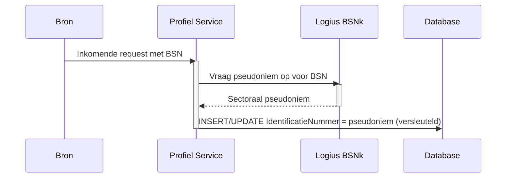

## Infrastructuur Architectuur

Deze sectie beschrijft de infrastructuurkeuzes die specifiek zijn voor de Profiel Service. Voor de algemene MOZa-infrastructuur (Standaard Platform van Logius, Kubernetes, klantomgeving, multi-DC) wordt verwezen naar het systeemwijde [§09 Infrastructuur Architectuur](../docs/09-infrastructuur-architectuur.md).

### Hostingomgeving

De Profiel Service draait op het Standaard Platform van Logius. Concrete cluster- en namespace-toewijzing staat beschreven in [§10 Deployment](10-deployment.md). Deze sectie richt zich uitsluitend op infrastructuurelementen die voor de Profiel Service architectonisch significant zijn.

### Authenticatie en autorisatie

Toegang tot de Profiel Service is op twee niveaus geauthenticeerd:

1. **Aanroeper-authenticatie**, uitgevoerd door de API-gateway op basis van FSC en FTV. Dit identificeert de organisatie die de aanroep doet (een dienstverlener, het MOZa-portaal of een vakapplicatie).
2. **Subject-authenticatie**, uitgevoerd door de Profiel Service zelf op basis van een meegestuurd JWT dat de eindgebruiker identificeert namens wie de aanroep plaatsvindt. Dit JWT wordt door de Profiel Service per request gevalideerd tegen de uitgevende identity provider.

De aanroeper vouwt dus voor de eigen identiteit; de eindgebruikersidentiteit wordt onafhankelijk door de Profiel Service geverifieerd voordat een gegevenslookup plaatsvindt.

#### Aanroeper-authenticatie via de gateway

De service is voorzien om gehost te worden in de **Logius Private Cloud (LPC)**. Op netwerkniveau hanteert LPC een whitelist: alleen verbindingen die binnenkomen via een FTV-gevalideerde aanroep worden toegelaten. Verkeer dat niet via FTV is geauthenticeerd komt het cluster überhaupt niet binnen, los van wat de gateway en de service zelf doen. Hiermee zit FTV op twee niveaus in de toegangsbeslissing: als netwerkfilter op de LPC-rand en als applicatieve tokenvalidatie op de gateway.

De gateway valideert vervolgens op basis van:

- **Federatieve Service Connectiviteit (FSC)** legt het contract vast tussen afnemer en aanbieder: welke dienst, voor welk doel, met welke verzoeken. Zonder geldig FSC-contract is technische toegang niet mogelijk.
- **Federatieve Toegangsverlening (FTV)** levert per aanroep een token met organisatie-identiteit, rol en contractcontext. De gateway valideert dit token en weigert verzoeken zonder geldige context.

Elke aanroep van de Profiel Service is daarmee een service-to-service-aanroep, ook wanneer er uiteindelijk een ingelogde eindgebruiker achter zit. Twee typen aanroepers zijn relevant:

- **Het MOZa-portaal of een vakapplicatie**, dat handelt namens een ingelogde burger of ondernemer. De eindgebruiker is daar aan de voorkant geauthenticeerd via DigiD, eHerkenning of eIDAS; het portaal verkrijgt in die flow een subject-JWT voor de eindgebruiker en stuurt dat mee in de aanroep naar de Profiel Service. De inlogflow aan de voorkant is buiten scope voor de Profiel Service en wordt beschreven in [§07 Code, Authenticatie](07-code.md#authenticatie).
- **Dienstverleners en ketenpartners** die rechtstreeks profielgegevens opvragen voor een specifieke eindgebruiker, bijvoorbeeld voor het versturen van notificaties. Ook deze partijen sturen het subject-JWT voor de betreffende eindgebruiker mee.

In beide gevallen handhaaft de gateway op basis van het FSC-contract van de aanroepende partij en het bijbehorende FTV-token. De Profiel Service zelf maakt geen onderscheid op netwerkniveau tussen "portaalverkeer" en "dienstverlenerverkeer".

Een uitgebreide beschrijving van FSC, FTV en hun samenhang met FDS en LDV staat in de [bijlage Logging, Toegang en Doelbinding](../decisions/addendum/profiel-service-logging-en-toegang.md).

#### Subject-authenticatie via JWT

De aanroeper stuurt bij elke request een JWT mee dat de eindgebruiker identificeert. De Profiel Service valideert dit JWT lokaal tegen de JSON Web Key Set (JWKS) van de uitgevende identity provider en gebruikt het gevalideerde subject (BSN, KvK of RSIN) als sleutel voor de gegevensbewerking.

- **Uitgevende identity providers.** Het JWT wordt uitgegeven door DigiD (voor de BSN-gebaseerde flow) of de eHerkenning-makelaar (voor de KvK/RSIN-gebaseerde flow). De definitieve combinatie wordt in een vervolg-ADR vastgelegd; tot dat besluit gaan we uit van beide bronnen naast elkaar.
- **Multi-issuer trustconfiguratie.** De Profiel Service kent voor elke geaccepteerde IdP een `iss`-waarde en de bijbehorende JWKS-URL. De `iss`-claim in het binnenkomende JWT bepaalt welke JWKS gebruikt wordt voor signature-verificatie.
- **Validatie per request.** Voor elk JWT controleert de service de handtekening tegen de JWKS, de `iss` tegen de configuratielijst, de `aud` op aanwezigheid van de Profiel Service-identifier, en `exp`/`nbf` op tijdsgeldigheid. Verzoeken met een ongeldig of ontbrekend JWT worden afgewezen met HTTP 401.
- **Performance.** JWKS-sleutels worden in-process gecached met een TTL en bij signature-mismatch direct opnieuw opgehaald. Daarmee voegt de validatie geen netwerkronde per request toe.
- **Identificatie uit het JWT.** De partij-identificatie (BSN, KvK, RSIN) komt uit een geverifieerde claim van het JWT, niet uit de request body. Welke claim-naam per IdP geldt wordt in de vervolg-ADR vastgelegd. Tot die definitie blijft de service de identificatie ook uit de body lezen en wijst hij requests af waarin body en token niet overeenstemmen.
- **Implementatie.** De Quarkus-extensie `quarkus-smallrye-jwt` levert signature-verificatie, JWKS-caching en claim-extractie. Voor automatische tests gebruiken we `quarkus-test-security-jwt` om JWT's lokaal te genereren zonder een echte IdP-roundtrip.

Subject-validatie geldt voor **alle endpoints** van de Profiel Service. Er is geen onderscheid tussen "lees-" en "schrijfendpoints" op dit punt.

#### Consequenties voor de Profiel Service

- De service implementeert geen eigen scope-mapping en geen eigen credential-store voor afnemers; aanroeper-autorisatie blijft volledig FSC-gedreven.
- De service voert wél eigen JWT-validatie uit voor het subject. Wijzigingen in geaccepteerde IdP's, `iss`-waarden of JWKS-URLs gaan via configuratie, niet via codewijzigingen.
- Partij-identificaties (BSN, KvK, RSIN) komen voornamelijk uit het gevalideerde JWT en worden nooit in het pad of in querystrings opgenomen. Dit voorkomt dat persoonsgegevens in access logs, proxy-logs of browserhistorie terechtkomen.
- LDV-registratie logt het subject zoals vastgesteld uit het JWT, niet de waarde uit de body, om te garanderen dat het geregistreerde subject altijd cryptografisch herleidbaar is naar de uitgevende IdP.
- Wijzigingen in toegangscontracten op aanroeperniveau verlopen via het FSC-beheerproces en niet via codewijzigingen in de Profiel Service.

### Secret management

De Profiel Service maakt gebruik van enkele soorten Kubernetes `Secret`-resources:

- Databasecredentials voor PostgreSQL.
- Versleutelingssleutels voor column-level encryption van `IDENTIFICATIE.IdentificatieNummer` en `CONTACTGEGEVEN.Waarde` (zie [§08 Data, Encryptie en opslag](08-data.md#encryptie-en-opslag)).
- Credentials voor externe API's (BSNk, KvK, EmailVerificatieService).

Al deze secrets worden opgeslagen als [Sealed Secrets](https://sealed-secrets.netlify.app/) in de infrastructuur-repository van het Standaard Platform op GitLab. De werking is als volgt:

1. Maak een Kubernetes `Secret`-manifest met de gewenste waarde.
2. Seal het secret met de `kubeseal` CLI tot een `SealedSecret`. De waarde is hierna uitsluitend in versleutelde vorm aanwezig en buiten het cluster nergens leesbaar.
3. Commit het `SealedSecret`-manifest naar de GitLab infrastructuur-repository.
4. De pipeline rolt het `SealedSecret` uit naar het cluster.
5. De Sealed Secrets-controller in het cluster unseal't het manifest naar een reguliere Kubernetes `Secret`, die als environment variable of mounted volume aan de Profiel Service-pod beschikbaar komt.

Implicaties:

- Per cluster werkt een eigen Sealed Secrets-controller met een eigen sleutelpaar. Dezelfde versleutelde manifesten zijn daardoor niet zonder hercodering bruikbaar in een ander cluster (test versus productie).
- Rotatie van een secret gebeurt door een nieuwe `SealedSecret` te genereren met de bijgewerkte waarde, deze te committen en de Profiel Service opnieuw uit te rollen.

#### Rotatiebeleid

Op dit moment is er nog geen rotatiebeleid voor de Profiel Service-secrets. Dit wordt in de toekomst in samenwerking met Logius ingevuld, aansluitend op hun infrastructuur.

### Pseudonimisering van BSN (BSNk)

Een ruw BSN komt niet voor in de database. De Profiel Service ontvangt of haalt een BSN op, pseudonimiseerde deze met behulp van de BSNk-module (BSN-koppelnummer), en bewaart vervolgens uitsluitend het sectorale pseudoniem.

Voor andere identificatienummers (KVK, RSIN, ...) wordt onderzocht in welke mate dezelfde aanpak toepasbaar is. Tot die beslissing genomen is, worden deze nummers wel versleuteld maar niet gepseudonimiseerd opgeslagen.

### BIO-classificatie

De Profiel Service verwerkt persoonsgegevens en valt daarmee onder de [Baseline Informatiebeveiliging Overheid (BIO)](https://www.bio-overheid.nl/). Voor zowel beschikbaarheid (B), integriteit (I) als vertrouwelijkheid (V) wordt een BBN-classificatie (Basis Beveiligingsniveau) bepaald.

| Aspect            | Indicatieve BBN | Toelichting                                                                                         |
|-------------------|-----------------|-----------------------------------------------------------------------------------------------------|
| Beschikbaarheid   | TBD             | Afhankelijk van de SLA-afspraken met aangesloten dienstverleners; richtinggevend BBN 1 of BBN 2.    |
| Integriteit       | TBD             | Foutieve contactgegevens leiden tot foutieve afhandeling bij dienstverleners; richtinggevend BBN 2. |
| Vertrouwelijkheid | TBD             | BSN en contactgegevens zijn persoonsgegevens met verhoogd risicoprofiel; richtinggevend BBN 2.      |

De definitieve classificatie volgt uit de DPIA (zie [§08 Data, Doelbinding en grondslag](08-data.md#doelbinding-en-grondslag)) en uit de risicoanalyse die conform BIO wordt uitgevoerd. De uitkomsten worden vastgelegd in een ADR en gepubliceerd bij het verwerkingsregister.

**TBD:** definitieve BBN-classificatie per aspect, plus de bijbehorende maatregelenmatrix.

### Beheer en eigenaarschap

- Applicatie-eigenaar: het Profiel Service-team binnen MOZa.
- Platformeigenaar: Logius (Standaard Platform).
- Secret management: zie [Secret management](#secret-management). De Sealed Secrets-controller wordt door het Standaard Platform beheerd; de versleutelde manifesten met de secrets worden door het Profiel Service-team onderhouden in de eigen infrastructuur-repository.
