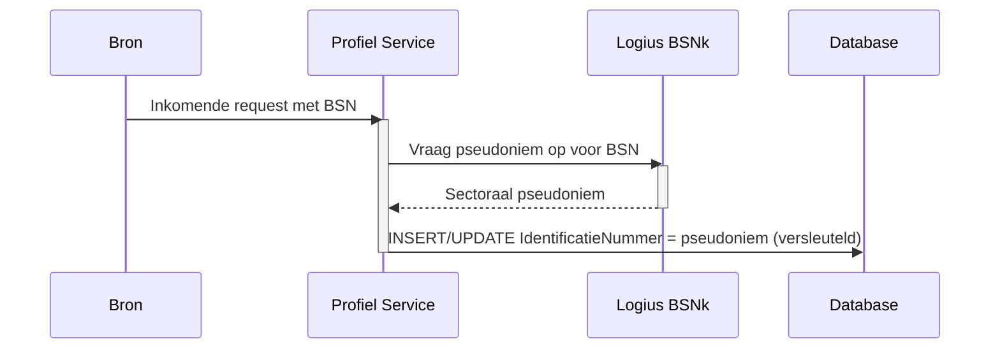

## Infrastructuur Architectuur

Deze sectie beschrijft de infrastructuurkeuzes die specifiek zijn voor de Profiel Service. Voor de algemene MOZa-infrastructuur (Standaard Platform van Logius, Kubernetes, klantomgeving, multi-DC) wordt verwezen naar het systeemwijde [§09 Infrastructuur Architectuur](../docs/09-infrastructuur-architectuur.md).

### Hostingomgeving

De Profiel Service draait op het Standaard Platform van Logius. Concrete cluster- en namespace-toewijzing staat beschreven in [§10 Deployment](10-deployment.md). Deze sectie richt zich uitsluitend op infrastructuurelementen die voor de Profiel Service architectonisch significant zijn.

### Sleutelmanagement

De Profiel Service slaat een aantal velden versleuteld op via column-level encryption (zie [§08 Data, Encryptie en opslag](08-data.md#encryptie-en-opslag)):

- `IDENTIFICATIE.IdentificatieNummer` (KVK, RSIN, en de BSNk-pseudoniem voor BSN)
- `CONTACTGEGEVEN.Waarde` (e-mailadres, telefoonnummer, applicatie-id)

De versleutelingssleutels worden gedeployed als [Sealed Secrets](https://sealed-secrets.netlify.app/) binnen het Standaard Platform. De sealed secret dat in git staat bevat de sleutel uitsluitend in versleutelde vorm; de Sealed Secrets-controller in het cluster ontsleutelt het manifest naar een reguliere Kubernetes `Secret`, die vervolgens als environment variable of mounted volume aan de Profiel Service-pod beschikbaar komt.

Implicaties van deze keuze:

- De sleutel is buiten het cluster nergens leesbaar opgeslagen. Het versleutelde manifest mag dus in git staan.
- Per cluster werkt een eigen Sealed Secrets-controller met een eigen sleutelpaar. Dezelfde versleutelde manifesten zijn daardoor niet zonder hercodering bruikbaar in een ander cluster (test versus productie).
- Rotatie van een versleutelingssleutel betekent het uitrollen van een nieuwe Sealed Secret met de nieuwe waarde en het opnieuw deployen van de Profiel Service.

**TBD:** strategie voor meerdere actieve sleutelversies tegelijk, zodat bestaande rijen leesbaar blijven na rotatie. Een gangbare aanpak is een sleutel-versie-indicator per versleutelde kolom plus meerdere sleutels parallel beschikbaar in de pod; de definitieve keuze wordt vastgelegd in een ADR.

### Pseudonimisering van BSN (BSNk)

Een ruw BSN komt niet voor in de database. De Profiel Service ontvangt of haalt een BSN op, stuurt deze direct door naar de BSNk-module (BSN-koppelnummer) van Logius, en bewaart vervolgens uitsluitend het sectorale pseudoniem dat BSNk teruggeeft.

Voor andere identificatienummers (KVK, RSIN, ...) wordt onderzocht in welke mate dezelfde aanpak toepasbaar is. Tot die beslissing genomen is, worden deze nummers wel versleuteld maar niet gepseudonimiseerd opgeslagen.

**TBD:** koppelvlak met BSNk. De Profiel Service gebruikt vermoedelijk BSNk-PP (Polymorphic Pseudonyms), maar het exacte BSNk-koppelprofiel (PP, IP, EI) en de sectorindeling worden in afstemming met Logius vastgesteld.

### BIO-classificatie

De Profiel Service verwerkt persoonsgegevens (BSN-pseudoniem, contactgegevens, voorkeuren) en valt daarmee onder de [Baseline Informatiebeveiliging Overheid (BIO)](https://www.bio-overheid.nl/). Voor zowel beschikbaarheid (B), integriteit (I) als vertrouwelijkheid (V) wordt een BBN-classificatie (Basis Beveiligingsniveau) bepaald.

| Aspect            | Indicatieve BBN | Toelichting                                                                                         |
| ----------------- | --------------- | --------------------------------------------------------------------------------------------------- |
| Beschikbaarheid   | TBD             | Afhankelijk van de SLA-afspraken met aangesloten dienstverleners; richtinggevend BBN 1 of BBN 2.    |
| Integriteit       | TBD             | Foutieve contactgegevens leiden tot foutieve afhandeling bij dienstverleners; richtinggevend BBN 2. |
| Vertrouwelijkheid | TBD             | BSN en contactgegevens zijn persoonsgegevens met verhoogd risicoprofiel; richtinggevend BBN 2.      |

De definitieve classificatie volgt uit de DPIA (zie [§08 Data, Doelbinding en grondslag](08-data.md#doelbinding-en-grondslag)) en uit de risicoanalyse die conform BIO wordt uitgevoerd. De uitkomsten worden vastgelegd in een ADR en gepubliceerd bij het verwerkingsregister.

**TBD:** definitieve BBN-classificatie per aspect, plus de bijbehorende maatregelenmatrix.

### Beheer en eigenaarschap

- Applicatie-eigenaar: het Profiel Service-team binnen MOZa.
- Platformeigenaar: Logius (Standaard Platform).
- Sleutelbeheer: zie [Sleutelmanagement](#sleutelmanagement). De Sealed Secrets-controller wordt door het Standaard Platform beheerd; de versleutelde manifesten met de applicatiesleutels worden door het Profiel Service-team onderhouden in de eigen infrastructuur-repository.
