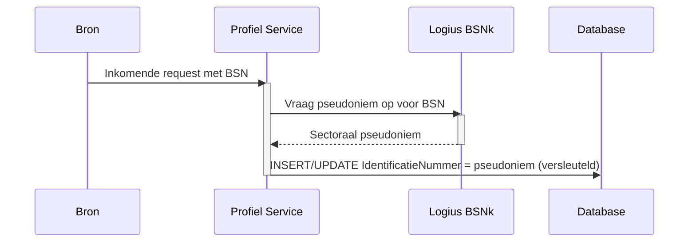

## Infrastructuur Architectuur

Deze sectie beschrijft de infrastructuurkeuzes die specifiek zijn voor de Profiel Service. Voor de algemene MOZa-infrastructuur (Standaard Platform van Logius, Kubernetes, klantomgeving, multi-DC) wordt verwezen naar het systeemwijde [§09 Infrastructuur Architectuur](../docs/09-infrastructuur-architectuur.md).

### Hostingomgeving

De Profiel Service draait op het Standaard Platform van Logius. Concrete cluster- en namespace-toewijzing staat beschreven in [§10 Deployment](10-deployment.md). Deze sectie richt zich uitsluitend op infrastructuurelementen die voor de Profiel Service architectonisch significant zijn.

### Authenticatie en autorisatie

Toegang tot de Profiel Service is op twee niveaus geauthenticeerd:

1. **Aanroeper-authenticatie**, uitgevoerd door de API-gateway op basis van FSC en FTV. Dit identificeert de organisatie die de aanroep doet (een dienstverlener, het MOZa-portaal of een vakapplicatie).
2. **Subject-authenticatie**, uitgevoerd door de Profiel Service zelf, maar alleen wanneer de aanroep namens een eindgebruiker plaatsvindt. In dat geval stuurt de aanroeper een JWT mee dat de eindgebruiker identificeert; de Profiel Service valideert dit JWT per request tegen de uitgevende identity provider. Handelt de aanroeper (bijvoorbeeld een dienstverlener) op eigen titel, dan is er geen subject-JWT en volstaat de aanroeper-authenticatie.

De aanroeper staat dus in voor de eigen identiteit (afgedwongen door de gateway); een eventuele eindgebruikersidentiteit wordt onafhankelijk door de Profiel Service geverifieerd voordat er namens die eindgebruiker een gegevensbewerking plaatsvindt. Autorisatie volgt uit beide identiteiten samen: de organisatie-identiteit bepaalt welke dienstverlener handelt en dus welke gegevens binnen bereik liggen, de eindgebruikersidentiteit bepaalt namens welke partij gehandeld wordt.

#### Aanroeper-authenticatie via de gateway

De service is voorzien om gehost te worden in de **Logius Private Cloud (LPC)**. Op netwerkniveau hanteert LPC een whitelist: alleen verbindingen die binnenkomen via een FTV-gevalideerde aanroep worden toegelaten. Verkeer dat niet via FTV is geauthenticeerd komt het cluster überhaupt niet binnen, los van wat de gateway en de service zelf doen. Hiermee zit FTV op twee niveaus in de toegangsbeslissing: als netwerkfilter op de LPC-rand en als applicatieve tokenvalidatie op de gateway.

De gateway valideert vervolgens op basis van:

- **Federatieve Service Connectiviteit (FSC)** legt het contract vast tussen afnemer en aanbieder: welke dienst, voor welk doel, met welke verzoeken. Zonder geldig FSC-contract is technische toegang niet mogelijk.
- **Federatieve Toegangsverlening (FTV)** levert per aanroep een token met organisatie-identiteit, rol en contractcontext. De gateway valideert dit token en weigert verzoeken zonder geldige context.

Elke aanroep van de Profiel Service is daarmee een service-to-service-aanroep, ook wanneer er uiteindelijk een ingelogde eindgebruiker achter zit. Twee typen aanroepers zijn relevant:

- **Het MOZa-portaal of een vakapplicatie**, dat handelt namens een ingelogde burger of ondernemer. De eindgebruiker is daar aan de voorkant geauthenticeerd via DigiD, eHerkenning of eIDAS; het portaal verkrijgt in die flow een subject-JWT voor de eindgebruiker en stuurt dat mee in de aanroep naar de Profiel Service. De inlogflow aan de voorkant is buiten scope voor de Profiel Service en wordt beschreven in [§07 Code, Authenticatie](07-code.md#authenticatie).
- **Dienstverleners en ketenpartners** roepen de Profiel Service in de regel op eigen titel aan, bijvoorbeeld om contactgegevens op te halen voor het versturen van een notificatie. Voor zulke aanroepen sturen zij geen subject-JWT mee: de aanroeper-authenticatie via FSC/FTV en de autorisatie op dienstverlenerniveau zijn dan voldoende, en de partij-identificatie komt uit het verzoek zelf. Zodra een dienstverlener een handeling uitvoert die door of namens een specifieke eindgebruiker wordt gedaan, stuurt hij wél het subject-JWT van die eindgebruiker mee, zodat de Profiel Service die identiteit valideert. Dat geldt ook wanneer een dienstverlener een eigen portaal aanbiedt waarin de eindgebruiker met DigiD of eHerkenning inlogt en daar profielgegevens inziet of wijzigt: elke aanroep vanuit zo'n portaal is een namens-aanroep, voor lezen én schrijven.

In beide gevallen handhaaft de gateway op basis van het FSC-contract van de aanroepende partij en het bijbehorende FTV-token. De Profiel Service zelf maakt geen onderscheid op netwerkniveau tussen "portaalverkeer" en "dienstverlenerverkeer".

Een uitgebreide beschrijving van FSC, FTV en hun samenhang met FDS en LDV staat in de [bijlage Logging, Toegang en Doelbinding](../decisions/addendum/profiel-service-logging-en-toegang.md).

#### Autorisatie van de handelende dienstverlener

De gegevens in de Profiel Service zijn per dienstverlener gescheiden: toewijzingen en voorkeuren die binnen de scope van de ene dienstverlener vallen, zijn voor een andere dienstverlener niet benaderbaar. De Profiel Service dwingt die scheiding zelf af:

- De handelende dienstverlener wordt afgeleid uit de organisatie-identiteit (OIN) die de FSC/FTV-laag heeft geauthenticeerd en wordt via het dienstverlenersregister van de Profiel Service vertaald naar de bijbehorende dienstverlener. De dienstverlener-identiteit komt nooit uit de request body of een parameter.
- Elke dienstverlener-gebonden operatie kent een eigenaarschapscontrole: bevraging en resolutie alleen binnen de diensten van de handelende dienstverlener, schrijfacties alleen op gegevens die aan die dienstverlener gebonden zijn.

Het FSC-access-token bevat de organisatie-identiteit als geverifieerde claim (`sub` = PeerID = OIN), gebonden aan het PKIoverheid-certificaat van de aanroeper. De gateway geeft het gevalideerde token door aan de Profiel Service; de fsc-core-specificatie (v2.0.0, §4.7.1.3 Routing) schrijft voor dat de Inway de `Fsc-Authorization`-header niet verwijdert bij het doorsturen naar de service. De service hervalideert het token per request (handtekening, `iss`, `exp`/`nbf`) en leest de OIN uit de `sub`-claim; het token is ondertekend door de Manager aan aanbiederszijde, dus die validatie kent geen externe sleutelafhankelijkheid. De certificaatbinding (`cnf`) wordt op de gateway afgedwongen, waar de mTLS-verbinding termineert.

Kanttekening: voor een toekomstige versie worden quota en anomaliedetectie per OIN op de GET-endpoints overwogen, om grootschalig uitlezen door een gecompromitteerd afnemersysteem te begrenzen en vroegtijdig te signaleren. De LDV-verslaglegging maakt zulk gebruik al per aanroep herleidbaar.

#### Subject-authenticatie via JWT

Wanneer een aanroep namens een eindgebruiker plaatsvindt, stuurt de aanroeper een JWT mee dat die eindgebruiker identificeert. De Profiel Service valideert dit JWT dan lokaal tegen de JSON Web Key Set (JWKS) van de uitgevende identity provider en gebruikt het gevalideerde subject (BSN, KvK of RSIN) als sleutel voor de gegevensbewerking. Aanroepen die een dienstverlener op eigen titel doet, bevatten geen subject-JWT.

- **Uitgevende identity providers.** Het JWT wordt uitgegeven door DigiD (voor de BSN-gebaseerde flow) of de eHerkenning-makelaar (voor de KvK/RSIN-gebaseerde flow); beide bronnen worden naast elkaar geaccepteerd.
- **Token-audience.** Een subject-JWT is alleen geldig als de `aud`-claim de Profiel Service-identifier bevat. Dit voorkomt dat een token dat een eindgebruiker bij een andere dienst heeft verkregen, door die partij bij de Profiel Service wordt hergebruikt. Een token uit de inlogflow van een eigen portaal van een dienstverlener is uitgegeven aan die portaal-client en voldoet daar niet vanzelf aan; hoe zo'n portaal een voor de Profiel Service geldig token verkrijgt (bijvoorbeeld token exchange bij de makelaar) wordt nog uitgewerkt.
- **Multi-issuer trustconfiguratie.** De Profiel Service kent voor elke geaccepteerde IdP een `iss`-waarde en de bijbehorende JWKS-URL. De `iss`-claim in het binnenkomende JWT bepaalt welke JWKS gebruikt wordt voor signature-verificatie.
- **Validatie per request.** Voor elk meegestuurd JWT controleert de service de handtekening tegen de JWKS, de `iss` tegen de configuratielijst, de `aud` op aanwezigheid van de Profiel Service-identifier, en `exp`/`nbf` op tijdsgeldigheid. Een ongeldig JWT wordt altijd afgewezen met HTTP 401. Voor aanroepen die namens een eindgebruiker plaatsvinden is een geldig JWT verplicht; ontbreekt het daar, dan wordt het verzoek eveneens afgewezen.
- **Performance.** JWKS-sleutels worden in-process gecached met een TTL en bij signature-mismatch direct opnieuw opgehaald. Daarmee voegt de validatie geen netwerkronde per request toe.
- **Identificatie uit het JWT.** Bij een aanroep namens een eindgebruiker komt de partij-identificatie (BSN, KvK, RSIN) uit een geverifieerde claim van het JWT, niet uit de request body. De claim-naam per IdP is onderdeel van de trustconfiguratie. Zolang die niet is vastgesteld, blijft de service de identificatie ook uit de body lezen en wijst hij requests af waarin body en token niet overeenstemmen. Bij aanroepen op eigen titel van de dienstverlener komt de partij-identificatie uit het verzoek zelf.
- **Implementatie.** De Quarkus-extensie `quarkus-smallrye-jwt` levert signature-verificatie, JWKS-caching en claim-extractie. Voor automatische tests gebruiken we `quarkus-test-security-jwt` om JWT's lokaal te genereren zonder een echte IdP-roundtrip.

Subject-validatie geldt voor elke aanroep die namens een eindgebruiker plaatsvindt, ongeacht of het om een lees- of schrijfendpoint gaat. Wijzigingen van partijgegevens gebeuren altijd namens een eindgebruiker en dragen dus altijd een subject-JWT. Aanroepen die een dienstverlener op eigen titel doet, kennen geen subject-JWT en worden uitsluitend op aanroeperniveau geautoriseerd (FSC/FTV en de autorisatie op dienstverlenerniveau).

#### Consequenties voor de Profiel Service

- De service implementeert geen eigen credential-store voor afnemers en geen eigen scope-mapping op contractniveau; die blijven FSC-gedreven. De gegevensscheiding per dienstverlener dwingt de service wél zelf af, op basis van de uit de OIN afgeleide identiteit.
- De service voert wél eigen JWT-validatie uit voor het subject. Wijzigingen in geaccepteerde IdP's, `iss`-waarden of JWKS-URLs gaan via configuratie, niet via codewijzigingen.
- Partij-identificaties (BSN, KvK, RSIN) komen voornamelijk uit het gevalideerde JWT en worden nooit in het pad of in querystrings opgenomen. Dit voorkomt dat persoonsgegevens in access logs, proxy-logs of browserhistorie terechtkomen.
- LDV-registratie logt het subject zoals vastgesteld uit het JWT, niet de waarde uit de body, om te garanderen dat het geregistreerde subject altijd cryptografisch herleidbaar is naar de uitgevende IdP.
- Wijzigingen in toegangscontracten op aanroeperniveau verlopen via het FSC-beheerproces en niet via codewijzigingen in de Profiel Service.

### Sleutelmanagement

De Profiel Service slaat een aantal velden versleuteld op via column-level encryption (zie [§08 Data, Encryptie en opslag](08-data.md#encryptie-en-opslag)):

- `IDENTIFICATIE.IdentificatieNummer`
- `CONTACTGEGEVEN.Waarde`

De versleutelingssleutels worden gedeployed als [Sealed Secrets](https://sealed-secrets.netlify.app/) binnen het Standaard Platform. De sealed secret dat in git staat bevat de sleutel uitsluitend in versleutelde vorm; de Sealed Secrets-controller in het cluster ontsleutelt het manifest naar een reguliere Kubernetes `Secret`, die vervolgens als environment variable of mounted volume aan de Profiel Service-pod beschikbaar komt.

Implicaties van deze keuze:

- De sleutel is buiten het cluster nergens leesbaar opgeslagen. Het versleutelde manifest mag dus in git staan.
- Per cluster werkt een eigen Sealed Secrets-controller met een eigen sleutelpaar. Dezelfde versleutelde manifesten zijn daardoor niet zonder hercodering bruikbaar in een ander cluster (test versus productie).
- Rotatie van een versleutelingssleutel betekent het uitrollen van een nieuwe Sealed Secret met de nieuwe waarde en het opnieuw deployen van de Profiel Service.

### Pseudonimisering van BSN (BSNk)

Een ruw BSN komt niet voor in de database. De Profiel Service ontvangt of haalt een BSN op, pseudonimiseerde deze met behulp van de BSNk-module (BSN-koppelnummer), en bewaart vervolgens uitsluitend het sectorale pseudoniem.

Voor andere identificatienummers (KVK, RSIN, ...) wordt onderzocht in welke mate dezelfde aanpak toepasbaar is. Tot die beslissing genomen is, worden deze nummers wel versleuteld maar niet gepseudonimiseerd opgeslagen.

### BIO-classificatie

De Profiel Service verwerkt persoonsgegevens en valt daarmee onder de [Baseline Informatiebeveiliging Overheid (BIO)](https://www.bio-overheid.nl/). Voor zowel beschikbaarheid (B), integriteit (I) als vertrouwelijkheid (V) wordt een BBN-classificatie (Basis Beveiligingsniveau) bepaald.

| Aspect            | Indicatieve BBN | Toelichting                                                                                         |
|-------------------|-----------------|-----------------------------------------------------------------------------------------------------|
| Beschikbaarheid   | TBD             | Afhankelijk van de SLA-afspraken met aangesloten dienstverleners; richtinggevend BBN 1 of BBN 2.    |
| Integriteit       | TBD             | Foutieve contactgegevens leiden tot foutieve afhandeling bij dienstverleners; richtinggevend BBN 2. |
| Vertrouwelijkheid | TBD             | BSN en contactgegevens zijn persoonsgegevens met verhoogd risicoprofiel; richtinggevend BBN 2.      |

De definitieve classificatie volgt uit de DPIA (zie [§08 Data, Doelbinding en grondslag](08-data.md#doelbinding-en-grondslag)) en uit de risicoanalyse die conform BIO wordt uitgevoerd. De uitkomsten worden vastgelegd in een ADR en gepubliceerd bij het verwerkingsregister.

**TBD:** definitieve BBN-classificatie per aspect, plus de bijbehorende maatregelenmatrix.

### Beheer en eigenaarschap

- Applicatie-eigenaar: het Profiel Service-team binnen MOZa.
- Platformeigenaar: Logius (Standaard Platform).
- Sleutelbeheer: zie [Sleutelmanagement](#sleutelmanagement). De Sealed Secrets-controller wordt door het Standaard Platform beheerd; de versleutelde manifesten met de applicatiesleutels worden door het Profiel Service-team onderhouden in de eigen infrastructuur-repository.
