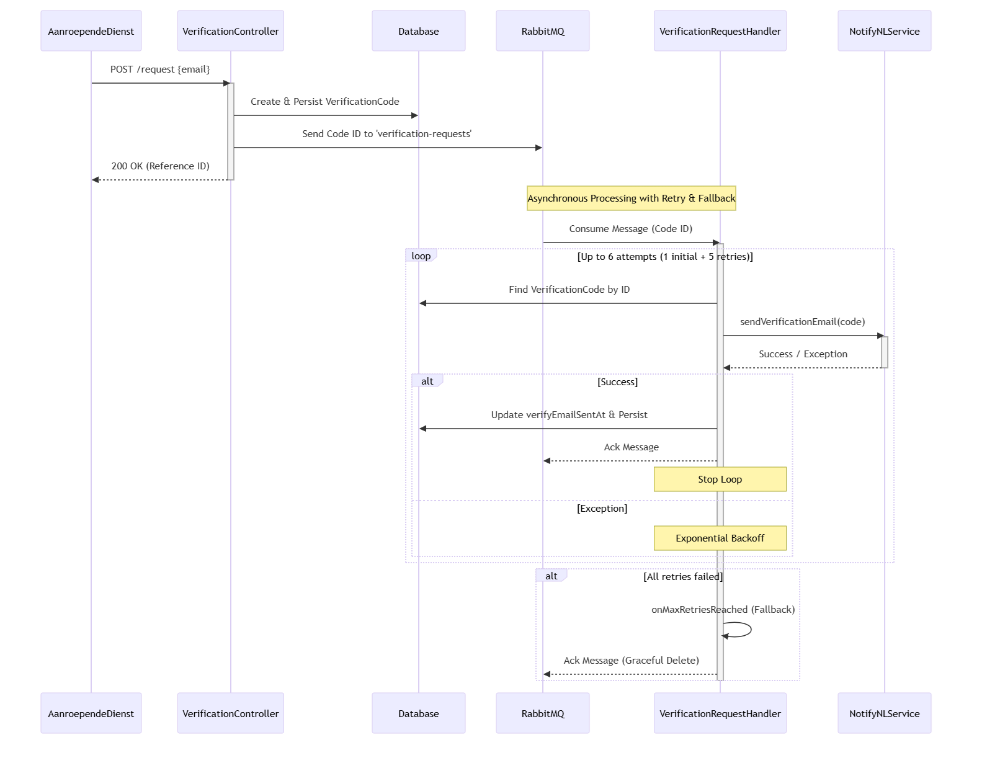
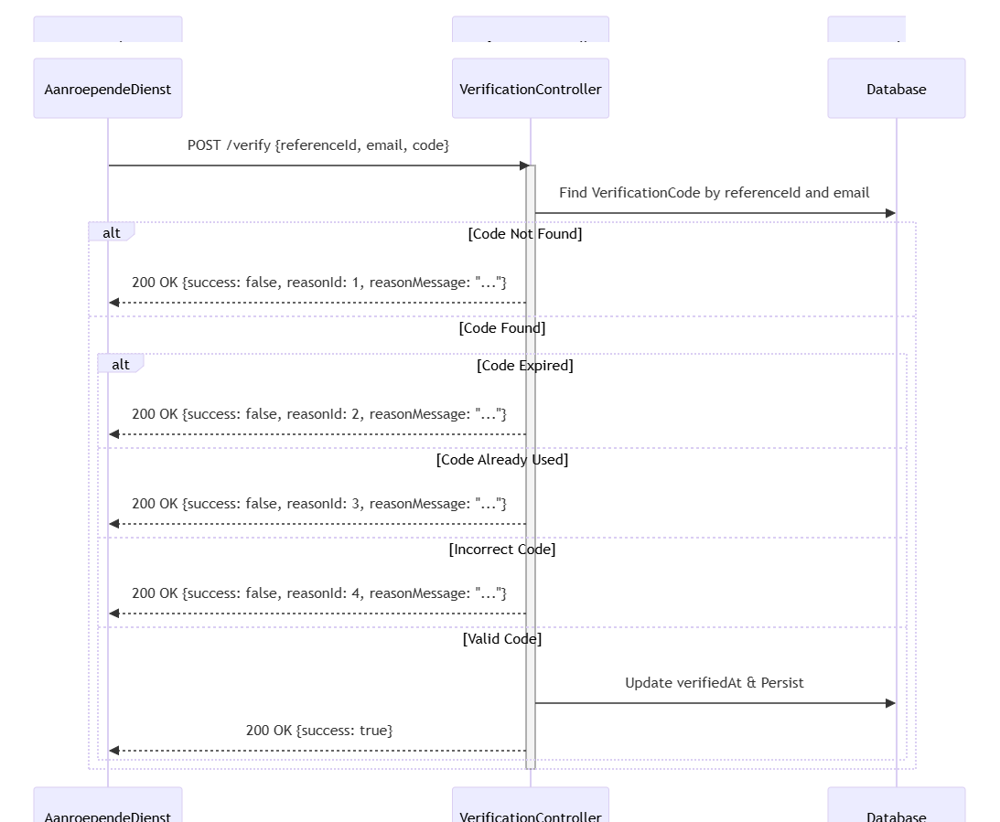
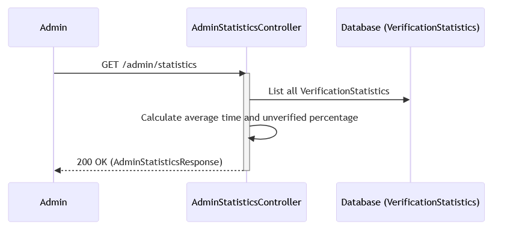

## Code

### Email verifiëren

Onderstaande sectie geeft voorbeeldcontracten (API) en schetst de basislogica. Dit is geen implementatie, maar richtinggevend voor teams.

#### HTTP API
*Link naar swagger*

### Verification Service Sequence Diagrams

#### Verification Request Flow

Deze flow beschrijft hoe een verificatieverzoek wordt aangemaakt en direct via de Notificatie Service wordt verstuurd.

  
Zie mermaid code

    
        sequenceDiagram
            participant AanroependeDienst
            participant VC as VerificationController
            participant DB as Database
            participant NNL as NotificatieService

            AanroependeDienst->>VC: POST /request {email}
            activate VC
            VC->>DB: Create {referenceId, verificationCode}
            VC->>NNL: sendVerificationEmail(email, verificationCode)
            activate NNL
            NNL-->>VC: 200 OK
            deactivate NNL
            VC-->>AanroependeDienst: 200 OK (referenceId)
            deactivate VC
        

#### Verification Completion Flow

Deze flow beschrijft hoe een gebruiker zijn email verifieërt met de ontvangen code.

  
Zie mermaid code

    sequenceDiagram
        participant AanroependeDienst
        participant VC as VerificationController
        participant DB as Database

        AanroependeDienst->>VC: POST /verify {referenceId, code}
        activate VC
        VC->>DB: Find by referenceId

        alt Code Expired
            VC-->>AanroependeDienst: 200 OK {success: false, reasonId: 2, reasonMessage: "..."}
        else Code Already Used
            VC-->>AanroependeDienst: 200 OK {success: false, reasonId: 3, reasonMessage: "..."}
        else Code Not Found
            VC-->>AanroependeDienst: 200 OK {success: false, reasonId: 1, reasonMessage: "..."}
        else Code Found
            alt Incorrect Code
                VC-->>AanroependeDienst: 200 OK {success: false, reasonId: 4, reasonMessage: "..."}
            else Valid Code
                VC->>DB: Delete record & Save statistics
                VC-->>AanroependeDienst: 200 OK {success: true}
            end
        end

        deactivate VC

#### Admin Statistics Flow

Deze flow is hoe een admin de statistieken kan ophalen van de verificatie service.

  
Zie mermaid code

    sequenceDiagram
        participant Admin
        participant ASC as AdminStatisticsController
        participant DB as Database (VerificationStatistics)
    
        Admin->>ASC: GET /admin/statistics
        activate ASC
        ASC->>DB: List all VerificationStatistics
        ASC->>ASC: Calculate average time and unverified percentage
        ASC-->>Admin: 200 OK (AdminStatisticsResponse)
        deactivate ASC

