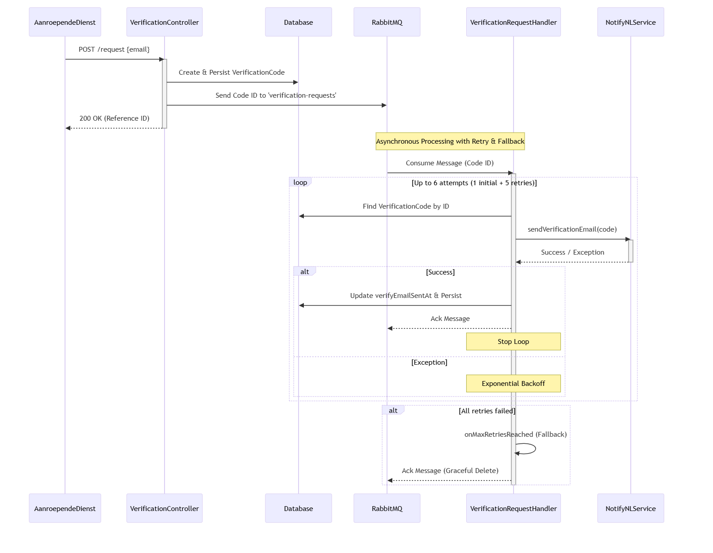
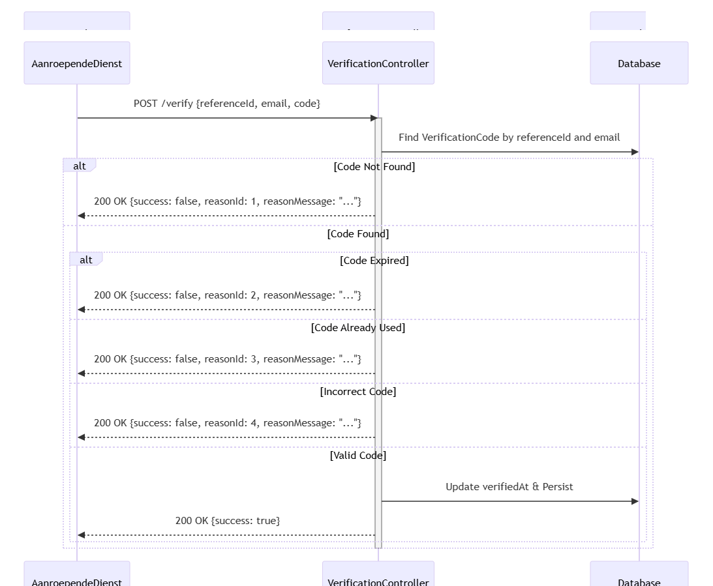
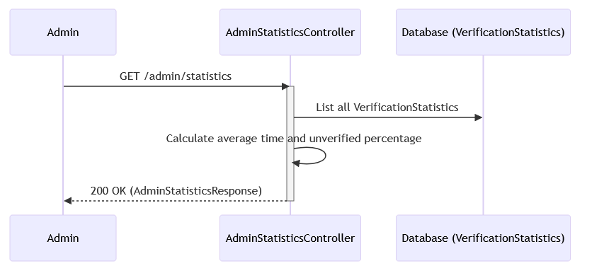

## Code

### Email verifiëren

Onderstaande sectie geeft voorbeeldcontracten (API) en schetst de basislogica. Dit is geen implementatie, maar richtinggevend voor teams.

#### HTTP API

De volledige OpenAPI-specificatie is beschikbaar in de repository: _link naar OpenAPI spec toevoegen_.

##### Endpoints overzicht

| Methode | Pad                          | Beschrijving                        | Succesrespons | Foutrespons                      |
|---------|------------------------------|-------------------------------------|---------------|----------------------------------|
| POST    | `/api/v1/request`            | Start een e-mailverificatie         | 200 OK        | 502 Bad Gateway (notificatie mislukt) |
| POST    | `/api/v1/verify`             | Valideer een verificatiecode        | 200 OK        | Zie foutcodes hieronder          |
| GET     | `/api/v1/admin/statistics`   | Haal verificatiestatistieken op     | 200 OK        | 401/403                          |

##### Foutcodes bij verificatie (`POST /api/v1/verify`)

Foutresponses volgen [RFC 9457](https://www.rfc-editor.org/rfc/rfc9457) (`application/problem+json`), conform de NL API Design Rules.

| Situatie          | HTTP Status                | ReasonId | Beschrijving                                      |
|-------------------|----------------------------|----------|---------------------------------------------------|
| Code niet gevonden | 404 Not Found             | 1        | Geen verificatie gevonden voor het opgegeven referenceId |
| Code verlopen     | 410 Gone                   | 2        | De verificatiecode is verlopen                     |
| Code reeds gebruikt | 409 Conflict              | 3        | De verificatiecode is al gebruikt                  |
| Onjuiste code     | 422 Unprocessable Entity    | 4        | De opgegeven code is onjuist                       |
| Geldige code      | 200 OK                     | —        | Verificatie geslaagd                               |

### Verification Service Sequence Diagrams

#### Verification Request Flow

Deze flow beschrijft hoe een verificatieverzoek wordt aangemaakt en direct via de Notificatie Service wordt verstuurd.

#### Verification Completion Flow

Deze flow beschrijft hoe een gebruiker zijn email verifieert met de ontvangen code.

#### Admin Statistics Flow

Deze flow is hoe een admin de statistieken kan ophalen van de verificatie service.

